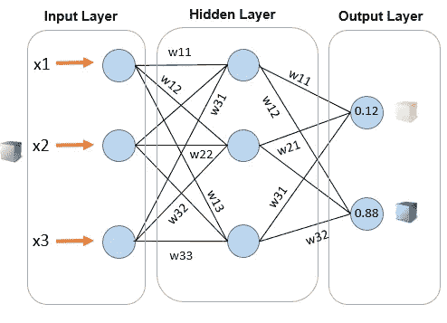
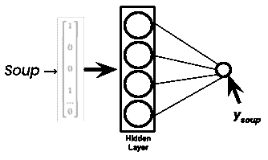
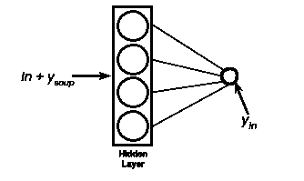
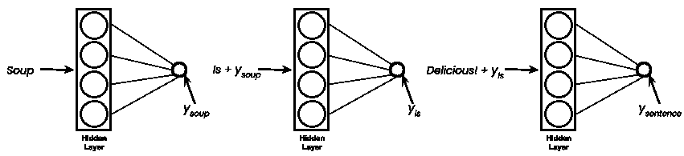
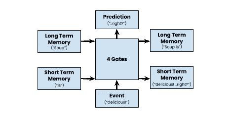
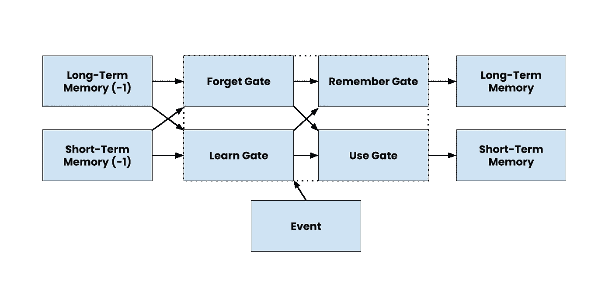

# 递归神经网络的直觉

> 原文：<https://medium.com/geekculture/the-intuition-of-recurrent-neural-networks-906a846e20b0?source=collection_archive---------13----------------------->

remember those memories? ML does too 🙌 | Photo by [Jon Tyson](https://unsplash.com/@jontyson?utm_source=medium&utm_medium=referral) on [Unsplash](https://unsplash.com?utm_source=medium&utm_medium=referral)

> 这是一篇介绍性文章。建议你了解一下[梯度下降](/geekculture/gradient-descent-simplified-631a7ce38cb6)、[后面的作品一些线性代数](https://www.deeplearningbook.org/)、[和基本的 DL 知识](https://www.deeplearningbook.org/)🙂。然而，它非常简单，有许多视觉效果，所以任何水平的知识都可以使用！

我一直很珍惜递归神经网络中的一种魔力。我记得不久前看过安德烈·卡帕西的《品评助理 LSTM》模型。在训练他的模型(使用相当随意选择的超参数)的几十分钟内，它开始产生即将有意义的意义。

> 怎么可能提取以前术语的精华来猜测未来的词？

我很震惊。从我的机器学习经验来看，我熟悉一个模型在**线性**数据中寻找和提取关系的能力，但是理解句子的主题、语法和风格有什么魔力呢？

Juergen Schmidhuber 发现了这个神奇的概念，他在传统的神经网络中加入了一种微妙的记忆感。这些就是我们今天看到的传统 rnn。

> 通过这篇文章，你将了解 LSTM 和 RNN 及其变种背后的数学运算。

## TL；速度三角形定位法(dead reckoning)

*   **RNNs 简体:**缩写代表什么？RNNs 和前馈网络有什么不同？算法的架构是什么？
*   **深入概念:**RNN 有哪些品种？LSTMs 是如何工作的？你的下一步是什么？

# 简化的 RNNs

## 介绍性示例

让我们假设您编写了一个对象检测模型，其中输入是野生动物的纪录片。

结果是准确的，但在某些情况下，该模型将狼归类为狗——因为它们属于同一家族。

在这种情况下，具有残差的神经网络将表现良好。如果计算机理解给定的纪录片围绕野生动物——从以前的物体检测运行中——它就可以简单地使用这一知识来正确预测狼的种类。这是 RNN 人做的事。

> 在 RNNs 中，当前输出取决于其当前值，但也取决于过去的输入。

在这种类型的神经网络中有巨大的力量。它可以识别情感分析的上下文，从语言和其他自然语言的可能性中进行翻译——通过记住以前的词义。

## 从过去的输入中获取记忆

在传统的密集分层前馈网络中，有三个不同的层。

*   **输入层:**神经元数量与输入的数据特征数量相关。
*   **隐藏层:**深度学习计算完成。超参数如层的大小和层数取决于具体问题。
*   **输出层:**我们通过一个 softmax 函数得出解或概率。

Weights (w_ii) are constants that are tuned through gradient descent | [Source](https://matlab4engineers.com/lesson/feed-forward-networks/?lang=en&v=3a52f3c22ed6)

另一方面，RNNs 通过引入循环机制允许记忆在前馈神经网络中持续。这个工具反复地将先前的输出传递到当前位置，充当记忆的高速公路。

> 与前馈网络相反，RNNs 允许信息循环。

如果我们将这个信息循环形象化，图表将如下所示。

Information is recurrently recycled back into the hidden layer

在这里，隐藏状态是表达信息高速公路的另一种方法。请注意，如果有多条信息需要通过 RNN 进行处理，这条高速公路将会不断更新。

为了更好地了解循环机制，让我们使用文本预测 NLP 模型作为指导。该模型根据之前的词义预测句子中的下一个单词。

> rnn 用于 NLP，因为它们在预测和分析信息序列方面表现良好。

> 请务必观看此演示，了解[文本预测](https://www.youtube.com/watch?v=5DSfFDdybzg)模型的功能。*😉*

在我们的模型中，第一步是将输入的句子分割成单个的单词，这些单词被转换成计算机可读的数字向量。这些向量依次单独进入神经网络。

如果那句话是*“汤好喝！”*、*、【汤】*的矢量化形式计算后传递给隐藏层。

word to vector transformation occurs through the one-hot encoding process

第二个单词“in”同样被传递，尽管有一个额外的向量**‘y _ soup’**。这个和形成了向量**‘y _ in’**，该向量具有当前单词以及先前单词的含义。

在对句子中的每个单词进行了无数次这样的添加之后，我们得到了一个向量，该向量描述了句子作为一个整体的含义和相关性，该向量可以用于预测句子中的其他单词。

y_sentence can then be used for paraphrasing and other NLP uses | tanh is the activation function used

请注意，上面显示的隐藏层不是单独的层。它们是一个层，剩余部分在其中循环。如果有多个层，则[梯度下降](/geekculture/gradient-descent-simplified-631a7ce38cb6)过程将会偏斜。

这样，我们就知道了递归神经网络的工作过程！然而，这种逻辑很少有出错的地方。

# RNN 品种

事实上，使用所示的 RNN 逻辑进行文本预测将不会像预期的那样起作用。这是因为 **y_sentence** 的词影响力分布不均。

例如，后来的单词如“好吃！”而“汤好喝！”对模型未来的文本预测有更大的影响。因此，在我们的模型中有一个短期的单词偏差。

the degree of a sentence’s influence on the model’s prediction is biased

在方程中引入长时记忆，可以平衡每个单词的影响程度。它也将对抗[消失梯度问题](https://medium.datadriveninvestor.com/how-do-lstm-networks-solve-the-problem-of-vanishing-gradients-a6784971a577)允许更长的单词序列，从中提取准确的意思。

> 运用短期和长期记忆的技术被称为 LSTM。

## 长短期记忆

LSTMs 是强大的工具。它广泛用于扩展的数据序列，如段落和 DNA，并为传统 rnn 的自然语言处理领域奠定了基础。

> 尽管 LSTM 的架构不同于经典的 RNN，但它本身的记忆能力却被认为是 RNN。

LSTM 架构由四个门组成，长期和短期记忆(来自输入序列)通过其中，以获得预测和更新的长期和短期记忆。

note that the text prediction process includes more steps including word embeddings, character embedding, and others.

注意到的四个门包括:

*   遗忘门:无用的数据从**长期记忆**中被丢弃，有用的数据被保留。
*   学习门:同样的，序列中的**当前事件**和**短时记忆**被加入以移除无用数据。
*   记忆门:将**遗忘门**和**学习门**后保存的信息组合起来，形成更新的长期记忆。这些信息将被保留以备将来事件使用。
*   使用门:计算来自**遗忘门**和**学习门**的输出，用于以下预测。

and the process continues…

# 后续步骤和未来阅读

既然我们理解了**记忆**和**递归神经网络**的思想，下一步就是理解它们背后的数学运算。

考虑阅读这篇文章，了解更多关于四个门的功能。如果你对 LSTM 和 RNN 的项目感兴趣，使用这个图像字幕教程来创建你自己的项目吧！

> 祝你在通往机器学习高峰的旅途中好运！

# 在你走之前…

> 机器学习一直是我的研究热点。无论是在 snapchat 过滤器还是垃圾邮件分类器中，到处都在使用**。今天，它更像是一种生活方式，而不是流行语。**
> 
> *这就是我进入数据科学领域的原因。从一开始，我就上瘾了，我希望我会一直上瘾。*
> 
> **如果你喜欢阅读这篇文章，请联系我的社交网站🤗(附言:想找点问题解决:有时间给我发几个过来)* [*LinkedIn*](https://www.linkedin.com/in/arjun-mahes-a46200220/)*|*[*简讯*](https://arjunmahes.substack.com/) *|* [*推特*](https://twitter.com/mahes_arjun)*