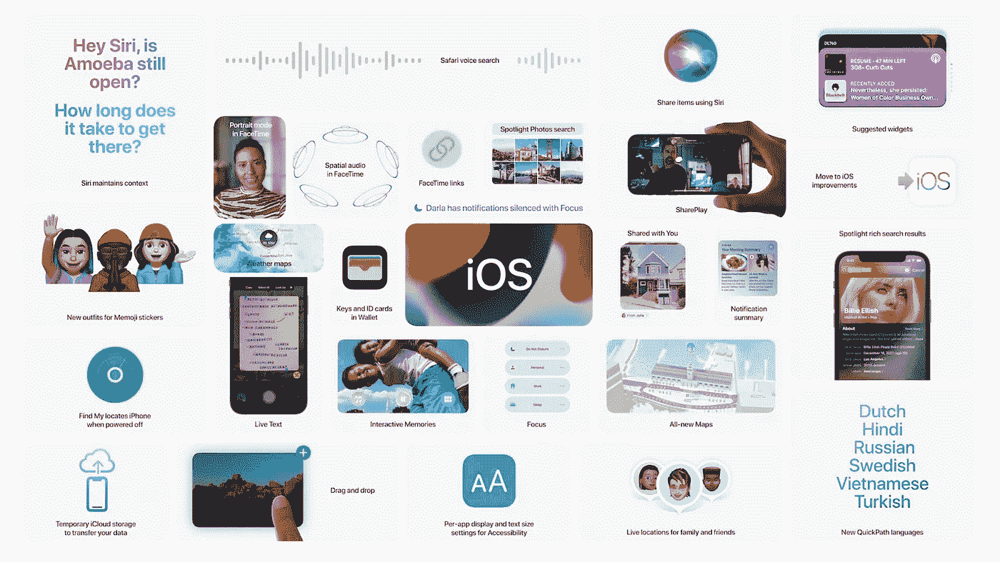
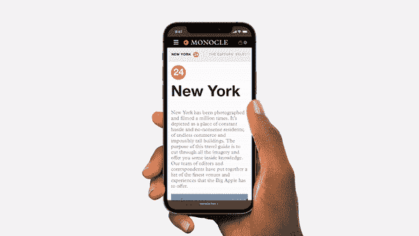
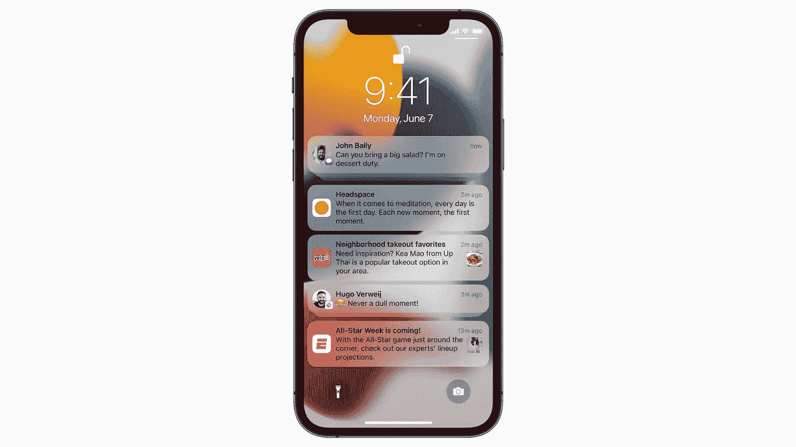
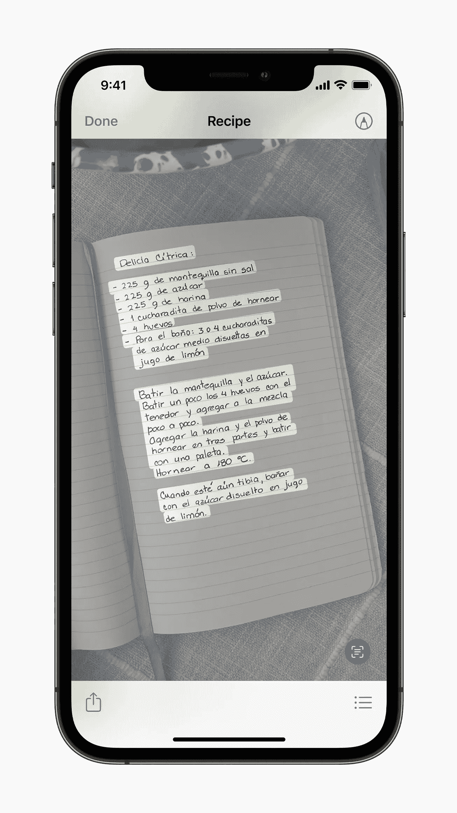
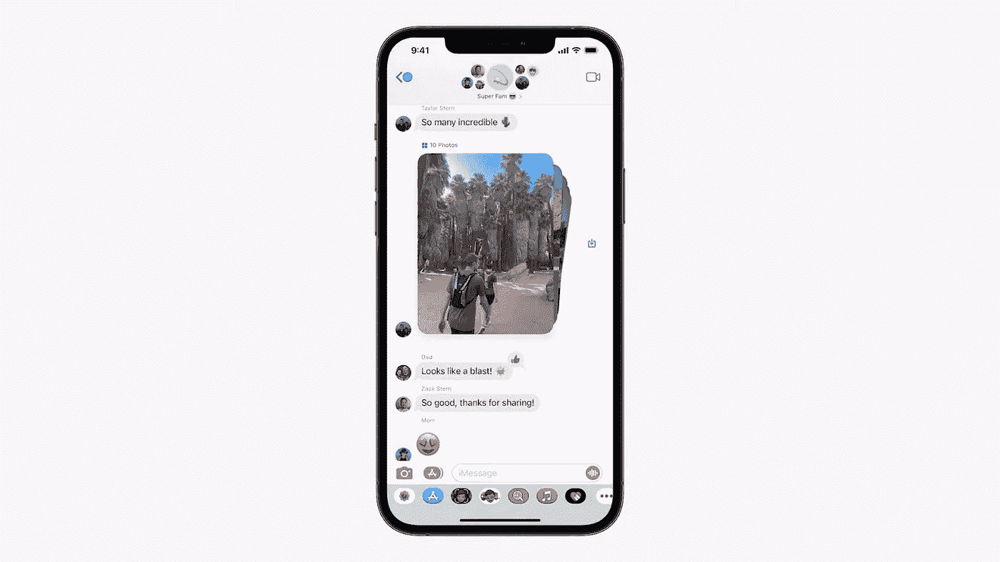

# 你其实应该关心的 iOS 15 功能！

> 原文：<https://medium.com/geekculture/the-ios-15-features-you-should-actually-care-about-e0cb8414a137?source=collection_archive---------65----------------------->

忘记通过 FaceTime 看电影，让我们看看你实际使用的功能。

WWDC 又过去了一年，iOS 15 发布了，但没有去年那么有影响力，主要功能主要是对 FaceTime、钱包和地图的改进。

这些功能很好，但对大多数用户来说并不真正有用，FaceTime 上的 Share play 很好，但谁会经常使用它呢？地图仍然远远落后于谷歌地图，钱包应用程序的改进，如司机 ID，现在对美国以外的任何人都没有用。

因此，在查看了第一个测试版并研究了 WWDC 会议上简要提到的一些其他功能后，我发现了一些不错的补充，我相信它们会改善你的 iPhone 体验。

**Safari 重新设计**

几年来，iPhone 上的 Safari 几乎没有什么变化，只是在一些地方做了细微的调整，但这是一次真正的重新设计。

在 iOS 15 中，Safari 经过了彻底的重新设计，拥有更容易操作的控件和一个紧凑的标签栏，当你不输入网址时，它会浮在屏幕底部。

**The new Safari UI.**

当你浏览时，新的浮动栏中的合并控件大部分时间都在用户界面的底部。

轻按标签栏 URL 会使其飞到屏幕顶部，您可以在那里搜索或输入网站地址。当你按下回车键时，页面就会加载，标签栏会飞回到屏幕底部，这与 Windows phone 上的网页浏览非常相似。

**New tabs window and search bar.**

在打开的标签之间滑动很容易，只需在标签栏上滑动，长按标签栏会弹出一个菜单，提供的选项包括复制、粘贴和搜索、添加到阅读列表、添加书签、为 X 标签添加书签、共享和移动到标签组。

点击标签栏中的 **…** (三个点)图标会弹出带有共享选项的常用操作菜单，但您也可以长按 **…** 图标切换到当前页面的阅读器视图。

最后，熟悉的多个打开标签的堆叠卡片风格视图消失了，取而代之的是，标签被安排为垂直滚动网格中的缩略图预览，而标签切换器视图中的标签栏功能被改变，以帮助您更有效地组织标签。

长按它的中心会弹出一个选项卡组选项的菜单，这对我们这些有大量打开的选项卡的人来说非常有用。

这是一个受欢迎的重新设计，但它仍处于早期阶段，我希望苹果在秋季公开发布之前对此进行更多的改进。

**通知重新设计**

通知现在显示联系人的照片和应用程序的大图标，使他们更容易识别，并给你一个更好的锁屏。

还有一个个性化的通知摘要，将非紧急通知收集在一起，在更合适的时间发送。摘要中的通知使用 on-device A.I 按优先级排列，分析用户与应用程序的交互，最重要和最相关的通知排在最前面。

**The new notifications layout.**

就个人而言，除了漂亮的应用程序图标和联系人照片，我不确定当你已经有了勿扰模式时，还有人想要这个摘要屏幕或延迟通知。

**更多部件**

去年，我们终于在 iOS 上收到了小工具，它们给了我们一种新的方式来个性化我们的主屏幕。

现在，随着 iOS 15 的发布，苹果又增加了一些新的苹果插件。

*   **查找我的小工具**——通过“查找我的小工具”直接从主屏幕使用 AirTags 跟踪你的苹果设备和个人物品
*   **联系人小工具** —通过电话、信息、FaceTime、邮件联系联系人，或者直接通过小工具查找我的。通过家庭共享，您可以采取其他措施，如批准购买或孩子的屏幕时间请求。
*   **Game Center widgets** —该 widget 显示您最近在各种设备上玩的支持 Game Center 的游戏。“朋友正在玩”小部件可以帮助您发现朋友玩的游戏。
*   **App Store widget** —在主屏幕上的“今日”选项卡中查看故事、收藏和应用内事件。
*   **睡眠小工具** —使用睡眠小工具查看睡眠数据并查看睡眠时间表。
*   **邮件小工具** —查看您最新的电子邮件，并直接通过邮件小工具快速访问您的邮箱。

就我个人而言，邮件和联系人是我一直在等待的小工具，只是为了能够浏览收件箱或点击呼叫某人，我相信“查找我的小工具”会让许多 AirTag 所有者高兴。

这次更新的小部件的唯一缺点是它们仍然不是交互式的，更像是实时瓷砖，让我们希望 iOS 16 能改变这一点。

**直播正文**

因此，这在 WWDC 被提及，是的，它是谷歌镜头的副本，但它仍然是一个了不起的功能，无需额外的应用程序就可以内置到 iOS 中，我觉得它需要更多的爱。

Live Text 使用设备上的智能来识别照片中的文本，并允许用户采取行动。例如，用户可以搜索并定位手写家庭食谱的图片，或者从店面或卡片上获取电话号码，并选择拨打电话。

该相机应用程序还可以快速识别和复制文本，如纸上显示的 Wi-Fi 密码或商店的标志。通过 Visual Look Up，用户可以了解更多关于世界各地的流行艺术和地标，自然界中的植物和花卉，宠物的品种，甚至书籍。

**Live text feature in action.**

如果没有谷歌搜索的支持，我不太相信仅凭判断 Siri 有多糟糕就能像他们声称的那样好，但我们会在未来几个月看到测试版的更新，但我希望基本的文本阅读会很好。

**iMessage 改进**

这些只是微小的更新，但我觉得这些小小的改动让 iMessage 对用户来说更好。

现在，根据发送的数量，在信息中发送的一组照片会显示为简略的拼贴画或可滑动的堆栈。现在还可以使用联系人姓名查找通过消息共享的图像。

**New stacked photos UI on iMessage.**

在“信息”中发送给您的内容会自动出现在新的“与您共享”部分。“与您共享”出现在“照片”、“Safari”、“Apple 新闻”、“Apple 音乐”、“Apple 播客”和 Apple TV 应用程序中。

用户还可以锁定与他们共享的内容，以便将其提升到“与您共享”、“信息”搜索和对话的详细信息视图中。

这些都是很有用的功能，让整个聊天变得不那么杂乱和流畅。

**拖拽**

iOS 15 带来了跨应用程序的拖放支持，这是以前你只能用 iPadOS 做的事情。通过拖放，您可以从一个应用程序中选取图像、文档和文件，并将其拖到另一个应用程序中。

你可以通过这条 [**推文**](https://twitter.com/viticci/status/1401999674899419143) 来查看它的运行情况

在许多应用程序中，您可以用一个手指拖移单个项目，在拖移的同时，用另一个手指轻按来选择其他项目。所选项目会一起移动，并堆叠在拖移原始项目的手指下方，然后您可以将项目作为一组拖移，并将它们放入另一个应用程序，如 Mail 或 iMessage。

当然，你可能仍然喜欢复制粘贴或直接分享到另一个应用程序，但对于多个项目来说，这是一个更快更有用的功能。

看起来这些小功能可能不会被大多数用户注意到，但对于超级用户来说，这是一个很好的补充，很遗憾苹果没有在 WWDC 展示这一点。

以上大概总结了 iOS 15 的一些不为人知的功能，我希望这让你对这个版本更加兴奋。

就我个人而言，我对 live stream reveal 非常失望，但过了一段时间后，我发现上面的这些功能确实是 iOS 的有用补充，我现在真的很期待完整版本。

拖放、实时文本、新的 safari 和新的小工具是这次更新中我最喜欢的，但我相信一些人仍然会喜欢苹果展示的其他东西，如 Share play、地图、钱包和新的天气应用程序。

随着更多的测试版更新的到来，还有很长的路要走，但是现在看起来今年它是一个稳定的更新，而不是一个惊人的更新。