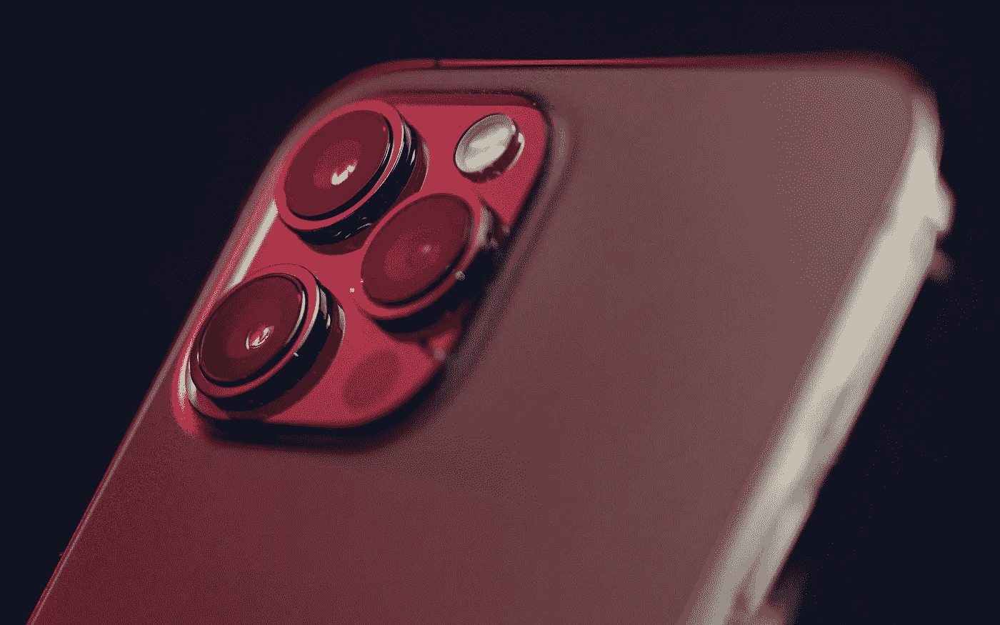

# iPhone 14 即将打破传统，人们的感觉已经很复杂了

> 原文：<https://medium.com/geekculture/the-iphone-14-is-about-to-break-tradition-and-feelings-are-already-mixed-9bc97202738e?source=collection_archive---------1----------------------->

## 未来，苹果会选择将大多数消费者视为二等公民吗？

Apple has been trying to make the iPhone Pro models more appealing for years and it looks like it will achieve just that with this year’s models, but at what cost for the mainstream market? (Image: The Registi, Unsplash)

所以！如果过去几周来自四面八方的大量消息还不足以让人们相信今年新 iPhones 会比预期的更早发布，那么现在…