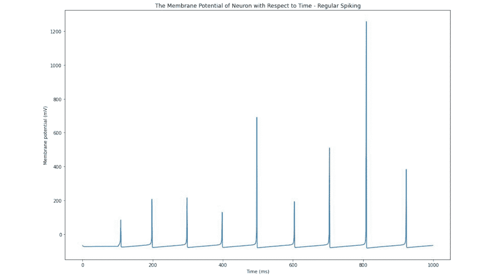

# Izhikevich 神经元模型

> 原文：<https://medium.com/geekculture/the-izhikevich-neuron-model-fb5d953b41e5?source=collection_archive---------6----------------------->

## 论文摘要:“尖峰神经元的简单模型”

The voltage of the Izhikevich Neuron Model. I created it myself and you can play around with it too!

> 论文作者:Eugene M. Izhikevich

# 旁注—纸面实施:

我实现了 Izhikevich 神经元模型！可以查看我的**实现网络**(带所有突触连接) [**这里**](https://colab.research.google.com/drive/17eU84AMpHetzTV57WqYIvCcoxkoSduxR?usp=sharing\) ！我还用所有的工具实现了神经元模型