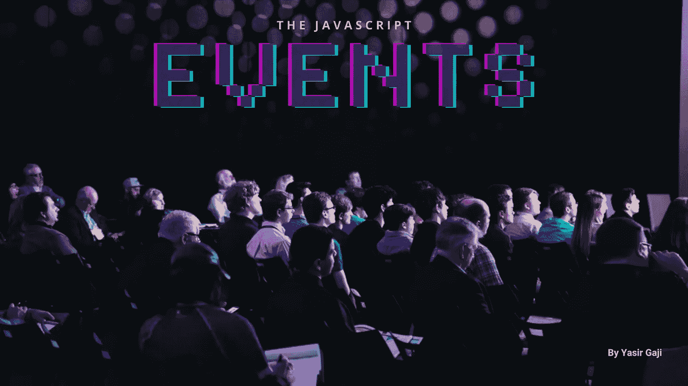
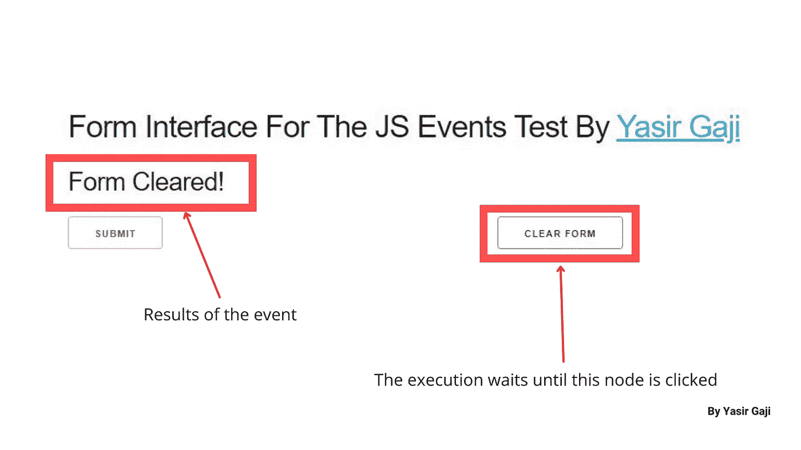
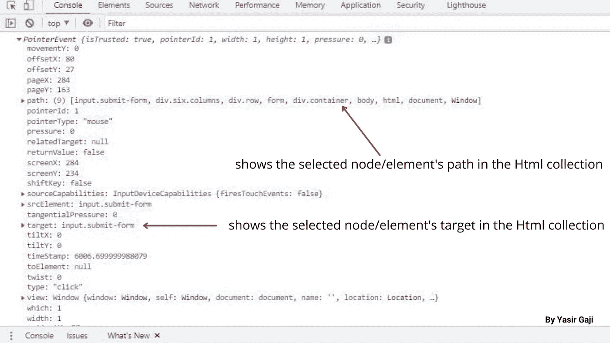

# Javascript 事件

> 原文：<https://medium.com/geekculture/the-javascript-events-4ba059bdacfe?source=collection_archive---------13----------------------->

> **事件发生在何时何地？**

这可能是一个编程和 Javascript 语言新手的想法，当然，这是一个非常好的问题。
但是 javascript 事件并不是你可能已经习惯的常规事件，它们并不在物理上或虚拟上发生，而是发生在 IDE*中，与任何网站、网络应用程序或用 javascript 构建的软件的界面进行交互。比如这个 ***中型*** 平台。*

**

*The JS EVENTS image By [**Yasir Gaji**](https://yasirgaji.com)*

*与接口交互是事件发生的地方，为了监听[***DOM***](/geekculture/being-the-don-of-the-dom-dod-a94f6eb9f6c3)*中的任何内容，使用`.addEventListener()`关键字并在监听事件后执行一个函数，如果它看起来很复杂，请不要担心，我会公正地处理它，到本文结束时，您应该明白了。**

**利用这个 [***接口***](https://the-js-events-test-interface.netlify.app/) 和它的 [***Html 集合***](https://gist.github.com/YasirGaji/453580a956c219dba1d6a112d399c920) 我们将了解我们拥有的 javascript 事件案例的类型以及如何最好地使用它们。**

# **第一个姿势**

**我们将研究**事件监听器**和**事件对象。****

## **事件监听器**

**这些基本上是 javascript 事件的最重要的方面，正如它们所暗示的那样，它们监听发生在 Html 集合中所选节点/元素上的事件以触发某些功能，并且我们绝对可以监听任何 [***DOM 事件***](/geekculture/don-of-the-dom-beta-749ab7ab563f) 方法。**

**例如，我们来听一下我们的 [***接口***](https://the-js-events-test-interface.netlify.app/)中提供的 [***Html 集合***](https://gist.github.com/YasirGaji/453580a956c219dba1d6a112d399c920) 中指定节点/元素上的`click`事件**

**Code representation of how event listers work by [**Yasir Gaji**](https://yasirgaji.com)**

**这几行代码从 [***Html 集合***](https://gist.github.com/YasirGaji/453580a956c219dba1d6a112d399c920) 中选择具有`clear-form`类名的节点，并向其添加一个事件监听器，该监听器接受两个参数，即`click`事件和命名函数`clearForm`。这意味着一旦点击了具有所选类名的节点/元素，就会执行`clearForm`函数。**

****

**Image representation of the code execution By [**Yasir Gaji**](https://yasirgaji.com)**

## **事件对象**

**Code representation of how to get the events object By [**Yasir Gaji**](https://yasirgaji.com)**

**正如在初始代码表示中一样，我们从 [***Html 集合***](https://gist.github.com/YasirGaji/453580a956c219dba1d6a112d399c920) 中监听所选查询上的`click`事件，一旦事件发生，我们就执行分配的函数，但是这里的函数会在控制台中打印出事件对象。**

****

**Image of the console showcasing the event object By [**Yasir Gaji**](https://yasirgaji.com)**

**这为在构建时选择对象中的任何参数提供了空间，例如，我们可以分别使用`e.path`和`e.target`在事件对象中定位路径或目标参数(表示事件发生的元素)。**

# **第二姿态**

**我们将调查**鼠标事件**和**键盘&输入事件****

## **鼠标事件**

**在第一个实例中，鼠标事件`click`用于引入主题，但是在本节中，我将引入更多的鼠标事件实例。**

**我们有:`dblclick` —双击事件、
`mousedown` —鼠标按下事件(单击并按住)、
`mouseup` —鼠标抬起事件(类似于单击事件，但不是，这在放开鼠标时触发)、
`mouseenter` —鼠标进入事件(一旦鼠标悬停在目标上就触发)、
`mouseleave` —鼠标离开事件(一旦鼠标离开指定环境就会触发)，
`mouseover` —鼠标悬停事件(类似于鼠标进入事件，但仅当在父目标中时触发)，
`mouseout` —鼠标离开事件(类似于鼠标离开事件，但不会对目标的子节点/元素生效)，
和`mousemove` —鼠标移动事件(当鼠标在其目标内和周围移动时触发)**

**举几个例子，当用 javascript 构建时，这些鼠标事件可以代替`click`事件来实现更动态的功能。**

## **键盘和输入事件**

**正如你可能猜到的，这些是基于键盘活动的事件，并且有很多这样的事件。**

**Code representation of dynamic rendering of the keyboard & input event by [**Yasir Gaji**](https://yasirgaji.com)**

**这几行代码将打印控制台中的每一个输入，这可能是监听`keydown`事件，然后选择并解析控制台中的每个输入值的结果。**

**我们有更多的键盘事件，如:`keyup`——按键上升事件(它的表现类似于按键下降事件，但只在不接触按键的情况下执行)，以及
`keypress`——按键按下事件(与按键上升和按键下降事件不同，一旦接触到按键，它会立即消失，这是我最喜欢的按键事件)。**

**我们也有一些输入事件，比如:`focus` —焦点事件(这是在输入之前点击输入域的内部)，以及`blur` —模糊事件(这是在输入域的外部被点击)，这里仅举几个例子。**

# **第三种姿态**

**我们将研究**事件冒泡**和**事件委派****

## **事件冒泡**

**这是从 ***DOM 中一个选中的节点/元素到其父节点/元素的冒泡事件。*****

## **事件委托**

**这就是我们在所选节点/元素的事件上实现逻辑以重定其子节点/元素的时候。**

# **结论**

**当用 javascript 构建时，事件**会发挥作用，抓住它们的核心很重要。它们可以直接实现，也可以动态实现到项目中。一定要提出问题来澄清和改正&建议，我期待他们。****