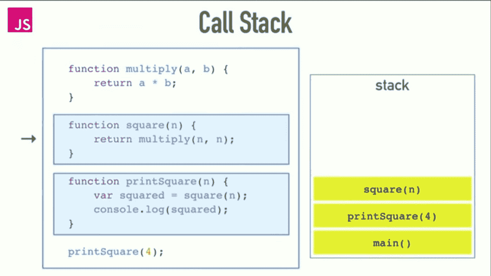
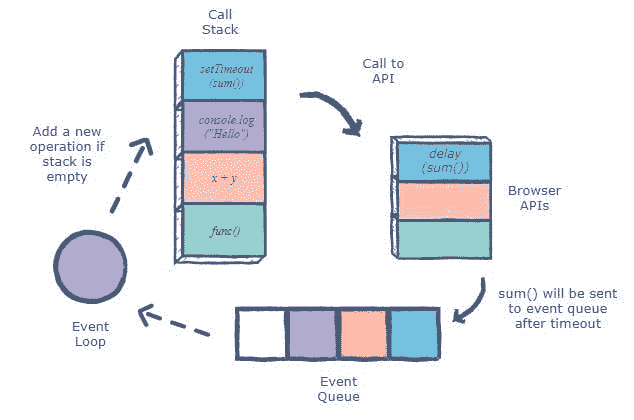

# JavaScript 中异步调用的旅程

> 原文：<https://medium.com/geekculture/the-journey-of-an-asynchronous-call-in-javascript-c96ebd193250?source=collection_archive---------31----------------------->

# JavaScript 中的同步操作

在 JavaScript 中，当执行很少的同步操作时，它们中的每一个都需要等到操作完成后才能执行。这意味着，无论前面的操作需要多长时间才能完成，一个操作都需要等待。

# 异步 JS

但是 javascript 中的异步操作却不是这样。异步操作不会阻止它后面的代码。异步操作与同步操作并行执行。

JavaScript 是一种单线程编程语言，但是使用少量的智能数据结构，我们就有了多线程的错觉。这一切是如何发生的非常美好。让我们开始吧。

我们将看看用于执行 javascript 程序的不同数据结构和构造。

# 调用栈

JavaScript 有一个调用栈，负责跟踪要执行的操作。每个要执行的操作都被添加到调用堆栈中。当一个操作被执行时，它被从调用栈中弹出。

# 浏览器 API

浏览器 API——内置于浏览器中的构造，位于 JavaScript 语言之上，允许您更轻松地实现功能。(来自 MDN)

浏览器内置了不同种类的 API。当从调用堆栈进行异步调用时，浏览器 API 为该调用启动自己的单线程操作。

# 回调队列

浏览器 API 带回的数据/回调被添加到回调队列中。

回调队列遵循队列数据结构来维护所有操作在调用堆栈中发送执行的正确顺序。

因此，我们有一个运行异步 javascript 代码的循环系统。

# 事件循环

事件循环有助于异步 javascript 代码的循环系统。它检查:

1.  如果调用堆栈为空
2.  事件队列具有数据/回调功能
3.  如果 1 和 2 为真，则回调队列中的数据/回调被添加到调用堆栈中

# 摘要

1.  操作调用被添加到调用堆栈中。首先执行同步调用。
2.  异步代码由浏览器 API 处理，它带回数据/回调函数。
3.  浏览器 API 带回的数据/回调被添加到回调队列中。
4.  事件循环检查调用堆栈是否空闲，以及回调是否有项目。如果是，则将回调队列中的项添加到调用堆栈中

一个美丽的圆圈就这样完成了！

*我希望你喜欢这本书。如果您有任何反馈，请在下面的评论中分享*