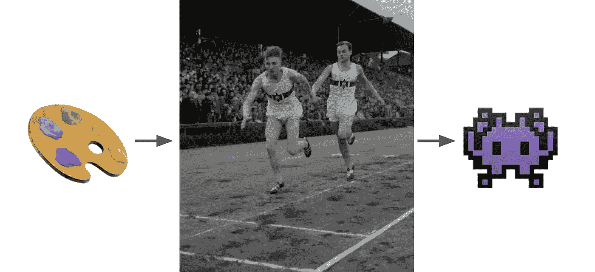

# 设计系统的门外汉指南(以及你现在如何开始一个)

> 原文：<https://medium.com/geekculture/the-laymans-guide-to-design-systems-and-how-you-can-start-one-now-20107dadbd05?source=collection_archive---------12----------------------->

A design system involves a lot of passing the baton, just like in a runner’s relay.

很多博客关注设计师的工具和技术，但我想帮助工程师、产品经理和创始人。为什么？因为他们是决定设计系统成败的人。这不仅仅是关于我们在 Figma 中的组件或与 Zeplin 的交接——最终用户只看到和使用您的工程师推出的东西。这是您的一站式商店…