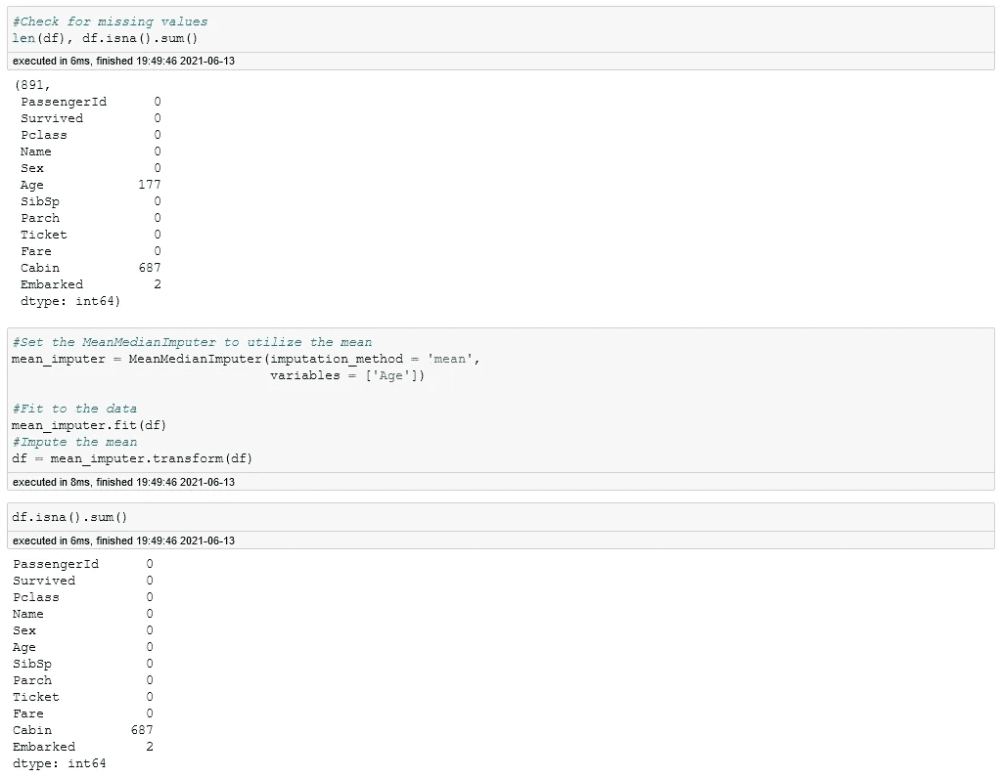
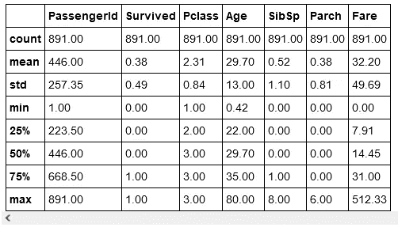
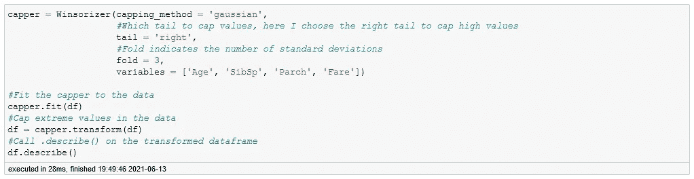
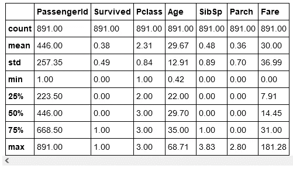
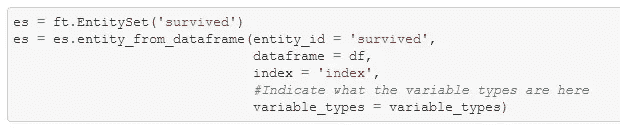
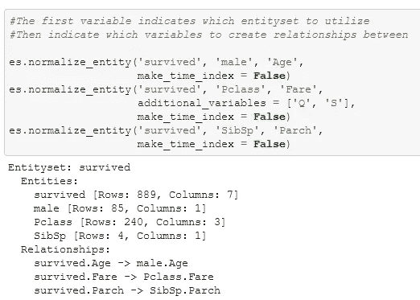
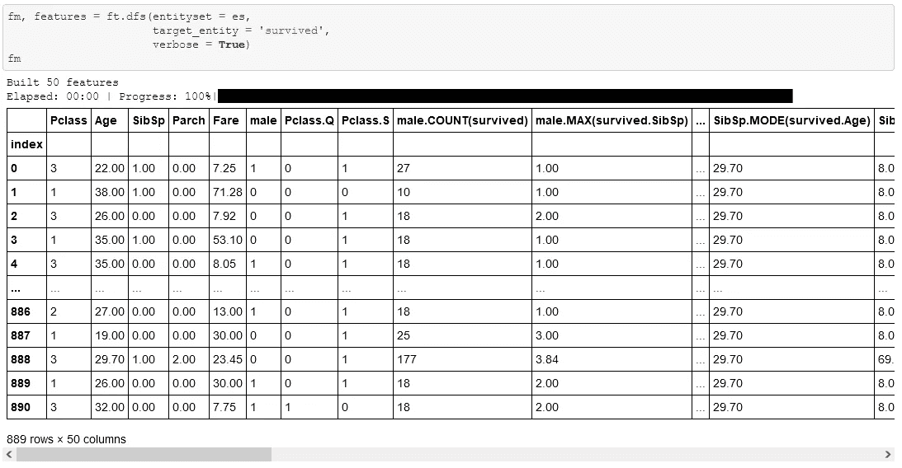
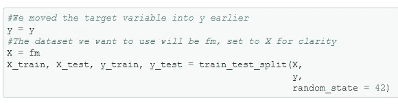
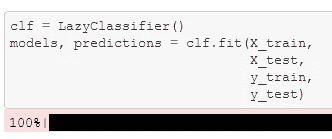
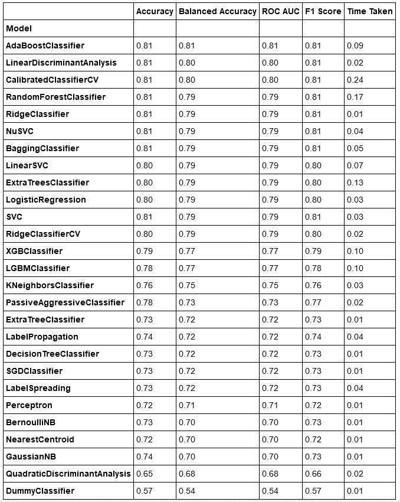

# 懒惰的 LazyPredict 预测:自动化 Python 库中的一个练习

> 原文：<https://medium.com/geekculture/the-lazy-lazypredict-prediction-an-exercise-in-automated-python-libraries-f1adb4cd3f5a?source=collection_archive---------34----------------------->

[LazyPredict](https://pypi.org/project/lazypredict/) 是一个优秀的工具，它可以自动运行不同类型模型的数据，并返回每个模型的性能信息。这是一个很好的工具，可以节省时间，否则将花费在手工测试不同的模型上。然而，当我查看这个库时，我不禁想知道利用 python 库我还能做些什么。

最终，我登陆了[特征引擎](https://pypi.org/project/feature-engine/)和[特征工具](https://pypi.org/project/featuretools/)，进行 EDA(探索性数据分析)和特征工程。有了这两个库和 LazyPredict，我做了一个名为“懒惰的 LazyPredict 预测”的小练习

# 懒惰的懒惰预测

Image by [Tim De Pauw](https://unsplash.com/@tmdpw) from [Unsplash](https://unsplash.com)

这提供了我所经历的过程的概述，为了更深入地了解，完整的笔记本可以在[这个资源库](https://github.com/ismizu/Lazy_LazyPredict)中找到。

对于这个项目，我决定使用 [Kaggle 的](https://www.kaggle.com/) [泰坦尼克号数据集](https://www.kaggle.com/c/titanic)。

打开数据后，我首先查看缺失(NaN)值。快速检查显示有相当多的东西因年代久远而丢失。虽然根据不同的分类器估算年龄，例如:每个乘客等级或票价的平均年龄，可能会估算出更准确的值，但我认为这不符合本项目的精神。因此，我简单地利用了功能引擎中的 MeanMedianImputer。

Checking the sum of NaN values before/after imputing

在为缺失的年龄估算了一个值后，我把船舱和上船的两行都丢了。

## 使用极端值

处理完缺失信息后，我转向了极端值。极值可能会扭曲模型预测，因为模型会尝试使用不同范围的值。解决这个问题的一种方法是限制值在某一点停止，这是 Feature Engine 允许的。

df.describe() results

打电话。在数据帧上描述()，我看了一下不同的值。看起来 Age、SibSp、Parch 和 Fare 有一些特别高的值。

例如，年龄变量。平均值为 29.70，第 75 百分位为 35。然而，最大值是 80。其他变量在最大值和其余值之间包含类似的差距。特别是票价，最大值为 512 英镑，而平均值为 32.20 英镑。

所以，是时候用功能引擎的 Winsorizer 做一点价值封顶了。

Running Winsorizer

做完这个，我打了电话。再次在数据帧上描述()并获得以下结果:

df.describe() post Winsorizer

这成功地将极值降低到平均值的最大三倍标准差。例如，Fare 以前的最大值是 512.33，但现在是 181.28。

## 特征工程

最后，谈到特征工程。为此，我利用了特征工具库。

首先，我创建了一个字典，告诉特征工具每一列是什么类型的数据。这是为了允许特征工程功能识别它应该进行什么样的交互。我将它赋给变量“variable_types ”,然后使用这些类型为特征工具设置一个实体。

Creating a new EntitySet

接下来，使用基本实体集，我创建了一些关系，我希望 Feature Tool 的深度特征合成能够从中探索和创建特征。

Relationship Between Variables

现在，剩下要做的就是运行深度特征合成工具来创建新的特征！

New table showing 50 columns

在此之前，经过数据清理和删除列，我最终获得了 8 个特性。然而，在运行 Feature Tool 的深度特征合成后，我最终得到了 50 个特征。这听起来很棒，但是这在模型中表现如何呢？是时候做些懒惰的预测了。

## 使用惰性预测测试模型

首先，我利用 sklearn 的 train_test_split 将我的数据分割成一个训练/测试分割。

Train/Test Split

接下来，我实例化了 LazyClassifer 并使用我的数据运行它。另外，LazyClassifier 会自动对数据进行缩放等操作。由于该过程可能与您选择的缩放/归一化数据的方式不同，因此最终结果可能会在您的最终模型中有所不同。

LazyClassifer

最后，我查看了输出。

LazyClassifier Output

看起来我将使用 Ada Boost 分类器！

## 最终注释

利用特征工具、特征引擎和惰性预测，我能够缩小模型的使用范围，并设计出一系列新特征。

本着几乎只使用三个库的精神，我忽略了一些项目，但总的来说，我对结果很满意。

这只是对这些库的功能，尤其是特性工具的一个简单介绍。用它们可以做更多的事情，它们都为它们的特性提供了广泛的笔记本教程，我期待着进一步深入研究。对于那些好奇的人来说，这里是以下内容的教程页面:
- [特征工具](https://github.com/alteryx/open_source_demos)-
-[特征引擎](https://nbviewer.jupyter.org/github/solegalli/feature_engine/tree/master/examples/)