# 选择最佳游戏鼠标的左撇子体验

> 原文：<https://medium.com/geekculture/the-lefty-experience-of-choosing-the-best-gaming-mouse-62fc878459ca?source=collection_archive---------8----------------------->

## 作为左撇子，寻找完美的游戏鼠标是一场全新的战斗，发现我认识的所有左撇子都在右手使用鼠标对我来说是新闻。

[Photo by Pixabay from Pexels](https://www.pexels.com/photo/room-chair-lot-356065/)

从右手扶手椅到开罐器，在一个右撇子的世界里，左撇子可能是一件麻烦事。

# 为自己寻找完美的鼠标是一场全新的战斗。

我知道这很肤浅，但是发现我认识的所有左撇子都在右手使用鼠标对我来说是新闻。我认识的人中，没有人会费力地为右手使用游戏鼠标，也没有人会在尝试新游戏时费力地重新映射他们所有的控制。

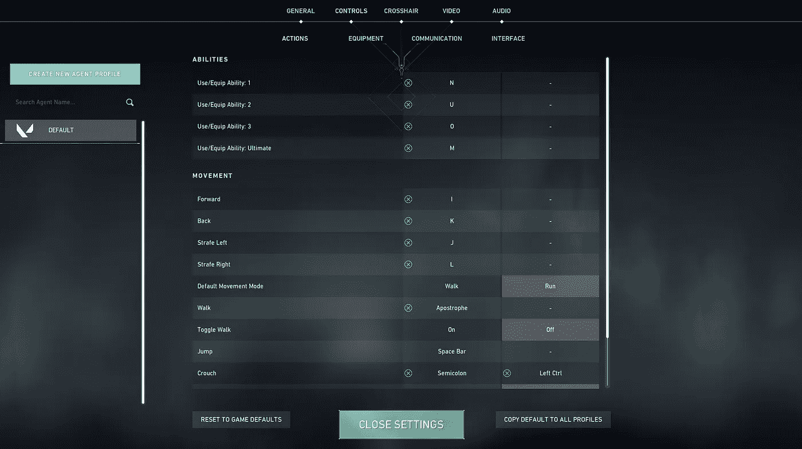

This is what my control scheme looks like for most games if I ever wanted to try something new.

## 突然，我不能向任何人寻求鼠标推荐。他们没有共同的奋斗。

用谷歌搜索一下，**我发现鼠标放在右边的左撇子比我想象的要多**。肯辛顿进行了一项 [LinkedIn 民意调查](https://www.kensington.com/news/ergonomic-workspace-blog/left-handed-mousing-can-be-for-anyone/)，问题是*“你的惯用手是什么，你用哪只手鼠标？”*

## 这一行足够告诉我:

> 只有 23%的受访者是左撇子。在肯辛顿民意调查的所有受访者中，19%的左撇子使用鼠标右键，而只有 4%的人使用鼠标左键。

# 是我做大量研究的时候了。

我知道我可以买一个普通的鼠标就完事了，但是**我想要一个可以长期使用的东西**。我已经受够了以前用的摇摇晃晃的老鼠。我想让自己过得更好。

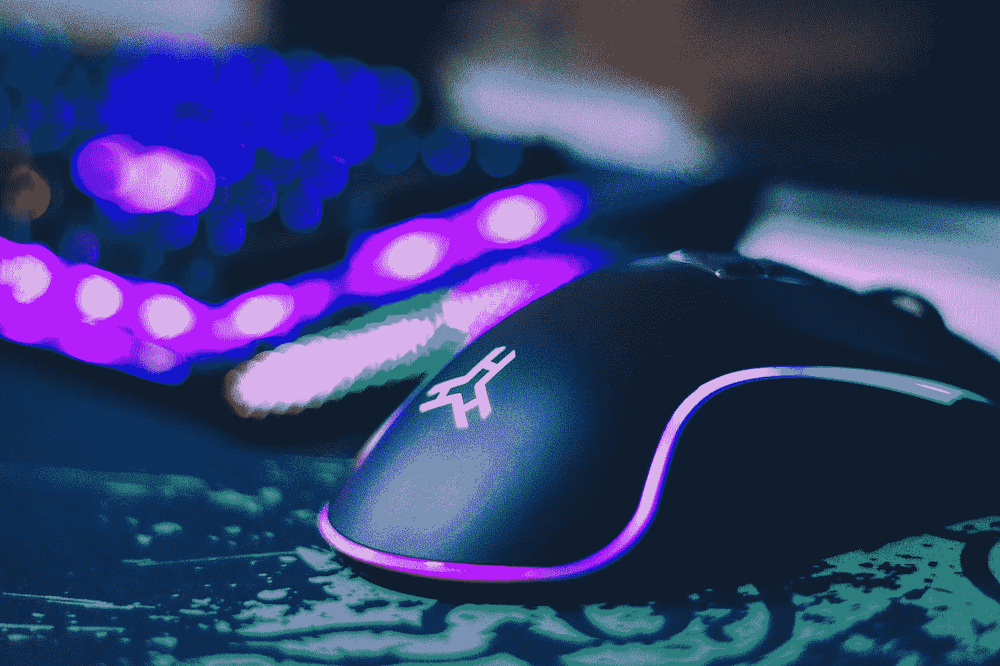

[Photo by John Petalcurin from Pexels](https://www.pexels.com/photo/close-up-photo-of-gaming-mouse-2115256/)

最初，我想要一个形状适合我的手的无线鼠标。我期待的附加功能是侧按钮、更轻的重量，也许是……*负担得起的东西。*

## 好吧，对一只老鼠来说这要求似乎太多了。

但我是一个每天花超过一半时间在电脑上的人，因为我是一名游戏开发人员，我的爱好——不出所料——包括视频游戏。对于像我这样的人来说，买一个物有所值的鼠标是一笔不错的投资。

除此之外，我用过的很多老款鼠标都用了一段时间，但它们并不舒服。

我拥有的最好的是 *Razer Ouroboros* 。它又重又笨，而且很贵。然而，它很适合我的手握，只要我忽略偶尔我撞到它的尖边时会感到的挤压。

## 自从鼠标出现双击问题后，我使用它的时间就缩短了。

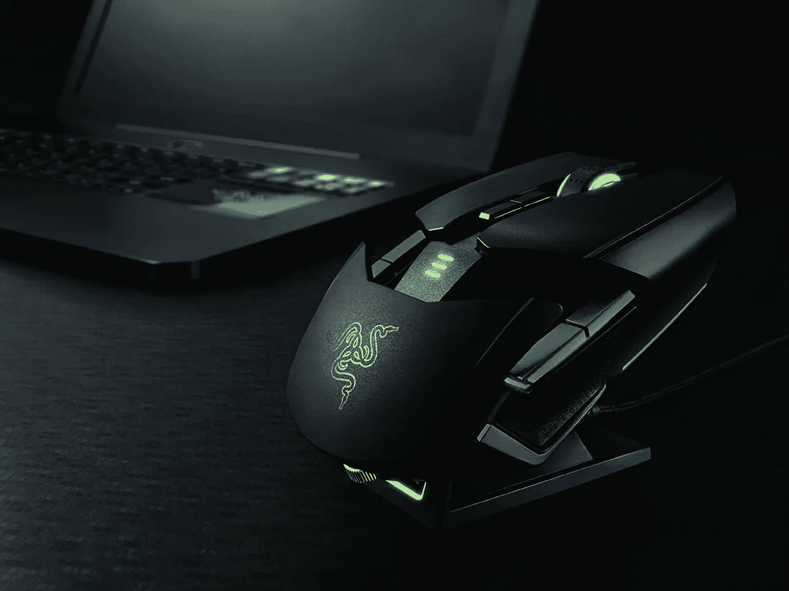

*The Razer Ouroboros was great for its time, really, it was just a bit too heavy (and pointy).* [*Photo credit*](https://images-na.ssl-images-amazon.com/images/G/01/apparel/rcxgs/tile._CB483369110_.gif)

## 显然，Razer Ouroboros 远非完美的左撇子鼠标。

所以我寻找真爱的下一步将是在互联网上四处窥探。我在各种社交媒体和网站上寻找其他左撇子认为最适合他们的鼠标。从那以后，很明显我的选择会受到限制。

**唯一为左撇子设计的外设来自 Razer 的左手鼠标系列。**

Razer’s leftie mice are notoriously difficult to get and ridiculously expensive to boot. [Photo credit](https://www.razer.com/gaming-mice/razer-naga-left-handed-edition)

## 于是，我把搜索范围缩小到了双手灵巧的老鼠。

没多久我就发现了*另一个*第一世界的问题。

有各种各样的鼠标，但大多数鼠标都只有左边的按钮。起初，我并不认为这是什么大问题。像*罗技 G304* 和*荣耀无线模型*这样的设备看起来是很棒而且负担得起的选择。

的确是这样，但我觉得我会为我无法使用的功能支付额外的费用。作为左撇子，我无法使用单面按钮。

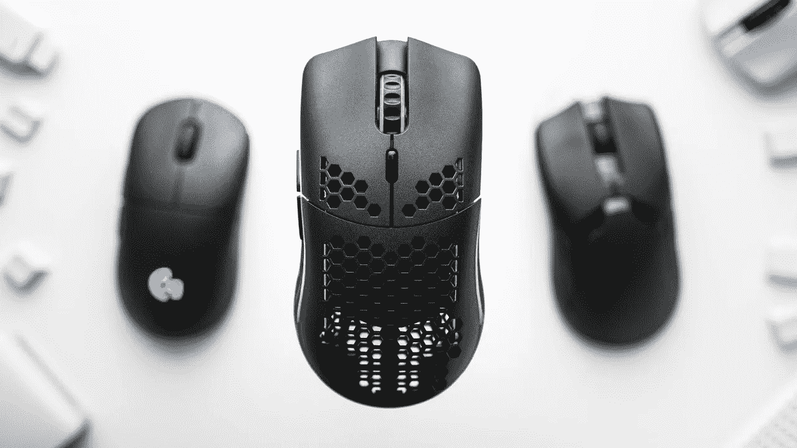

*This could have been such a great mouse, if only it had more buttons…* [*Photo credit*](https://www.youtube.com/watch?v=0G9qumk_VJg)

## 这促使我加倍搜索。我想要一台可以充分利用其功能的设备。

于是，我决定开始测量我的手的尺寸。我还确定了我经常使用的鼠标类型，以确保一切对我来说都是完美的。

我打算在疫情最热的时候买一个鼠标，所以去商店测试我的选择是不可能的。我只能相信我做了足够好的研究。

在长时间阅读和疯狂观看评论视频后，我找到了我可能的竞争者。幸运的是，肯定有更符合标准的选项。

[Photo by Karolina Grabowska from Pexels](https://www.pexels.com/photo/unrecognizable-man-holding-wallet-with-money-4386421/)

## 不幸的是，它们都很贵。

但是我自己想要一个好的鼠标，而且我有办法为它支付一些钱。最终，我决定为我的下一个鼠标更深入地研究这些候选者。

# 介绍竞争者:

## 1.罗技 G Pro 无线

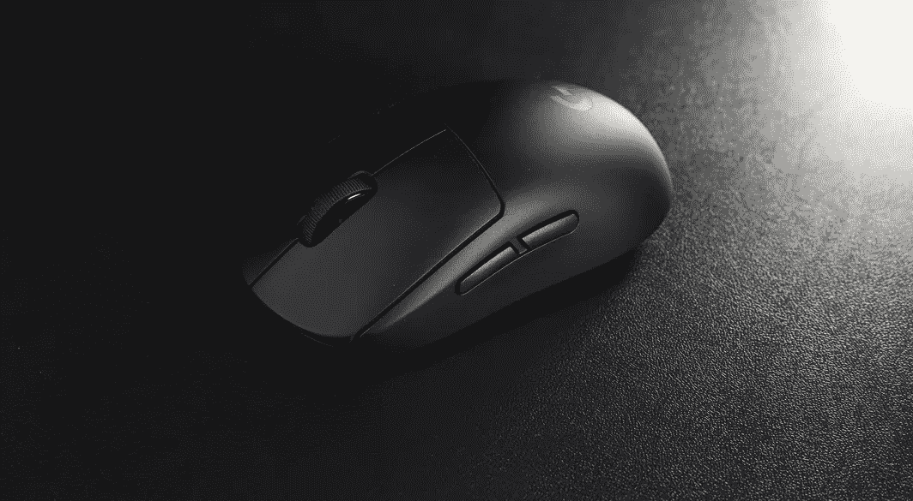

One of the most popular gaming mice of 2018 makes a comeback. [Photo credit](http://cdn.shopify.com/s/files/1/0459/1157/2630/products/LogitechGProWirelessskinswrapsmodsSurfaceGaming_Base_6c770a1c-d24e-421b-910c-f5eb49d254bc_1200x1200.jpg?v=1601776216)

## **2。雷蛇蝰蛇终极**

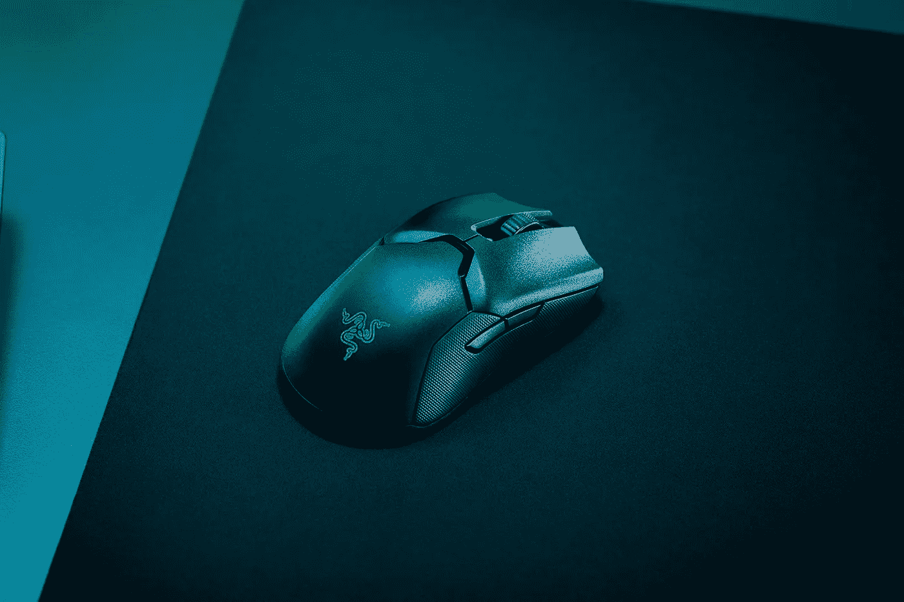

The ever popular Razer Viper Ultimate may be a no-brainer. [Photo credit](https://www.razer.com/gaming-mice/razer-viper-ultimate)

## **3。华硕 ROG Pugio II**

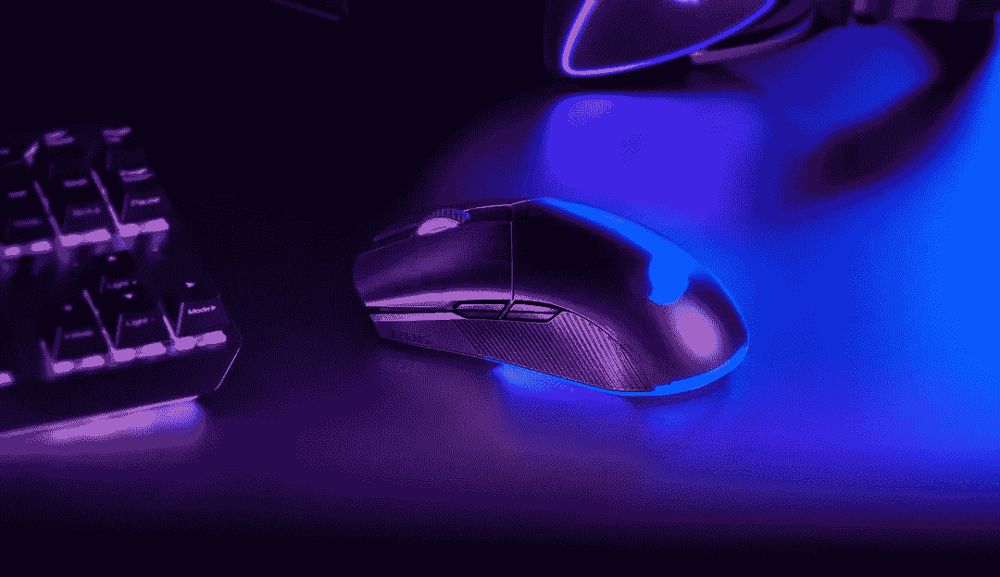

The Asus ROG Pugio II is an unexpected contender. [Photo credit](https://dlcdnimgs.asus.com/websites/global/products/7yzfgrbhnmgxweaa/img/bg-header-m.jpg)

## **候选人并不意外，除了我不知从哪里找来的*华硕* *普吉欧 II* 。**

关于它的评论很少，不像前两只老鼠因为受欢迎而被大量报道。对于 Razer Viper Ultimate 来说尤其如此，因为在当时，它是一款无与伦比的轻型无线游戏鼠标。

当我浏览每一个竞争者时，我决定创建一个小的电子表格，让自己粗略地看一下每一款鼠标能提供什么。

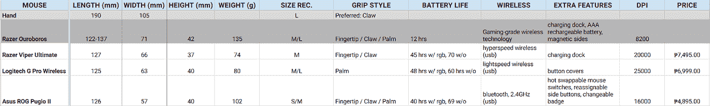

*The prices listed were how much they cost at the time I was choosing between them, around mid 2020\. In USD, they would be $143.44, $133.95, and $93.68 respectively. Specs for each mouse can be found here:* [*Ouroboros*](https://www.whatmouse.com/razer-ouroboros-specs/)*,* [*Viper*](https://www.razer.com/gaming-mice/razer-viper-ultimate)*,* [*GPW*](https://www.logitechg.com/en-ph/products/gaming-mice/pro-wireless-mouse.910-005274.html)*,* [*Pugio II*](https://rog.asus.com/ph/mice-mouse-pads/mice/ambidextrous/rog-pugio-ii-model/)

仅凭这些信息，你可能会认为华硕 ROG 普吉欧 II(T2)会是一个容易的选择，因为它有额外的功能，同时也是三款中最便宜的。但事实并非如此。它是最重的鼠标，具有最差的传感器，最低的电池寿命，以及最长的延迟。

## **另一方面，*罗技 G Pro 无线*确实有很好的规格，但功能集令人印象深刻。**

它也是老鼠中最老的模型。知道了这一点，我期待它现在会更便宜。然而，它的价格仍然类似于最近的 *Razer Viper Ultimate。但是有了类似的规格，我想这是可以理解的。*

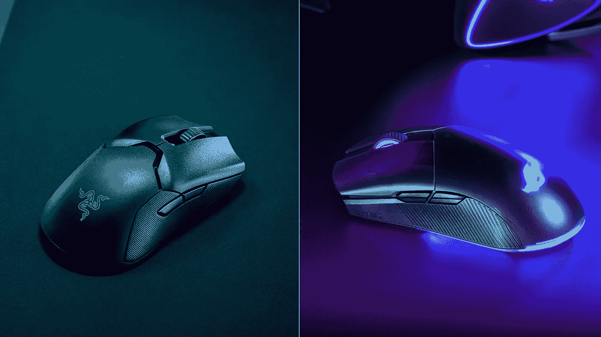

On the left is the Razer Viper Ultimate — [Photo credit](https://www.razer.com/gaming-mice/razer-viper-ultimate), and on the right is the Asus ROG Pugio II — [Photo credit](https://dlcdnimgs.asus.com/websites/global/products/7yzfgrbhnmgxweaa/img/bg-header-m.jpg)

尽管*罗技 G Pro Wireless* 与 *Razer Viper Ultimate* ，**我发现自己在*华硕 ROG Pugio II* 和 *Razer Viper Ultimate* 而不是*之间来回穿梭。***

华硕 ROG Pugio II 为其价格提供的额外功能听起来很棒。然而， *Razer Viper Ultimate* 的轻质和令人印象深刻的外形也不是我想要传递的东西。我厌倦了拿着较重的鼠标，我觉得轻量级的鼠标会给我带来巨大的变化。

# 最终，我选择了 *Razer Viper Ultimate* ，尽管它的价格太高。

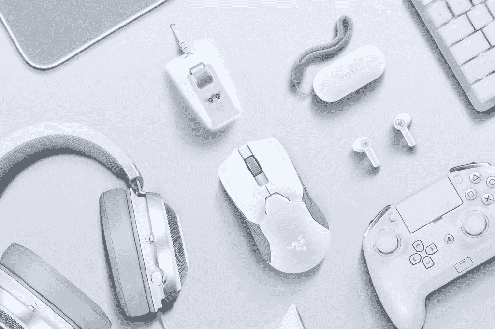

[Photo credit](https://cdn.shopify.com/s/files/1/0355/8296/7943/products/as_b8035e35-bf2c-4cdf-97c5-3de8424c1edc_500x.jpg?v=1608784514)

我的决定更加坚定，因为这款设备的规格最符合我的个人喜好。它略微扁平的形状与我通常的爪子握持方式相得益彰，大小似乎很适合我的手，我对更轻鼠标的偏好严重影响了我拿起它。更不用说，它还拥有最长的电池寿命。

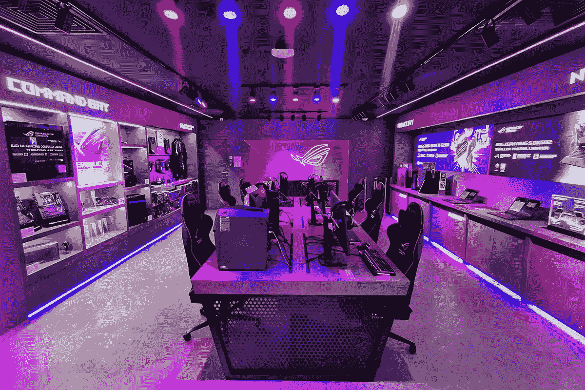

[Photo credit](https://dlcdnimgs.asus.com/websites/SG/aboutasus/ROGStoreBugis/IMG_20200624_175107.jpg)

**如果不是因为疫情关闭商店，我很想测试一下*华硕 ROG Pugio II* ，看看我会如何使用它。**但是现在*雷蛇* *蝰蛇终极*在我手里，我觉得我根本回不去一个更重的设备。

## 我的关键要点:**在购物前了解自己的喜好**。

我花了一段时间才做出决定，我不后悔。如果你不知道自己在做什么，因为害怕错过“下一个最好的事情”而加入下一个潮流可能不值得。

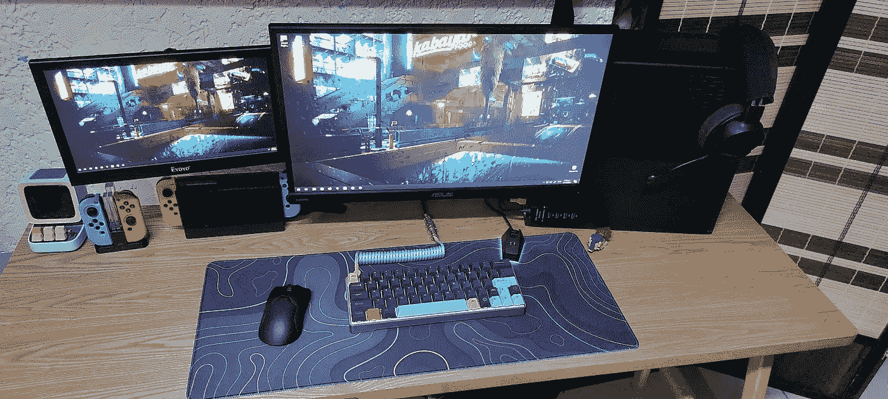

Whenever I send images of my setup, people always notice that my mouse is on the “wrong” side.

## 另一件不断浮现在我脑海中的事情是，在一个为大多数人构建的世界里，作为一名左撇子要进行一场艰苦的斗争。

**如果我在买鼠标前不需要考虑我的左撇子，一切都会更便宜和方便。**

你可能不同意我的最终决定，但最终一切都取决于你个人的喜好。尽管如此，我还是乐于在市场上发现新的游戏鼠标，并找出最适合我的鼠标。

我希望我的经历也能给我的一些左撇子朋友一些关于他们下一次购买的见解。