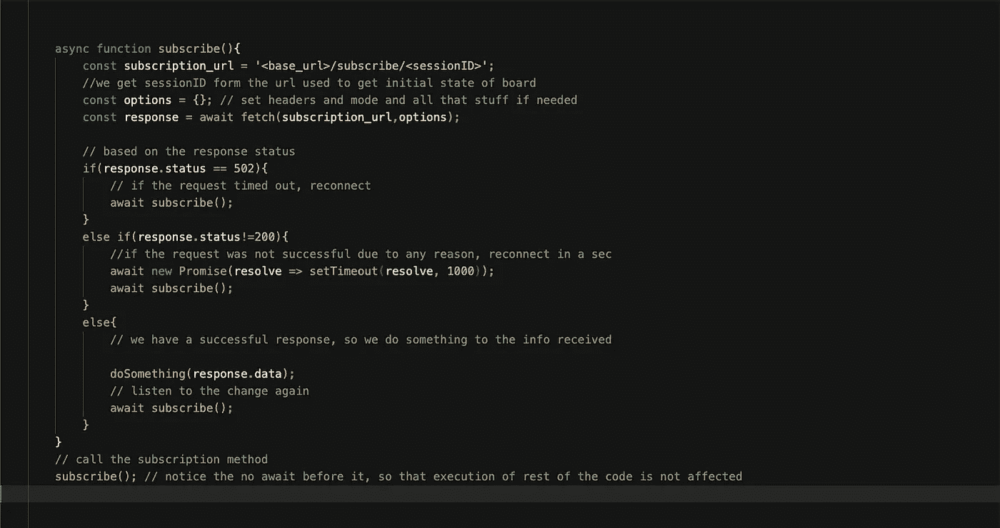
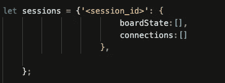
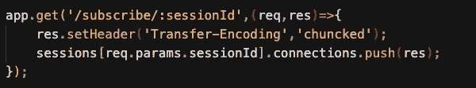
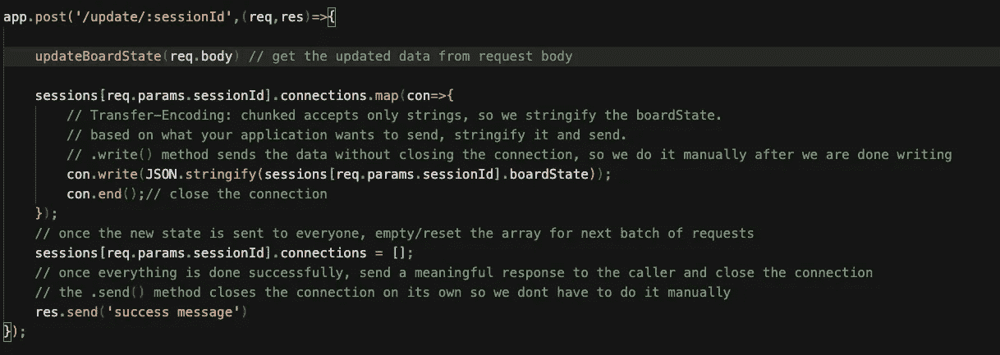

# 漫长的投票之路

> 原文：<https://medium.com/geekculture/the-long-polling-way-ca0b2034e4c5?source=collection_archive---------24----------------------->

请允许我带您进行一次有趣的旅程，它让我对什么是长轮询以及它在 javascript 中实现的简单性有了惊人的了解。现在，我不会过多关注代码质量，因为这个博客的主要目的是介绍这个想法，我会让你决定你想要使用的设计原则。那么，有了这个免责声明，让我们开始吧。

所以，我真的很无聊，想创建一个简单但很酷的项目来取乐，也许还能学到一些新技术。下面是我想做的问题陈述:“给定一个共同的棋盘配置，比如说‘n’个人，如果其中一个用户点击了棋盘上的任何一个方块，它会改变所有用户的方块颜色。”

相当简单的想法，对不对？只需创建一个电路板实例，并创建一个唯一的会话来存储电路板的状态，所有使用该会话 id 访问 API 的用户都可以看到电路板的状态，并根据活动不断更新电路板。但是，如何将一个用户对对象状态的更改反映给该会话中的其他所有人呢？

你可能想到的第一件事(我的意思是我想到的第一个解决方案)是打开一个 get 请求，直到我们从另一个进程得到一个事件`updated`。一旦我们得到 updated 事件，我们就将对每个请求的响应发送给那个 get 请求。但问题是，在 node 中，每个处理请求的函数都是阻塞的，这基本上意味着如果我进行 get 调用，除非该函数执行完毕，否则我们无法真正调用另一个处理程序，这意味着，如何以及在哪里发送该事件是一个问题，服务器在这一点上相当挂起。

**解决方案:**

经过几分钟的思考，我意识到我试图解决的问题是谷歌文档已经在使用的(在某种程度上..).经过一些研究(我说的研究是指 stackoverflow 和 medium posts)，我发现了两种可能的解决方法..

1.  使用 websocket
2.  使用所谓的长轮询(这是本博客的主题)

所以，让我们把套接字实现留到以后，来讨论简单而直观的长轮询方法。

你问什么是长轮询…..

嗯， ***基本上就是收集一个端点上的所有请求，一旦有东西要发送给客户端就发送响应，同时保持连接一直打开*** 。现在，我花了相当多的时间在谷歌文档的网络调用上，我没有看到任何开放的请求，但更多的是周期性的调用，所以我认为他们处理它的方式可能是不同的(我将试图找出这一点，也许是另一个博客的主题，也是操作转换算法)。但对我来说，这似乎是一个可行的解决方案。

现在让我们跳到有趣的部分..节点中的实现

所以，接下来是这个想法—

*   请求新板时，创建一个新的唯一 sessionID，并将其用作存储板状态、更改和 subscribed_requests 的键
*   对于观察特定会话的板的每个客户端，订阅每当板的状态改变时给出板状态的端点，基本上监听板的状态改变
*   一旦一个用户触发了更新，就改变板状态，并且发送新的板状态或者仅仅发送对该会话的所有打开的请求所做的改变
*   关闭请求并清除 subscribed_requests 数组/队列
*   所有客户端再次调用订阅端点，并再次监控板状态的变化

该实现将有两个方面，一方面，服务器可以接受大量打开的请求，并跟踪会话的打开请求，另一方面，客户端可以订阅电路板状态的变化。

**前端订阅代码:**

前端实际上只需要有一个服务订阅功能。假设我们有一个`<base_url>/subscribe`端点，前端订阅该端点来监听对板状态所做的更改。

the frontend function to subscribe to change

fetch()用于对 API 进行 get 调用。

让我们讨论事情的后端，完成完成事情的整个周期..

**事情的后端:**

在后端，我们有两个感兴趣的端点..一个是接收和收集特定会话的所有请求，另一个是在更改时触发，发送对所有收集的请求的响应并关闭连接。

这里为了简单起见，让我们用一个全局散列表来跟踪会话。每个会话包含以下数据—

the sessions hashmap to track changes

我们将每个请求推送到连接阵列，板状态是当前的板状态，如果发生更改，将作为响应发送给所有客户端。

1.  订阅获取端点:

the subscribe endpoint to collect the requests

上面的函数相当简单，当客户端点击订阅端点时，我们只是将它存储在 connections 数组中，而不关闭连接(在 dev tools 的 network 选项卡中，这将显示为 pending 状态)。

2.更新端点:

该端点负责对板状态所做的更改。一旦这被触发，板状态被更新，所有未决的请求被给予响应，并且连接被关闭。前端的 subscribe 函数接收这个响应，并向 subscribe 端点重新发送 get 请求，以便能够再次侦听更改(如果有)。

the update endpoint

post 调用是由前端在状态发生变化时发出的(在我的例子中，它是在点击事件时发出的)。正文包含变更的所有必要信息。在 doc 类 app 的情况下，可能是字符变化和位置变化)。

一旦状态更新完成并且新状态传播到所有客户端，连接就关闭(network 选项卡现在将显示一些状态代码，UI 将根据您对 frontend 的 subscribe()中的响应所做的操作进行更新)。

这样，我们就完成了订阅更改的整个循环，并且能够将更改反映给正在收听更改的每个客户端。下一步是在多个用户试图访问和改变状态的情况下如何处理冲突。这个问题值得拥有自己的博客，它的工作方式非常有趣。

到目前为止，您已经看到了如何创建一个应用程序，您可以在其中进行更改，并将其反映给所有查看公告板的客户。你可以创建一个限制，只有你可以改变，其他人只能看着它。

**概念实现项目思路:**

1.  创建一个笔记应用程序，您可以在其中键入内容，并且您的朋友可以看到您正在键入的内容。
2.  创建一个 3x3 井字游戏，你可以和你的朋友一起玩..

我希望这是一个有趣的阅读..敬请关注更多此类内容。祝你新年快乐！