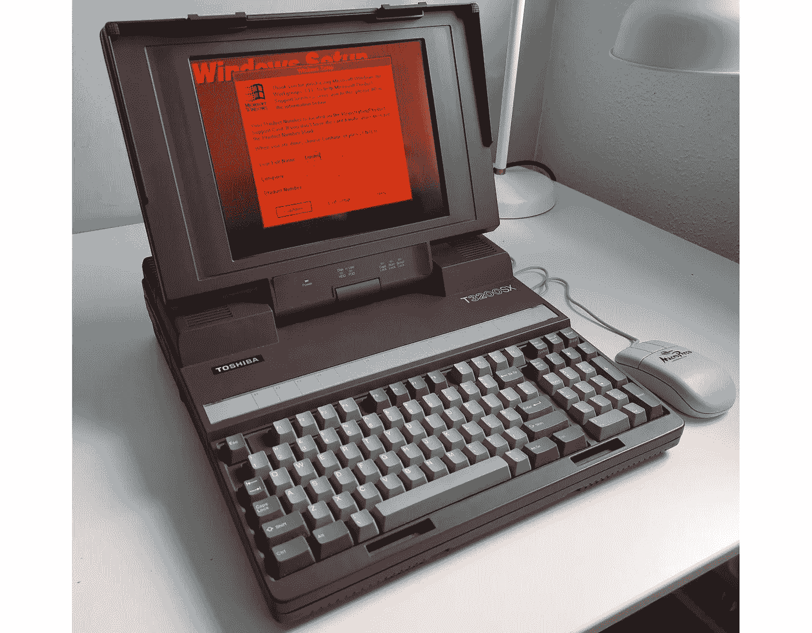

# “便携”笔记本电脑，今天看起来怎么样？第二部分—1989 年的东芝 T3200

> 原文：<https://medium.com/geekculture/the-luggable-laptop-how-does-it-look-today-part-ii-toshiba-t3200-from-1989-6d15ce56eadd?source=collection_archive---------1----------------------->

现在每个人都能买得起笔记本电脑。但是这个时代是怎么开始的呢？让我们回到便携式电脑又大又重又贵的时代。这是 1989 年的东芝 T3200SX 一台“便携式”电脑，配有 1MB 内存、40 MB 硬盘和华丽的 640x480 16 灰色阴影气体等离子屏幕:

