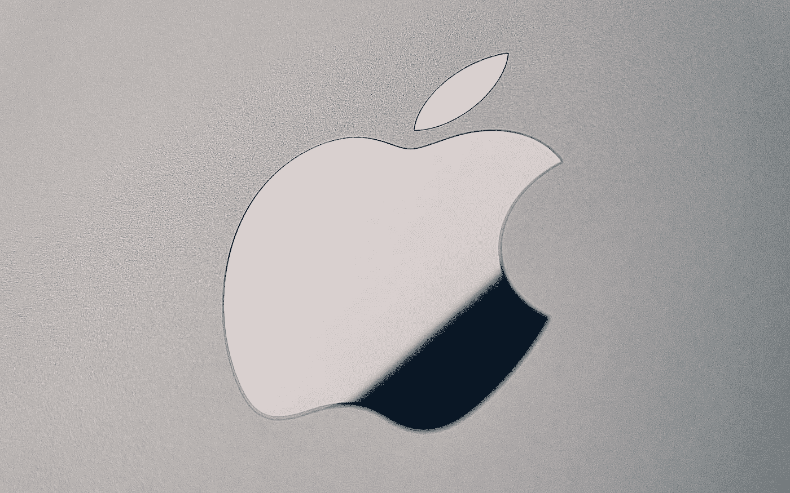

# 我们都需要的 M1、未来和苹果

> 原文：<https://medium.com/geekculture/the-m1-the-future-and-the-apple-we-all-need-8bc5068f4a10?source=collection_archive---------5----------------------->

## 蒂姆·库克和他的团队拥有创造历史的独特机会——问题是，他们会抓住这个机会吗？

Apple has done some amazing work with its silicon. Now it’s time to prove that it understands how it can bring about real change in the world by thinking of consumers first. (Image: Alex Kalinin, Unsplash)

苹果发布[其 M1 超处理器和新的 Mac 工作室](/geekculture/apple-breaks-new-ground-in-performance-with-the-mac-studio-3d1cc3624f44)已经一周了——由于各种原因在整个个人电脑行业掀起了波澜——但我们许多人仍在努力思考…