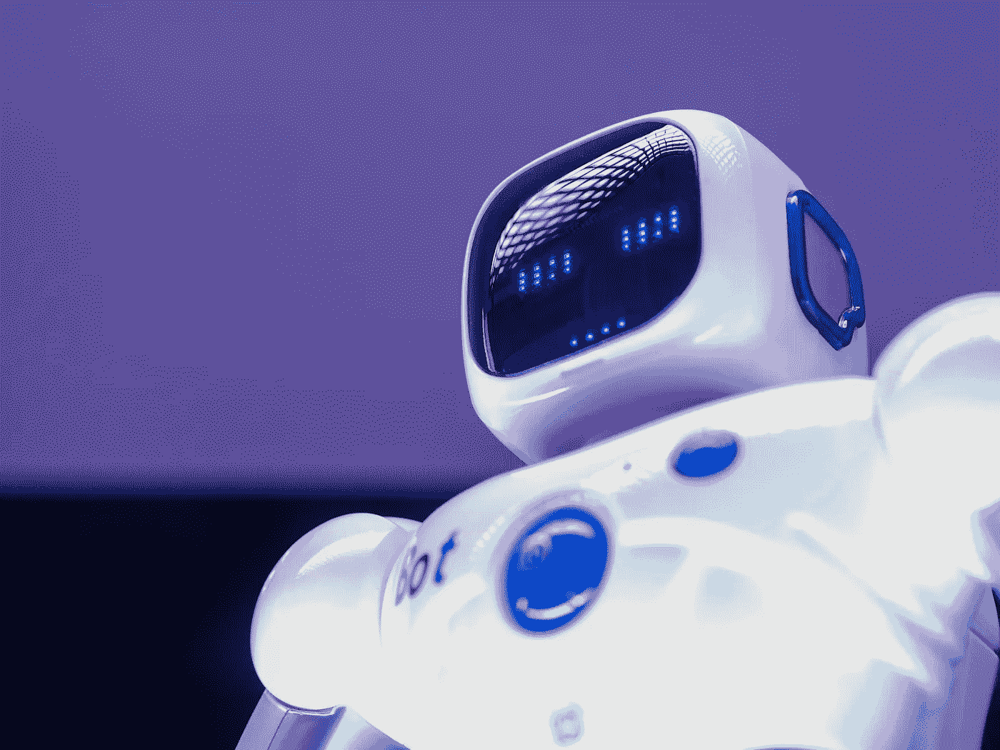

# 机器来找我们了！

> 原文：<https://medium.com/geekculture/the-machines-are-coming-for-us-f97274cb428c?source=collection_archive---------55----------------------->

## 而未来看起来…无聊？！

Photo by [Kindel Media](https://www.pexels.com/@kindelmedia?utm_content=attributionCopyText&utm_medium=referral&utm_source=pexels) from [Pexels](https://www.pexels.com/photo/low-angle-shot-of-robot-8566526/?utm_content=attributionCopyText&utm_medium=referral&utm_source=pexels)

从我记事起，我们就一直被警告机器的崛起以及这可能意味着什么。诚然，当我还是个孩子的时候(当时还太小，看不了 18 级电影)，这些警告有点不可思议，因为博弈论计算机系统控制了现实世界的核武器，有自我意识的未来机器人及时回来杀死了他们的克星……