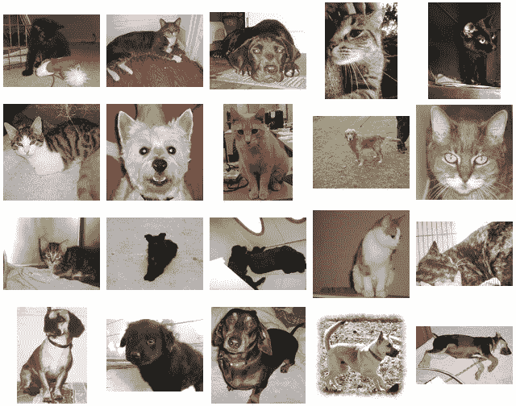
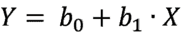

# 前馈的魔力。PyTorch 深度学习第 3 部分

> 原文：<https://medium.com/geekculture/the-magic-of-feed-forward-deep-learning-with-pytorch-part-3-2135aa74cb38?source=collection_archive---------21----------------------->

## 征服深度学习的基础

Photo by [Ahmed Hasan](https://unsplash.com/@carsive?utm_source=medium&utm_medium=referral) on [Unsplash](https://unsplash.com?utm_source=medium&utm_medium=referral)

知道什么是人工神经网络(ANN)是一回事，知道它实际上如何工作是另一回事。如果你想利用深度学习来构建酷项目，理解人工神经网络是必不可少的。ann 的概念可以应用于几乎所有其他类型的神经网络。谈到人工神经网络，有两个主要概念需要理解:**前馈和反向传播。**这两个概念都需要大量的深入理解，所以我会把它们拆分成不同的文章。在本文中，我们将接触前馈概念。公平的警告，为了理解前馈，你需要理解基本的矩阵/向量运算。如果你需要复习，这里有一些参考资料:[基础矩阵运算复习](http://math.mit.edu/~dyatlov/54summer10/matalg.pdf)。

Photo by [Uriel SC](https://unsplash.com/@urielsc26?utm_source=medium&utm_medium=referral) on [Unsplash](https://unsplash.com?utm_source=medium&utm_medium=referral)

# 前馈

前馈是一个相当简单的概念。本质上，你所做的就是通过你的网络发送你的数据。换句话说，您正在通过输入层将数据发送到隐藏层，并最终发送到输出层。这里有一个很好的形象化的例子来说明这个概念:

A Feed-Forward Neural Network, Image by [Stanford University](https://cs.stanford.edu/people/eroberts/courses/soco/projects/neural-networks/Architecture/feedforward.html), Public Domain

如上图所示，**前馈本质上是获取你的输入(你的特征)并通过你的人工神经网络得到你的输出的过程。然而，在这个讨论中仍然有一个问题没有得到回答:在每个节点上发生了什么？接下来我们来回答这个问题。**

## 每个节点发生了什么？

发生在每个节点的计算非常非常重要。每个节点对其输入进行加权求和，然后通过激活函数进行求和。迷茫？别担心，让我们把它拆开。

Examples of Cat & Dog Images, Image by Adrian Rosebrock on [PyImageSearch](https://www.pyimagesearch.com/2016/08/08/k-nn-classifier-for-image-classification/)

每个输入都有一个权重。这是因为一些输入可能比其他输入更重要/更不重要。例如，如果我正在构建一个神经网络来对猫和狗的图像进行分类，我会更关心眼睛、耳朵等的形状。而不是图像是在室内还是室外等。我希望你不要仅仅根据地点(室内或室外)来决定什么是猫或狗。我想你会根据每种动物的特征，比如眼睛或耳朵，来判断某样东西是猫还是狗。很明显，正如你所看到的，给每个输入相同的权重是不合理的。有些投入肯定比其他投入更值得重视。

为了将权重应用于给定节点的输入，我们执行加权求和。如果你熟悉机器学习，你的脑海中可能会有一个灯泡熄灭。这是因为这个过程和线性回归一模一样！

Linear Regression Equation, Image Reference: [Pearson Correlation and Linear Regression](http://sites.utexas.edu/sos/guided/inferential/numeric/bivariate/cor/)

左边的图像显示了一个基本的一元线性方程。b0 代表偏置项，b1 代表应用于输入 X 的权重，Y 是您的输出。这是在只有 1 个输入且没有激活功能的节点上发生的情况。在真实的场景中，您的节点会有很多很多的输入。这样，我们可以将这个方程展开成如下: **Y = b + W1*X1 + W2*X2 + … +WnXn。** Wn 代表第 n 个输入 x 的第 n 个权重。可以使用线性代数简化该方程(注意，权重&输入通常出现在矩阵中)。当我们将权重&输入视为矩阵时，我们得到以下等式: **W^T*X + b** 。注意^T 代表转置(我假设你知道转置是什么意思，但是如果你不知道，请参考下面的参考资料)。此外，注意“W^T * X”部分可以根据权重矩阵&输入矩阵的形状不时地重新排列。这种计算在人工神经网络的每个节点上进行。

现在我们已经对每个节点的加权求和有了具体的了解，让我们对激活函数有一个具体的了解。

## 激活功能

激活函数非常非常容易理解。它本质上是一个函数，根据函数的特性接受一些输入并提供一些输出。例如，常见的激活函数是 sigmoid 函数。sigmoid 函数以将其值压缩在 0 和 1 之间而自豪。同样，有许多激活函数对您的输入执行某种转换。考虑到这一点，现在我想介绍一下观察单个节点上发生的情况的正式数学方法:

**一个节点的输出= y(W^T * X + b)**

*   y =激活函数
*   W =权重矩阵
*   X =输入矩阵
*   b =偏差项

本质上，你在取你的加权和&通过一个激活函数。关于这个问题，我最后想说两点:

*   没有必要有激活功能。你的安没有它也能工作得很好。但是，激活函数允许您转换节点的输出。这些转换使你的人工神经网络有更好的性能。
*   每个隐藏层上激活函数的选择取决于你的问题。

## 最终意见

前馈是一个需要理解的重要概念。话虽如此，我还是在这里列出了一些要点和概念。请注意，尽管我已经列出了一些关键概念，但如果您还没有阅读前馈部分，我还是强烈建议您阅读一下。

Photo by [Jaye Haych](https://unsplash.com/@jaye_haych?utm_source=medium&utm_medium=referral) on [Unsplash](https://unsplash.com?utm_source=medium&utm_medium=referral)

***关键概念:***

*   前馈指的是通过人工神经网络(数据->输入->隐藏层->输出层)发送数据
*   前馈过程通常用于进行预测和反向传播(我们将在以后的文章中讨论这个概念)。
*   在人工神经网络的每个节点上，节点执行加权求和，并通过一个激活函数进行求和。数学上看起来是这样的:节点的输出=激活 function(Weights^T *输入+偏置)。
*   激活函数变换加权求和，使得它可以针对问题的上下文被适当地变换。

如果你已经完成了这篇文章，我感谢你。看到人们阅读我的内容并学习新的东西对我来说真的很重要。请在下面的评论中告诉我你对这篇文章的想法。

Photo by [Mike Swigunski](https://unsplash.com/@mike_swigunski?utm_source=medium&utm_medium=referral) on [Unsplash](https://unsplash.com?utm_source=medium&utm_medium=referral)

# 关于作者

我是罗格斯大学新不伦瑞克分校的本科生，正在攻读计算机科学和认知科学专业。此外，我正在辅修工商管理和数据科学证书。我已经应用机器学习一年多了，最近我开始涉足深度学习。我对人工智能的力量非常感兴趣，迫不及待地想与社区分享我的学习成果！请随时通过 LinkedIn 联系我，或者给我发电子邮件到 jinal.shah2821@gmail.com。