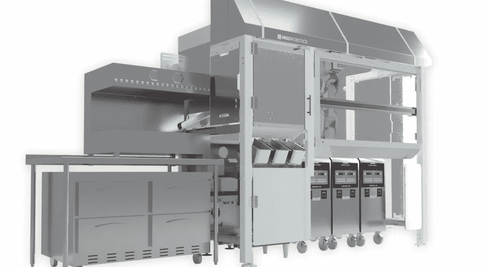

# 市场可能最终为食品自动化技术做好了准备

> 原文：<https://medium.com/geekculture/the-market-might-finally-be-ready-for-food-automation-technology-afb07a33f521?source=collection_archive---------19----------------------->

日益恶化的劳动力短缺加上机器人技术的黄金时代可能会给食品自动化技术带来一场完美风暴

有没有想过为什么快餐业会掠夺像年轻、收入低的员工这样的人？尽管存在普遍的误解，但这并不是因为他们只是为了好玩而喜欢榨干青少年的生命(他们确实是这样)，而是…