# 背后的数学:关于主成分分析(PCA)的一切

> 原文：<https://medium.com/geekculture/the-math-behind-everything-about-principle-component-analysis-pca-d6f0baff5681?source=collection_archive---------6----------------------->

## PCA 降低了许多空间中的数据点的维数。一些现成的代码和库允许编码人员轻松地创建 PCA，但是，您知道什么是 PCA 以及它在数学上是如何工作的吗？

Photo by [Evie S.](https://unsplash.com/@evieshaffer?utm_source=unsplash&utm_medium=referral&utm_content=creditCopyText) on [Unsplash](https://unsplash.com/s/photos/dimension?utm_source=unsplash&utm_medium=referral&utm_content=creditCopyText)

[主成分分析(PCA)](https://www.dezyre.com/data-science-in-python-tutorial/principal-component-analysis-tutorial#:~:text=The%20main%20idea%20of%20principal,up%20to%20the%20maximum%20extent.) 的主要思想是降低由许多变量组成的数据集的维数，这些变量或多或少相互关联，同时最大限度地保留数据集中存在的变化

直观地说，主成分分析允许我们用较低维度的图片来查看数据点的位置。当用户从信息最丰富的角度看时，它可以被称为这些数据点的投影或“阴影”，如上面菱形图片的阴影。

如果有人问你什么是 PCA，这些是你应该记住的关于 PCA 的第一件事。

*   减少尺寸
*   试图保持数据集中的最大方差
*   有时，新的维度无法解释。
*   允许创建易于可视化的

# PCA 在数学上是如何工作的？

在网上，PCA 的数学部分很少一步一步讲解。关于它的资源很少，而且大部分都不够详细。 ***我相信数学直觉能让我们把长期的拼图块*** *。*因此，现在您可以通过一个示例了解 PCA 的分步计算。
假设我们有一个关于 5 名学生不同体育课考试成绩的数据集，我们将尝试降低该数据集的维度。

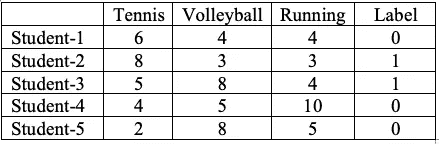

# 1-获取数据集的特征，不考虑标注。

主成分分析在特征维度上工作，在这种情况下是运动课程。因此，我们不应该考虑标签列和唯一的学生 id。该过程仅与数据集的特征相关。在实施所有步骤后，每个学生在 PCA 选定维度的新分数将是一个结果。

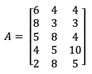

# 2-数据集的规范化

***PCA 是一种将分量方向改变到最大方差方向的做法。*** 基本上，原始数据会被分配到方差最大化的不同方向。如果不归一化数据集，PCA 技术可能会偏向特定的特征。

标准化分两步完成:

*   首先，从每个数据点减去变量各自的平均值。这会产生一个平均值为零的数据集。
*   其次，减去平均值后，将每个数据点除以标准差。(我不会在本文中实现它)

您可以看到每列的平均值如下:

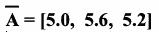

# **3-计算协方差矩阵**

> 在我们开始之前，我们将快速地看一下协方差和方差之间的区别。[方差](https://datascienceplus.com/understanding-the-covariance-matrix/)衡量单个随机变量的变化(比如人口中一个人的身高)，而协方差是衡量两个随机变量一起变化的程度(比如人口中一个人的身高和体重)。

数据点的归一化与协方差矩阵相关联。因为在协方差公式中，需要从每个属性的每个数据点中减去每个列(特征)的平均值。如果应用归一化，平均值将为零。如果不应用归一化的第一步，它将通过协方差矩阵公式来完成。

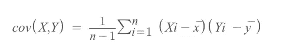

协方差计算应该发生在两个特征的每个组合中。

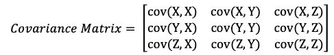

如果我们说，我们有 d 维(d 个特征)，协方差矩阵将在 dxd 维。

*   这是一个正方形矩阵
*   它是对角对称矩阵，因此 cov(X，Y) = cov(Y，X)

cov(X，X)表示 X 特征的方差。数字越大表示方差越大。因此，矩阵的对角线部分表示每个特征的方差。矩阵中每隔一个元素表示两个不同变量的协方差。

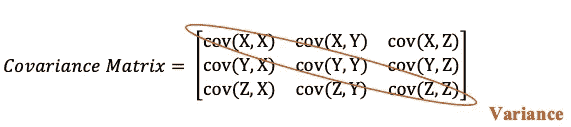

在我们的例子中，你可以看到 A 矩阵和每一列的平均值。

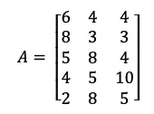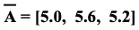

因此，实现为协方差矩阵的一个值:

Cov(X，Y)=[(6–5)*(4–5.6)+(8–5)*(3–5.6)+(5–5)*(8–5.6)+(4–5)*(5–5.6)+(2–5)*(8–5.6)]/(5–1)

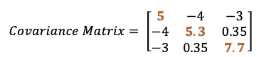

## 这个协方差矩阵告诉我们什么？

*   可变性最高的是跑步(+7.7)，可变性最低的是网球(+5.0)。
*   排球和跑步之间的协方差是正的(如 0.35)，这意味着得分趋向于以正的方式协变。随着网球分数的上升，跑步分数也会上升，反之亦然。
*   网球和排球之间的协方差是负的(as -4)，这意味着分数倾向于以负的方式协变。随着网球分数的上升，排球分数会下降，反之亦然。
*   如果任何两个特征的协方差为零，这意味着相关的两个课程的分数之间没有可预测的关系。

# 4-计算特征值

特征值是用于变换(拉伸)特征向量的标量。

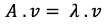

A 是方阵(它是协方差矩阵 A)，v 是特征向量，λ是作为特征值(与矩阵的特征向量相关联)的缩放器。
当你把问题的右边移到左边时，你需要解下面的方程来得到λ特征值。

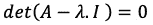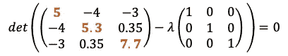

现在，我们需要通过求解上面的方程来获得λ值。如何解决 3X3 维的行列式在下图中，但更多信息请阅读[此链接](https://www.mathsisfun.com/algebra/matrix-determinant.html)。

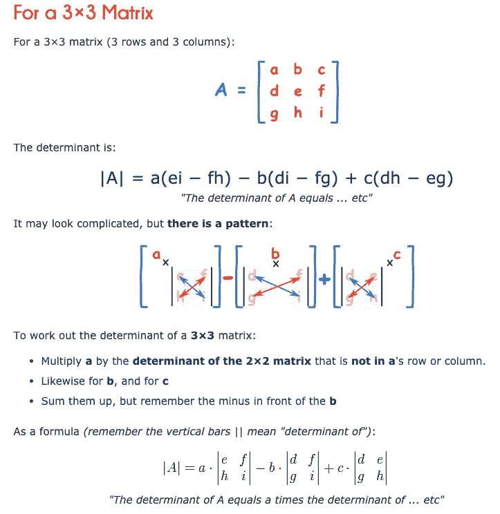

因此，最终我们的方程几乎等于下面的方程:

解完这个方程后，你会得出:

# 5-计算特征向量

> 直观地说，[特征向量是一个向量](https://towardsdatascience.com/the-mathematics-behind-principal-component-analysis-fff2d7f4b643)，当对其应用线性变换时，其方向保持不变。

找到特征值后，现在是找特征向量的时候了。你可能记得我们一开始的等式是:

现在，我们知道了 A 和λ。现在的问题是，哪个向量与(A — λ)矩阵点乘后给出零？
对于每一个λ值，我们都会找到不同的特征向量。让我们开始:

(A- λ。I) = B，其中 B 矩阵等于 A 负特征值矩阵。

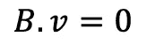

通过解这个方程，我们会找到特征值对应的特征向量。特征值= [λ = 11.0，λ = 6.4，λ = 0.58 ]，对应的特征向量将为:

# 6- **分类选择**

**按照对应的特征值递减对特征向量进行排序，选择特征值最大的前 n 个特征向量。**

特征向量只定义空间中新维度的方向。因此特征向量是单位向量。我们需要根据这些向量来形成我们的数据集。

> 我们使用主成分分析的目标是创建更少的维度，因此我们将根据我们期望的维度数量选择一些特征向量。

将特征值对应的特征值从高到低排序。例如，如果你想把维数从三个减少到两个，那么取对应于前两个最高特征值的前两个特征向量。

# **6。用特征向量矩阵创建最终数据点。**

最终目标是将真实数据集转换到新的子空间上，这样我们就可以将所有学生的信息转换到二维空间中。我们需要点乘**标准化的**数据集和通过取最高特征值创建的特征向量矩阵。在矩阵乘法中，第一个矩阵的列数应该等于第二个矩阵的行数。

(3 列 x 5 行)矩阵将点乘以(2 列，3 行)矩阵，以获得新维度的转换数据集。

***(规格化一个矩阵)。(特征向量矩阵)=变换数据集***

*   红色方块表示根据特征向量，哪一行乘以哪一列得到新维度中的第一个元素。

总之，您可以在二维空间中看到由主成分分析确定的每个学生的最新数据集，以及来自原始表格的相同标签。

如果你有任何反馈，请给我留言！

*注:实数显示到小数点后两位。*

*我的这篇帖子最初发表于 2021 年 4 月 8 日 https://www.datadriveninvestor.com***。**