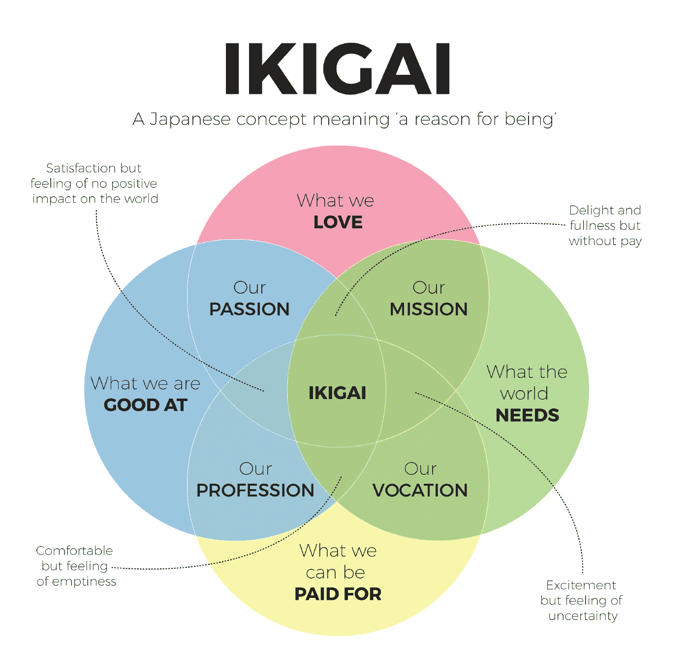
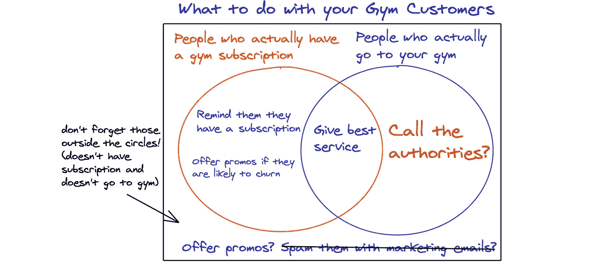
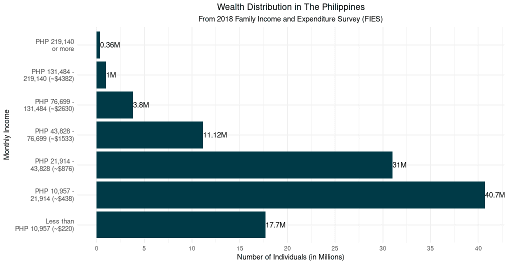
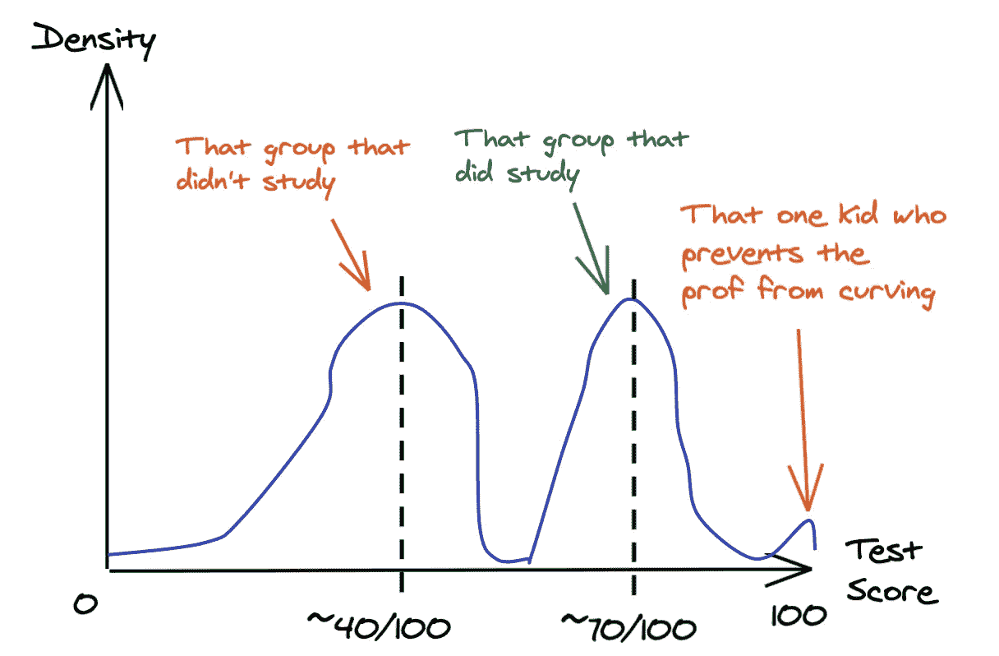
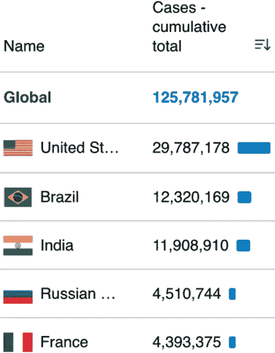
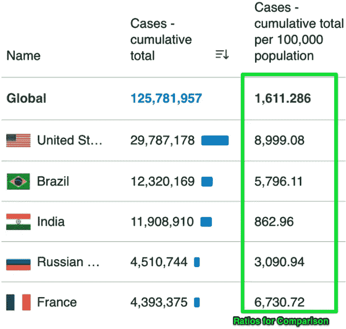
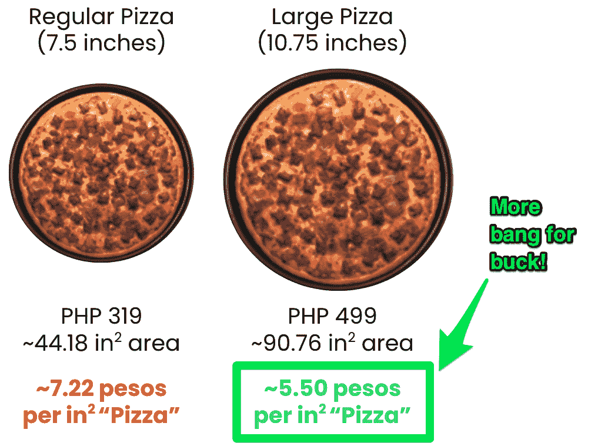

# 你会在现实世界中用到的三个数学概念

> 原文：<https://medium.com/geekculture/the-math-concepts-youll-actually-use-in-the-real-world-1711834812e4?source=collection_archive---------12----------------------->

“反正你永远不会在*的真实世界*中使用*那个*

当我在高中和大学学习数学的时候，我总是听到人们说这样的话。虽然我确实从来没有分解过另一个多项式，应用过勾股定理，或者计算过另一个解析导数或积分，等等。我敢肯定，在我职业生涯的多个阶段，我不知何故已经感受到了成为数学爱好者的边缘。

Why does Billy need 80 watermelons anyway? ([Image Source](https://www.whataboutwatermelon.com/index.php/2012/11/quotable-watermelon-hows-your-watermelon-math/))

这很难描述，但练习数学帮助我解决了问题，我相信每个人(不仅仅是技术人员)都会从中受益。

我在这篇文章中的目标是分享**我们在课堂上学到的三个基本数学概念，我相信*每个人*都会发现这些概念在*现实世界*中的应用是有用的。**这些是我日常使用的概念(作为一名数据专业人员)，我们中的一些人可能已经在不知不觉中使用了它们。我相信认识和掌握这些将会展示(1)数学在课堂之外是多么有用,( 2)数学在现实世界中无处不在。

# 数学概念#1:维恩图

谁不喜欢维恩图？

它们非常灵活，可以用于各种各样的用例，从有趣的迷因，一直到教授生活课程的媒介。

A Venn Diagram teaching you a life lesson (See source post [here](/@WeAreHowDoI/how-ikigai-can-be-applied-to-early-stage-companies-bce2c5d92bfc)!)

维恩图的概念通常是在课堂上遇到的，最有可能是在学习集合论的时候(回忆:并集、交集等等。).

以这样或那样的形式，我相信我们都遇到过这样的问题:**“如果所有的 A 都是 B，那么一些 A 是 C 吗？那么一些 B 也是 C 吗？”这些被称为三段论——如果我们没有合适的工具来处理它们，它很容易变得混乱。诸如此类的问题实际上隐藏在现实世界中:**

## 真实世界的应用

*   在疫情，有多少人接受了检测？在那些测试呈阳性的人中，有多少人实际上是阴性的？测试结果呈阴性的人实际上呈阳性的比例是多少？(即混淆矩阵)
*   那些看过你的脸书广告的人当中，有多少人真的注册了账户？有多少人没有看到广告就真的买了你的产品？有多少人看到了广告，被朋友推荐，但没有购买？(即转换漏斗——尤其是非线性的客户旅程)。
*   如果我们首先给前线人员注射疫苗，然后是那些有风险的人，然后是家属，等等，如果不重复计算，我们第一批、第二批等等总共需要多少疫苗？考虑到这些组可能并不相互排斥！(即计数问题或运筹学)

当试图浏览上面的例子时，很容易被弄糊涂，尤其是当你试图在心里做的时候。在我的职业生涯中，有很多这样的情况，会议陷入了僵局，因为人们似乎无法在处理上述问题时达成一致。

What a whiteboard ideation session can look like (Made with [Excalidraw.com](https://excalidraw.com/))

谢天谢地，当我遇到这样的问题时，**我的数学本能立即告诉我迅速拿出一张纸，画出相关的圆圈，并创建维恩图**来使事情变得更清楚。简短的解释之后，我们就能够指出维恩图的每个区域，确定涉及多少实体，并作为一个小组决定什么是适当的策略！

对于那些没有购买我们产品但看到广告的人，我们可以尝试不同的销售方式。那些病毒检测呈阴性但实际上呈阳性的人告诉我们检测试剂盒的有效性。对于第一批和第二批疫苗，我们可能各需要 100 剂，但第三批，我们可能不再需要 100 剂，因为这些人在第一批或第二批中已经合格。

维恩图就像逻辑问题的瑞士军刀。掌握*何时*和*如何*运用它们不仅会在你的职业生涯中，还会在其他任何地方给你带来奇迹。

# 数学概念#2:分布

我之前遇到过这条推文:

这不是一篇数据文章，但我想我可以基于我认为是上面那条推文的信息来解释分布的重要性。

假设我们想了解财富分配。下图显示了根据 2018 年的一项调查，菲律宾每个收入等级有多少人:

Created with ggplot2\. [Data Source](https://pidswebs.pids.gov.ph/CDN/PUBLICATIONS/pidsdps2022.pdf)

假设目标是理解收入不平等的状态。从图表中可以得出一个直接的结论:大多数人的月收入在 220 美元到 438 美元之间，而少数人的月收入超过 4382 美元(大约高出 10 倍！).如果你知道一点统计数据，你可以计算出加权平均收入高于每月 438 美元。你甚至可以尝试得到中位数和众数…哦，甚至是第 10 和第 90 个百分点！等待..我们想做什么来着？

当我们深入研究统计数据时，事情很容易变得复杂。不同的是，对于一个有经验的统计学家来说，他或她看着分布，做一些计算，然后说出简单的话**“这个国家大约 25%的财富分配给了整个人口的 5%”**

在这一点上我可能跑题了，但是这强调了掌握分布概念的重要性。根据我的教学经验，分布是数学中最常被误解的话题之一，然而它仍然是实践中最常用的话题之一！

## 真实世界的应用

*   我们可以看到疫情死亡人数最高的年龄范围是多少？最高感染人数怎么样？(你会很容易地发现这些问题有不同的分布形状——当然这导致了在制定健康协议时的不同策略)
*   人们对某个视频失去兴趣通常需要多少秒？(Instastories 或抖音视频应该持续多久？).在我们关闭社交媒体应用程序之前，我们通常能容忍多少广告？(限制显示的广告数量)。
*   导航应用程序检测到哪些位置的交通活动密度最高？(想象一下热图)我们应该在哪些区域设置自行车道，或者部署更多的交通官员？

Example of a multimodal (“many peaks”) distribution (Made with [Excalidraw.com](https://excalidraw.com/))

当你听到像“通常”、“平均”、“最常见或最不常见”以及其他同义词这样的词或短语时，你就知道你遇到了一个与分布有关的问题。

掌握分布意味着认识到世界上有比通常的钟形正态分布更多的现象。分布可以是离散的或连续的，偏斜的或对称的，单峰的或多峰的(有两个或更多的“峰值”)，等等。像均值或中位数这样的统计数据有助于捕捉一些信息，但更多的时候，你会希望看到整个故事。

如果你想更深入地了解一下，有很多探索发行版及其应用的帖子，比如下面由[micha oles zak](https://medium.com/u/c58320fab2a8?source=post_page-----1711834812e4--------------------------------)撰写的帖子:

 [## 6 有用的概率分布及其在数据科学问题中的应用

### 带有示例和 Python 代码的实用概述。

towardsdatascience.com](https://towardsdatascience.com/6-useful-probability-distributions-with-applications-to-data-science-problems-2c0bee7cef28) 

# 数学概念#3:比率

我个人称比率为“数学的伟大均衡器”,与它们在实践中的普遍应用有关。

为了用一个简单的例子来说明(现在我可能过度使用了疫情的话题)，让我们看看下面来自世卫组织网站的数字，显示了每个国家累计的新冠肺炎病例数。

Extracted from [https://covid19.who.int/table](https://covid19.who.int/table); March 27, 2021

从这里开始，人们可能犯的第一个错误是，假设应对疫情疫情表现最差的国家是美国，其次是巴西和印度。然而，我相信大多数人会理解这是一种不公平的评估每个国家的方式，因为这真的不是苹果与苹果的比较。**每个国家都有不同的人口数量——如果人口多，当然病例也会多！**

使用一个简单的比率，每 100，000 人中的病例数(即，在 100，000 人中，平均有多少人患有该疾病？)，然后我们可以“均衡”景观，并在不同国家之间进行比较。

Extracted from [https://covid19.who.int/table](https://covid19.who.int/table); March 27, 2021

嗯，美国仍然是最高的，但至少这表明，与其他国家相比，印度实际上显示出较低的比率(免责声明:有许多方法可以评估 Covid 响应性能，这是许多其他因素中的一个例子)。

在应用中，比率可能比分布和文氏图更常见。除了是“伟大的均衡器”，它们还可以汇总信息(想想 10 个信息图表中的 X 个，百分比统计)，在单位之间转换(想想外汇或公制之间的转换)，等等。应用程序实在太多了，我可能需要一个全新的帖子来列出一些最重要的应用程序。

## **现实世界应用**

*   我应该投资哪里？一只股票能涨到 30 到 40 美元(10 美元差价)，还是一只股票能从 40 美元涨到 52 美元(12 美元差价)？(百分比变化也是比率！)
*   如果电子邮件的成本相同，一个电子邮件活动为一个消费产品吸引了 100 个新用户(基数大),与另一个电子邮件活动为一个企业产品吸引了 100 个新用户(基数小)相比，哪个更好？
*   假设我们有来自交通应用程序的数据，并且我们有所有汽车在每个地区行驶的总距离和时间，我们能测量不同地点的“交通有多糟糕”吗？(想想速度，另一个比率，作为交通流量的代理)。

Some rough calculations on what pizza size is worth it. There’s actually a lot of [articles](https://food-hacks.wonderhowto.com/how-to/why-you-should-always-order-large-at-least-when-comes-pizza-0156539/) about this.

像其他概念一样，掌握何时以及如何使用比率是你能学到的最有用的技能之一。**它可以从熟悉它们最适用的地方开始**，例如比较、测量相对变化与绝对变化、翻译测量单位以及其他常见应用。接下来你知道的是，你几乎总是会点更大的披萨，因为你知道它们物有所值(取决于餐馆)。

# 观点:现代教育应该关注逻辑、基本统计和编码

在结束这篇文章之前，我想分享一篇来自 2019 年的[文章](https://www.latimes.com/opinion/story/2019-10-23/math-high-school-algebra-data-statistics?hss_channel=tw-1318985240)，它是我的朋友在我写这篇文章的过程中与我分享的。以下是《邮报》的直接引用:

> 我们的高中生学习代数、几何、代数二年级和微积分(针对最优秀的学生),因为艾森豪威尔时代的决策者认为这一课程将培养出最好的火箭科学家来从事冷战期间的项目。

最引人注目的一点是，尽管随着计算机的兴起，我们处理信息的能力发生了巨大的变化，但大多数现代课程 50 多年来都没有改变。

我们现在处于信息时代，数据量的增长速度超过了人类处理其全部复杂性的能力。正因为如此，我观察到的是问题越来越偏向于***我们应该看什么数据******“应该怎么看？”****“我们如何从有限的数据中提取洞察力？”*

我不是说微积分之类的东西应该被扔出窗外(我还是爱它们！)，但肯定有理由认为*每个人* **都应该考虑深入研究逻辑、基本统计和编码**。以这样或那样的形式，讨论的三个数学概念涉及到这三个主题(编码使它更容易和更快)。我真诚地相信这不仅适用于像我这样的技术从业者，也适用于任何接触数字和数据的人。

我真的希望在未来，我们生活在一个“无论如何，你都不会在现实世界中应用*那个*”的世界里，这将最终成为一个过时的说法！

这篇文章主要是我作为一名数据专家和一名数学专业学生的想法的融合。请随时给 nfrimando@gmail.com 发电子邮件或通过 LinkedIn 与我联系。很高兴分享笔记和讨论，如果你有想法和意见分享！再次大声呼喊帮助我编辑这篇文章的 Fernandina Ko！