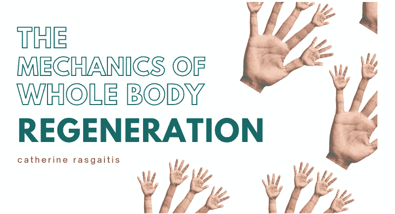

# 全身再生的机制

> 原文：<https://medium.com/geekculture/the-mechanics-of-whole-body-regeneration-af53a9c249a?source=collection_archive---------13----------------------->

## 借助转基因技术观察豹蠕虫截肢后的影响

photo by [Sarah Richter](https://pixabay.com/users/sarahrichterart-1546275/), courtesy of [Pixabay](https://pixabay.com/photos/hand-hands-finger-thumb-2571553/)

想象一下，切掉你的腿，但你没有因失血而死，而是重新长出了你的腿。

虽然人类没有这些再生能力，但许多其他生物有！肢体再生动物包括蝾螈、壁虎和…