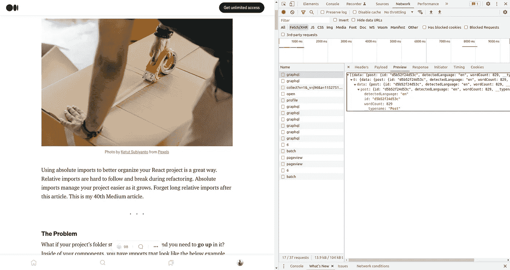
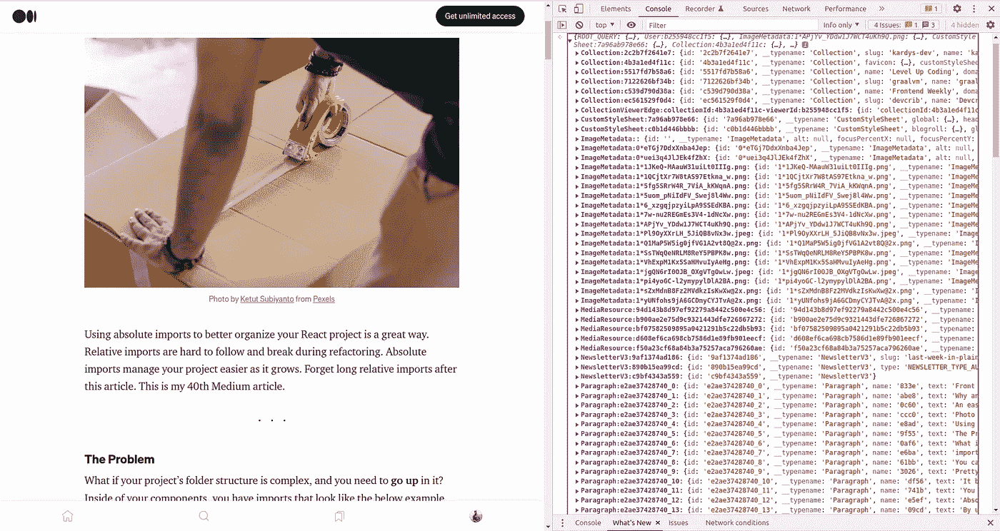

# 中型 RSS 源缺少的部分

> 原文：<https://medium.com/geekculture/the-medium-rss-feeds-missing-part-65a0b556dda1?source=collection_archive---------9----------------------->

## 检索中等帖子的统计信息(clapCount、voterCount、responseCount 和 readingTime)


Photo by [Ryoji Iwata](https://unsplash.com/@ryoji__iwata?utm_source=unsplash&utm_medium=referral&utm_content=creditCopyText) on [Unsplash](https://unsplash.com/s/photos/puzzle-missing-pieces?utm_source=unsplash&utm_medium=referral&utm_content=creditCopyText)

在这篇文章中，我将解释如何使用 REST API 来检索 Medium feed 帖子的统计信息(`claps count`、`voter count`、`response count`和`reading time`)，Medium RSS feed 中缺少这个特性是我创建这个高级 Medium API 的动机。这是我的第 41 篇媒体文章。

# 最初的直觉

> 我想在开发我的个人网站时获得我的中等帖子的统计数据(`*claps count*`、`*voter count*`、`*response count*`和`*reading time*`)。2 年前，当我在我的网站上实现 medium widget 时，我发现了 [Pixelpoint.io](https://medium-widget.pixelpoint.io/) ，它生成了一个具有 medium 帖子鼓掌计数的 widget。那一刻我很好奇他们是怎么实现的？后来我忘了研究它，但上个月我发现 pixelpoint.io 的小工具不工作了。我到处寻找满足我需求的解决方案，但是找不到，所以我别无选择，只能自己编码。

我最初的直觉是查看 RSS 提要，但是没有提供这样的细节，然后我查看了 Medium 的官方文档 public [REST API](https://github.com/Medium/medium-api-docs) ，也没有任何内容。Medium REST API 只允许你通过`HTTP POST`方法创建一个 Medium 文章(参见[第 3.3 节](https://github.com/Medium/medium-api-docs#33-posts))。*您不能使用媒体 API 检索或编辑媒体文章😔。*

为了理解如何在 Medium post 中检索有用的统计数据，我开始使用浏览器开发工具检查 Medium。令人震惊的是，在所有的 XHR 呼叫中没有请求获得统计数据，这促使我查看 Medium post 的 HTML 响应。



Inspecting a Medium post page.

```
curl [https://medium.com/p/unique_Id_of_the_post](/p/unique_Id_of_the_post) >> post.html
```

作为一个 javascript 变量，鼓掌计数、投票计数、响应计数和阅读时间被直接注入到 HTML 响应中。您可以通过在 Post 页面的 Javascript 控制台中键入`console.log(window.__APOLLO_STATE__);` 来验证这一点。



`window.__APOLLO_STATE__ object`

然后我使用`[request](https://github.com/request/request)`和`[cheerio](https://cheerio.js.org/)`收集那些有用的统计数据。

# 如何抓取脚本标签中的数据


Photo by [Kike Salazar N](https://unsplash.com/@kikesalazarn?utm_source=unsplash&utm_medium=referral&utm_content=creditCopyText) on [Unsplash](https://unsplash.com/s/photos/scrape?utm_source=unsplash&utm_medium=referral&utm_content=creditCopyText)

在一篇中篇文章中，数据以 JSON 的形式出现在脚本标签中。通过使用 javascript，这些数据在浏览器端被提取并呈现在 DOM 中。通常，脚本标记中的数据采用以下形式:

然后我在没有无头浏览器的情况下抓取中等大小的帖子数据。

首先，我得到网站，并寻找错误。然后我确认身体是否存在，并使用`$`中的`cheerio`载入身体。在`try`块中，所有的标签脚本内容都被映射到一个数组中。然后找到包含`window.__APOLLO_STATE__`的元素，用空字符串替换赋值`window.__APOLLO_STATE__ =` 。我将`/&quot;/g`替换为`"`，并使用`JSON.parse`进行解析。最后，从 JSON 中获取适当的值。

这种技术相对于无头浏览器的优势是速度超快，占用的处理和资源更少。

# 如何使用高级媒体 API

你可以使用我开发的[高级媒体 API](https://github.com/sabesansathananthan/advanced-medium-api/tree/develop) ，如下所示:

有 5 种类型的请求。您可以通过使用`HTTP GET`方法获得所有响应。

## JSON 中的中馈

您可以通过使用以下链接(替换您的用户名而不是`@username`)获得最近 10 篇中型文章的 RSS 提要。

```
*medium.com/feed/@username* or *username.medium.com/feed*
```

API 的以下请求给出了 RSS 提要的直接 JSON 转换。

```
curl [https://advanced-medium-api.herokuapp.com/medium/user/{userId}](https://advanced-medium-api.herokuapp.com/medium/user/{userId})
```

## 中等高级数据

您可以在 JSON 中获得缺少部分的介质进给，如`clapCount`、`voterCount`、`responseCount`、`readingTime`。在每个 post(items)对象中注入每个缺失数据。

API 的以下请求给出了 RSS 提要的 JSON 转换，并注入了丢失的数据。

```
curl [https://advanced-medium-api.herokuapp.com/advanced/user/{userId}](https://advanced-medium-api.herokuapp.com/advanced/user/{userId})
```

## 中等定制数据

JSON 转换的中等 RSS 提要是根据类别定制的。根据最近 10 篇文章中的使用次数对中等文章的标签进行排序，`tagOrder`返回标签的排序。Medium 的最新 10 篇文章被 3 除，每 3 篇文章被放入一个数组，这些数组被放入一个数组。有一种算法可以在该媒体帖子的其他标签中返回最适合该媒体帖子的标签。

下面的 API 请求给出了 JSON 中媒体提要的定制版本

```
curl [https://advanced-medium-api.herokuapp.com/customized/user/{userId}](https://advanced-medium-api.herokuapp.com/customized/user/{userId})
```

## 中型定制高级数据

该响应包含注入了诸如`clapCount`、`voterCount`、`responseCount`、`readingTime`之类的缺失统计的媒体定制数据。

下面的 API 请求给出了 JSON 中介质提要的定制版本，其中缺少介质提要的一部分。

```
curl [https://advanced-medium-api.herokuapp.com/advanced/customized/user/{userId}](https://advanced-medium-api.herokuapp.com/advanced/customized/user/{userId})
```

## 特定帖子的缺失数据。

该响应仅包含特定介质柱的介质进给的缺失部分(`clapCount`、`voterCount`、`responseCount`、`readingTime`)。

**请求**💻 ➡ 🌎 **:**

```
curl [https://advanced-medium-api.herokuapp.com/medium/post/{postId}](https://advanced-medium-api.herokuapp.com/medium/post/{postId})
```

**响应**🌎➡💻：

```
{
  "clapCount": 98,
  "responseCount": 4,
  "voterCount": 12,
  "readingTime": 4
}
```

# 结论

这个 API 是开源的，我欢迎你的贡献。过去两年，我使用了来自 [Pixelpoint.io](https://medium-widget.pixelpoint.io/) 的 medium widget，它生成了一个具有中等帖子鼓掌计数的 widget。当我使用 Pixelpoint.io 时，我没有做研究来获得介质馈送的丢失部分。但是在 Pixelpoint.io 不工作的 2 个月前，这个事件影响了我的个人网站。因此，我推动自己，创造了这个 API。