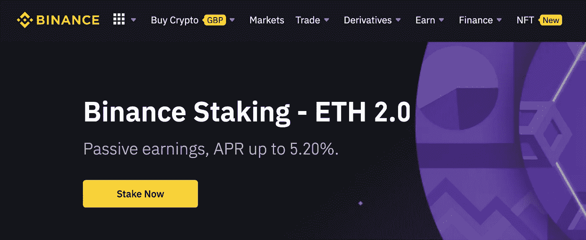

# 合并在这里:学习如何通过币安股票以太坊和变得富有

> 原文：<https://medium.com/geekculture/the-merge-is-here-learn-how-to-stake-ethereum-via-binance-and-become-rich-ccc86ace4538?source=collection_archive---------4----------------------->

## 第 21 集

## 作为以太坊投资者，通过下注赚取被动收入

2022 年 9 月 9 日，谷歌的 web3 客户工程师萨姆·帕迪拉分享了一条推文，敦促 T2 的维塔利克·布特林和以太坊的人们在谷歌上搜索“合并”