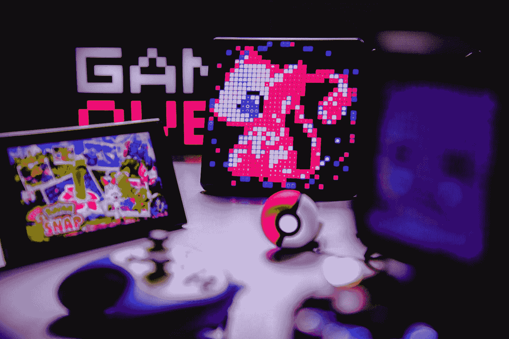

# 元宇宙招魂术

> 原文：<https://medium.com/geekculture/the-metaverse-necromancy-3945b78780c0?source=collection_archive---------20----------------------->

不朽、复兴和反乌托邦

Photo by [Branden Skeli](https://unsplash.com/@branden_skeli?utm_source=medium&utm_medium=referral) on [Unsplash](https://unsplash.com?utm_source=medium&utm_medium=referral)

# 你能复制并成为数字迈克尔·杰克逊吗？

**你不会停止听说元宇宙**

连续实时渲染的 3D 世界。对于元宇宙的构成没有一个明确的定义。大多数人认为它是通常想象的虚拟现实的预热版本。一个…的数字化身