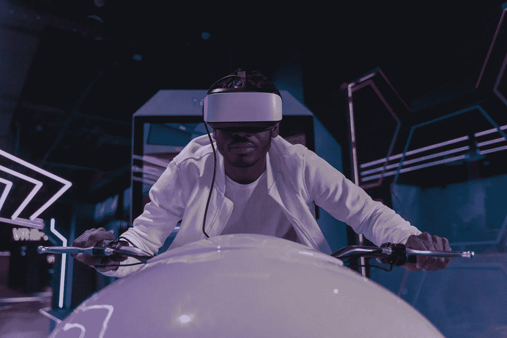

# 元宇宙的利弊

> 原文：<https://medium.com/geekculture/the-metaverse-pros-cons-8d16714c4295?source=collection_archive---------0----------------------->

## 对人类进化的积极和消极影响

Photo created by [Tima Miroshnichenko](https://www.pexels.com/ro-ro/@tima-miroshnichenko?utm_content=attributionCopyText&utm_medium=referral&utm_source=pexels), from [Pexels](https://www.pexels.com/ro-ro/fotografie/consola-de-jocuri-video-jocuri-video-joc-joaca-6498717/?utm_content=attributionCopyText&utm_medium=referral&utm_source=pexels)

你一定听说过或读过这个新话题，[元宇宙](https://en.wikipedia.org/wiki/Metaverse)，自从脸书开始向元宇宙过渡以来，这个话题似乎充斥了所有的新闻标题。它正在发生，但现在我们仍处于初始阶段。

如果你想了解脸书向元宇宙过渡的细节，你可以在这里阅读:

 [## 脸书向元宇宙的过渡

### 下一代互联网的第一步

medium.com](/geekculture/facebooks-transition-to-the-metaverse-6f2d52a35cc7) 

科学家们有一个关于宇宙中存在其他文明的理论，这可能是“为什么还没有文明联系我们*”这个问题的答案。*“当文明进化到一定程度后，会倾向于在虚拟世界中寻求庇护。真实的宇宙充满敌意，太大而无法探索，或者至少这是我记得读过的。

如果是这样的话，也许我们的文明才刚刚开始遵循这种进化模式。我们刚刚开始建设我们的元宇宙。

# 元宇宙不可避免

当我第一次听到元宇宙这个词时，我立刻明白了它指的是什么。

在现实世界中，我们可以有我们的宇宙和其他宇宙，与我们的平行或不平行，我们称这一切为多元宇宙。在虚拟现实中，我们可以考虑由特定的应用程序、游戏或模拟创建的不同宇宙，整个事情可以被称为元宇宙。

我们现在看到的只是一个开始，但我发现元宇宙不仅仅是众多游戏世界。它是虚拟现实、增强现实和物理现实的结合。换句话说，元宇宙是宇宙之外的东西，来自[希腊语 *meta*](https://en.wikipedia.org/wiki/Meta) ，意为*超越*。

# 元宇宙的光明面

《元宇宙》的一个很酷的地方是，它将允许人们体验一个无尽的虚拟世界，在那里他们可以使用虚拟角色做他们梦寐以求的事情。

举个例子，你可以在大自然中创造你最喜欢的放松点，但是这个大自然是虚拟的。你可以改变风景，就像你可以改变笔记本电脑的壁纸一样。它就像一个全新层次的互联网，3D，完全沉浸式。

元宇宙概念的一个更基本的版本可以在游戏《分散之地》中看到，这是一个开放的世界，你可以选择一个化身，玩游戏，参加音乐会，结识朋友，采矿，制作 NFT 可穿戴设备，探索等等。

你可以在这里阅读更多关于分散土地的信息:

 [## 分权的第一步

### 你能做什么以及如何开始盈利

medium.com](/geekculture/the-first-steps-in-decentraland-31f8e522bf50) 

我认为元宇宙可以有以下优点:

*   把人们聚集在一起
*   创造许多乐趣
*   提供了外星世界神秘气氛
*   让一切变得更愉快、更有趣
*   改善在家工作和家庭教育

# 元宇宙丑陋的一面

在我看来，元宇宙丑陋的一面是人与现实之间的分离。正是在这种视角下，技术完全吸引了人类的注意力，将我们从现实世界中完全转移开。我们最终会对元宇宙上瘾，我们的孩子也会和它一起成长。

我也知道这是人类物种进化的必然方向。技术最终是我们的延伸，技术是我们的未来。即使我们中的一些人可能不同意这个方向，或者可能根本不喜欢它，但它是我们前进的方向。

在我看来，元宇宙有以下缺点:

*   产生上瘾
*   让你忘记时间
*   把你与真实的自然和真实的世界分开
*   过度刺激你的感官

元宇宙无疑是下一件大事，是互联网的正常发展。就像电脑在 80 年代，互联网在 90 年代，智能手机在 2000 年之后，或者加密货币在最近十年。

它将如何影响我们的生活，在很大程度上取决于我们，取决于我们将如何使用它。我打赌它会像其他创新一样发生。有些人会利用元宇宙做好事，有些人会做坏事。

我们正在经历我们历史下一步的开始。让我们拥抱它！