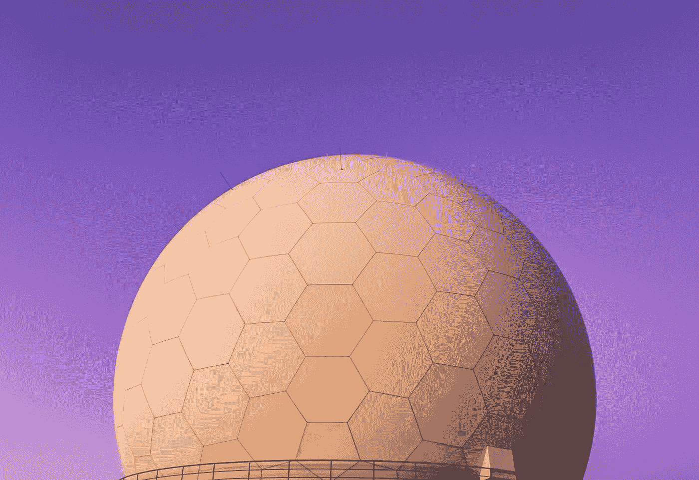

# 简化的元宇宙

> 原文：<https://medium.com/geekculture/the-metaverse-simplified-878f2512c2cb?source=collection_archive---------19----------------------->

## 为什么大肆宣传？

Photo by [Daniele Franchi](https://unsplash.com/@daniele_franchi?utm_source=medium&utm_medium=referral) on [Unsplash](https://unsplash.com?utm_source=medium&utm_medium=referral)

## 它的起源

元宇宙这个术语的存在时间比我们大多数人想象的要长。这个词是由作家尼尔·斯蒂芬森在他 1992 年的科幻小说《雪灾》中创造的。然而，近年来，这个术语已经成为一个流行语，经常被认为是下一个大事件。它的人气飙升可以归因于[脸书决定](/the-investors-handbook/in-zuckerberg-we-trust-1e22597da9b3)将自己更名为 Meta 和 Mark…