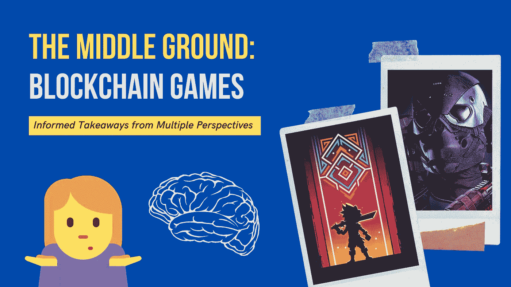

# 中间地带:区块链游戏

> 原文：<https://medium.com/geekculture/the-middle-ground-blockchain-games-ed0a0600f40b?source=collection_archive---------17----------------------->

a divisive topic in the gaming industry

关于区块链游戏、NFT 和密码辩论的喧嚣令人疲惫不堪。🤮

双方都对对方充满敌意和蔑视。下面，我列出了我从我认为的中间立场中学到的东西。

# 🌲环境冲击

对于加密人员来说——批评家对于将开发推向正确的方向很重要。太棒了…