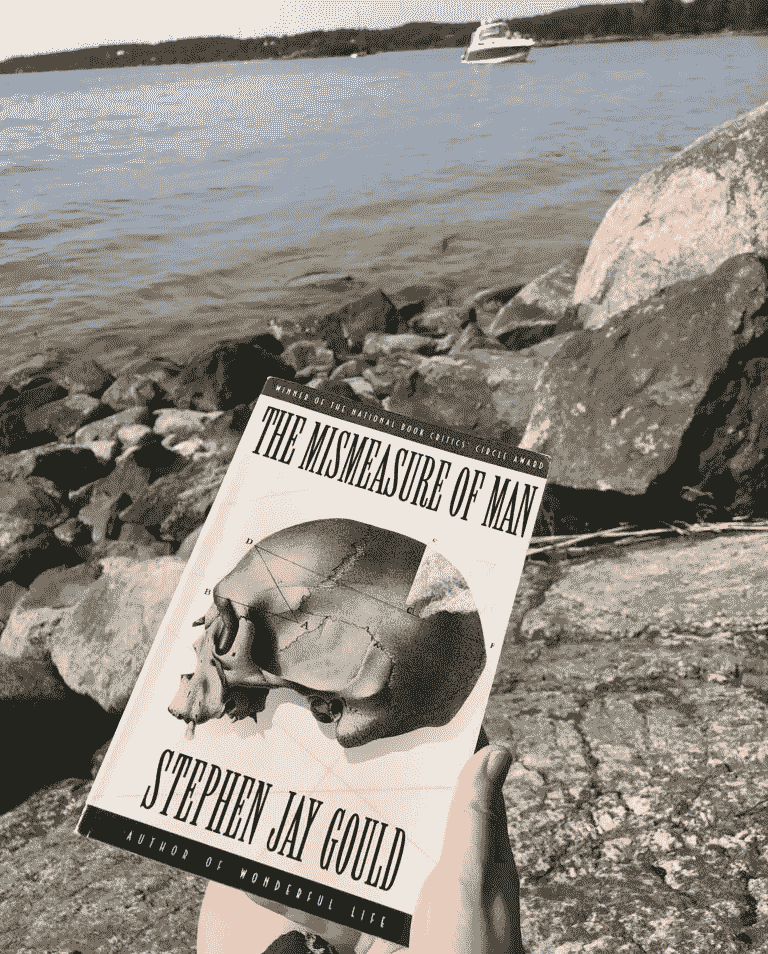

# “人的错估”与偏见的破碎数据科学

> 原文：<https://medium.com/geekculture/the-mismeasure-of-man-and-broken-data-science-of-prejudice-3aacff214321?source=collection_archive---------40----------------------->

收集人类的汇总数据有很多好处。这些数据现在无处不在，它被用来输入算法，这些算法定义了我们在脸书看到的视频，在我们的谷歌搜索中弹出的广告，哪些候选人接到了现场面试的电话，哪些候选人收到了礼貌的“不感谢”电子邮件，以及城市的哪个部分需要更多的警察…