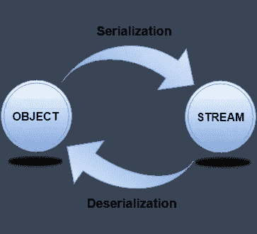

# Java 序列化中经常被遗忘的错误

> 原文：<https://medium.com/geekculture/the-mistake-often-forgotten-in-java-serializable-9c02b2b5f3fa?source=collection_archive---------6----------------------->

> Java 中的序列化允许我们将一个对象转换成流，我们可以通过网络发送它，或者将它保存为文件或存储在 DB 中以备后用。

特别是在微服务架构中，序列化和反序列化变得更加重要，因为我们经常需要将对象从一个服务发送到另一个服务，在那里字节流转换频繁发生。

[https://www.javatpoint.com/serialization-in-java](https://www.javatpoint.com/serialization-in-java)