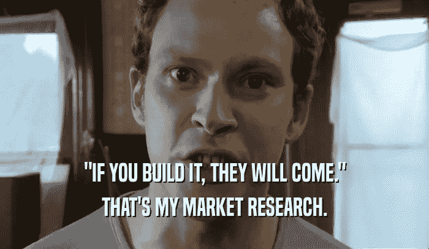

# 数字化转型:MVP 的误用

> 原文：<https://medium.com/geekculture/the-misuse-of-mvp-57346328f069?source=collection_archive---------6----------------------->

## 这是关于验证想法，而不是建立第一个版本

我们已经习惯性地认为 MVP——最小可行产品——是初始构建版本的同义词，这种版本通常需要大量的前期投资并需要数年来构建。

[Peep Show, Channel 4 — gifglobe.com](https://peepshow.gifglobe.com/scene/?frame=S03E02-yR9Y253i)

> MVP 的教训是任何额外的工作…