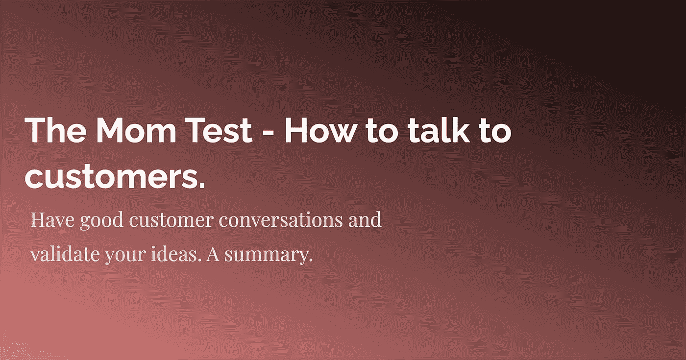

# 妈妈测试——如何与顾客交谈。总结

> 原文：<https://medium.com/geekculture/the-mom-test-how-to-talk-to-customers-a-summary-690d2516ad80?source=collection_archive---------11----------------------->

## 与客户进行良好的对话，并验证您的想法。

Rob Fitzpatrick 所著的《妈妈测试，如何与客户交谈&了解当所有人都在对你撒谎时，你的业务是否是个好主意》这本书旨在改善你与客户的对话，并从中获得真正的学习！标题背后的意思是你不应该…