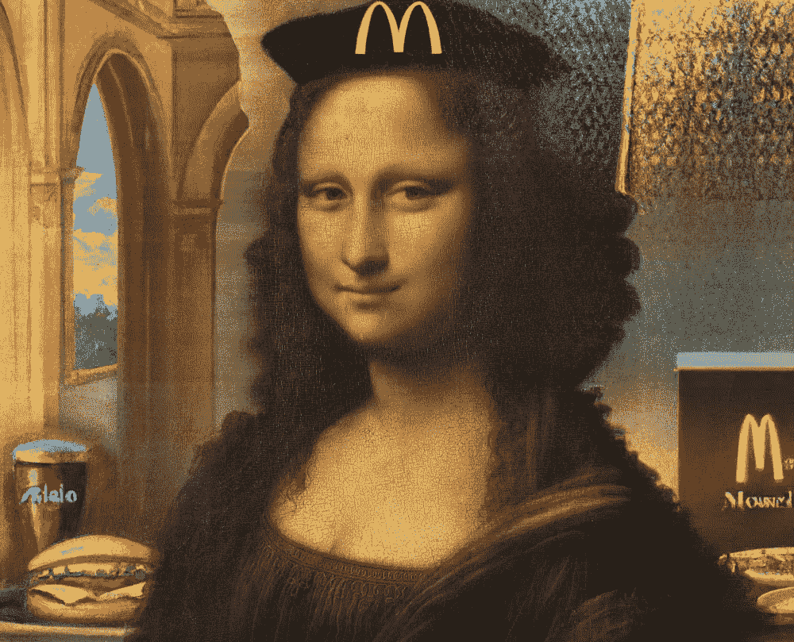

# 蒙娜丽莎…作为一名快餐工人？

> 原文：<https://medium.com/geekculture/the-mona-lisa-as-a-fast-food-worker-44f6a904f343?source=collection_archive---------19----------------------->

你可以用 OpenAI 的 DALLE-2 做的疯狂的事情

Source: Leonardo da Vinci and DALLE-2

图像生成从未如此有趣！随着 OpenAI 的 DALLE-2 [现在对公众开放，任何人都可以创造人工智能生成的艺术。](https://openai.com/dall-e-2/)

作为一名快餐工人，我决定接受制作蒙娜丽莎画像的挑战。