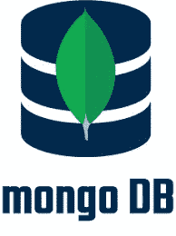
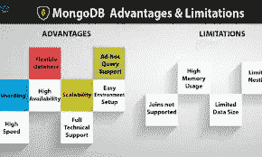

# MONGODB

> 原文：<https://medium.com/geekculture/the-mongodb-bcbe29756a4f?source=collection_archive---------60----------------------->

数据库中的 Db。市场上有各种类型的数据库。在这篇博客中，我们将讨论是什么让 **MongoDB** 脱颖而出及其相关方面。

# 什么是 MongoDB —

MongoDB 是一个源代码可用的跨平台面向文档的数据库程序。作为一个 NoSQL 数据库程序，MongoDB 使用带有可选模式的类似 JSON 的文档。它是由 MongoDB 公司开发的。MongoDB 是一个开源的文档数据库和领先的 NoSQL 数据库。MongoDB 是用 C++写的。它是一个面向文档的数据库，提供了高性能、高可用性和易伸缩性。MongoDB 致力于集合和文档的概念。

MongoDB 通过副本集提供高可用性。副本集由两个或多个数据副本组成。每个副本集成员可以在任何时候充当主要或辅助副本的角色。默认情况下，所有写入和读取都在主复制副本上完成。辅助副本使用内置复制来维护主副本的数据拷贝。当主副本失败时，副本集自动进行选举过程，以确定哪个辅助副本应该成为主副本。辅助节点可以选择提供读取操作，但默认情况下，数据最终是一致的。

如果复制的 MongoDB 部署只有一个辅助成员，则必须向该集合中添加一个称为仲裁器的独立守护进程。它只有一个责任，那就是解决新的初选。因此，理想的分布式 MongoDB 部署至少需要三台独立的服务器，即使只有一台主服务器和一台辅助服务器。

# 工作—

MongoDB 使用由文档组成的记录，这些文档包含由字段和值对组成的数据结构。文档是 MongoDB 中数据的基本单位。这些文档类似于 JavaScript 对象符号，但是使用了一种叫做二进制 JSON (BSON)的变体。使用 BSON 的好处是它可以容纳更多的数据类型。这些文档中的字段类似于关系数据库中的列。根据 MongoDB 用户手册，包含的值可以是各种数据类型，包括其他文档、数组和文档数组。文档还将包含一个主键作为唯一标识符。

文档集被称为集合，其功能相当于关系数据库表。集合可以包含任何类型的数据，但限制是集合中的数据不能分布在不同的数据库中。

mongo shell 是 MongoDB 开源发行版的标准组件。一旦安装了 MongoDB，用户就可以将 mongo shell 连接到他们正在运行的 MongoDB 实例。mongo shell 充当 MongoDB 的交互式 JavaScript 接口，允许用户查询和更新数据，并执行管理操作。

类似 JSON 的文档的二进制表示由 BSON 文档存储和数据交换格式提供。随着数据量和吞吐量需求的增加，自动分片是另一个关键特性，它使 MongoDB 集合中的数据能够跨多个系统分布，以实现水平可伸缩性。

NoSQL 数据库管理系统使用单个主架构来实现数据一致性，辅助数据库维护主数据库的副本。操作会自动复制到这些辅助数据库，以实现自动故障转移。

# 数据库—

数据库是集合的物理容器。每个数据库在文件系统上都有自己的文件集。一台 MongoDB 服务器通常有多个数据库。

# 集合—

集合是一组 MongoDB 文档。它相当于 RDBMS 表。集合存在于单个数据库中。集合不强制架构。集合中的文档可以有不同的字段。通常，集合中的所有文档都具有相似或相关的目的。

# 文档—

文档是一组键值对。文档具有动态模式。动态模式意味着同一集合中的文档不需要具有相同的字段集或结构，并且集合文档中的公共字段可以保存不同类型的数据。

# 好处—

*   面向文档的存储(JSON 格式)
*   任何属性的索引
*   复制和高可用性
*   自动分片
*   丰富的查询
*   快速就地更新
*   MongoDB 的专业支持

# 应用程序—

*   大数据
*   内容管理和交付
*   移动和社交基础设施
*   用户数据管理
*   数据中心

# 真实生活用例—

**1。易贝**

易贝是一家跨国公司，它为客户对客户的销售提供了一个平台。它目前正在 MongoDB 中运行大量项目，如商品分类、云管理、元数据存储、搜索建议。

**2。大都会人寿**

大都会人寿是员工福利计划、年金和保险领域的领先公司。在中东、欧洲、爱莎、拉丁美洲、日本、美国有 9000 多万客户。大都会人寿将 MongoDB 用于名为 Wall 的高级客户服务应用程序。

该应用程序提供了大都会人寿客户的交易、保单详情和其他详情的综合视图。它看起来像脸书之墙，从 70 个遗留系统中提取数据，并将其合并成一个记录。它存储 24tb 的数据，在两个数据中心的六个服务器上运行。大都会人寿正在开展一系列大数据项目，基于 MongoDB 的应用是其中的一部分。

谢谢大家！！