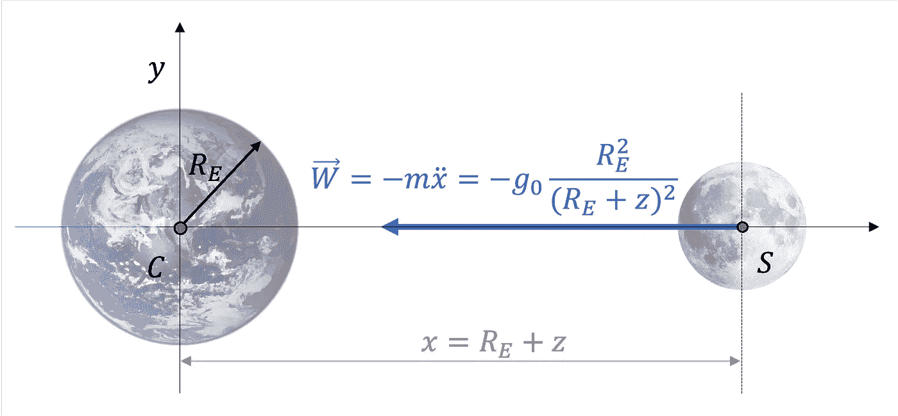
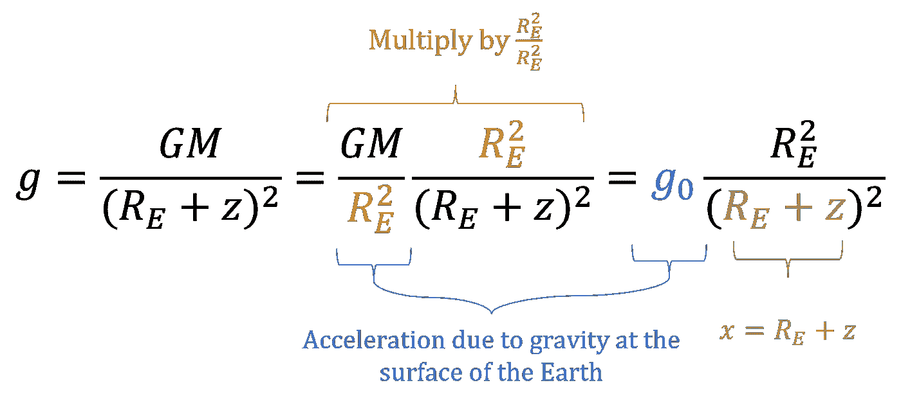
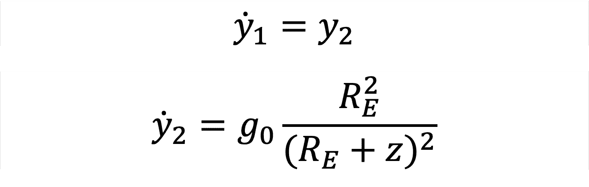
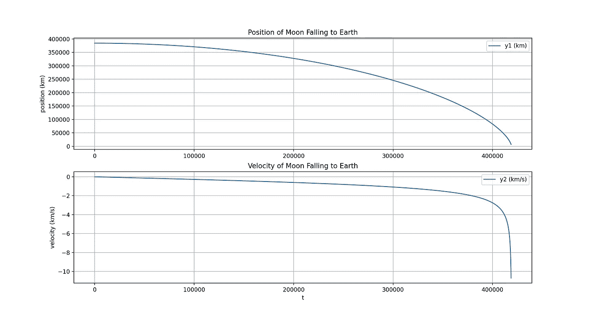
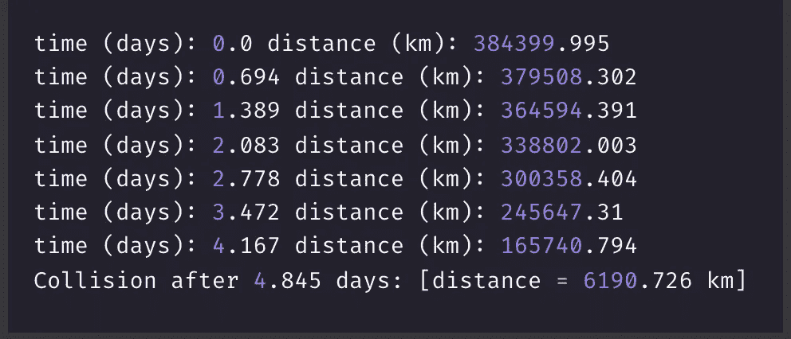

# 数值积分的应用|第二部分——牛顿运动定律

> 原文：<https://medium.com/geekculture/the-moon-in-free-fall-8ccb460b1e32?source=collection_archive---------9----------------------->

## 用数值积分求解牛顿定律

## 介绍

求解*常微分方程通过数值积分在工程和科学学科中是至关重要的。ODEs 描述各种物理*现象*。*

*本文演示了控制物体相对于彼此的**运动的常微分方程的近似解。***

* [## 如何使用 Python 进行数值积分

### 本文旨在演示如何使用 Python 对函数的积分进行数值计算。

python .平原英语. io](https://python.plainenglish.io/how-is-numerical-integration-done-using-python-4585344e5800) 

Photo by [Benjamin Voros](https://unsplash.com/@vorosbenisop?utm_source=medium&utm_medium=referral) on [Unsplash](https://unsplash.com?utm_source=medium&utm_medium=referral)

**月球距离地球**大约 **384，400 公里**。该值*在其*椭圆轨道*和**中变化***。

> 如果月球突然停在轨道上，要多久才会落到地球上？

计算**月球落到地球**所需的**时间**是一个*假设*问题。它包括用数字技术求解牛顿运动定律。

*数值积分计算月球在地球引力作用下向地球运行 384400 公里所需的时间。** 

## *假设*

*某些 ***假设*** 是开始分析所必需的:*

*   *重力只作用于地球和月球之间。*忽略其他引力效应*，比如太阳和其他行星的影响。*
*   *月球轨道瞬间停止*，意味着其相对于固定地球的速度为零。**

**在这个壮观的碰撞过程中，当月球开始向地球*自由落体时，它将沿着**直线**运行。直线运动称为*直线运动*。***

**图 1 显示了简化的地月系统的*自由体图*。*水平 x 轴***

****

**Figure 1 — Free Body Diagram of the Earth-Moon System**

**计算自由落体时间包括找到**运动方程** (EOM)，然后*对* *进行数值积分*。应用**牛顿万有引力定律**和**牛顿第二定律**得出描述自由落体的 EOM。**

> **目的是确定月球在地球引力的影响下沿直线向地球运行 384，400 公里所需的时间。**

## **牛顿万有引力定律**

***牛顿万有引力定律*描述了 m₁和 m₂.两个物体之间的引力重力的*与两个物体之间距离的平方成反比*，如等式 1 所示。**

****

**Equation 1 — Newton’s Law of Universal Gravitation**

*   ****W** : 以**牛顿**计量的重力**
*   *****x:*** 从地球中心到月球中心的位置向量，以公里为单位( *km* )**
*   ****m₁** :地球的质量( *5.972 × 10 ⁴* ，单位为国际单位制千克( *kg* )**
*   ****m₂** :月球的质量( *7.348× 10 公斤*)。**
*   *****G*** *:* 引力常数，*6.674×1011m3⋅kg−1⋅S2*。单位读作“米的立方，每千克秒的平方”。**

**修改等式 1，考虑到 **m₁** 是一个大质量*天体，比如质量*米的地球，给出等式 2。****

****

**Equation 2 — Gravitational Force, W = mg**

**𝑔是重力加速度 ( *米/秒*)，𝑔₀是地球表面的加速度**。**将地球的质量和半径代入等式 2 的括号内，得到𝑔₀。**

****

**Equation 3 — Acceleration due to Gravity (on Earth’s Surface)**

**𝑔 *随着与地球中心的距离而变化*。于是*随着月球越来越靠近地球，***𝑔******增大*** 。需要等式 4 来确定地球表面上方任何**高度 *z*** 处的重力加速度。***

****

**Equation 4 — Variation in Acceleration due to Gravity at Altitude *z* above the Earth’s Surface**

**将等式 4 代入等式 2，给出在距离地球表面*的高度*处，质量 **m₂** 上的**重力****w**。****

****

**Equation 5 — Variation in Acceleration due to Gravity at Altitude *z* above the Earth’s Surface**

## **牛顿第二定律**

**牛顿第二定律概述了物体的**加速度**和作用在该物体上的所有**力**的总和之间的*关系*，如等式 6 所示。**

****

**Equation 6 — Newton’s Second Law; F = ma**

**这个场景中*唯一作用在月球上的力*是 **W** 。因此，牛顿第二定律简化成为方程 7。**

****

**Equation 7 — Newton’s Second Law Applied to Earth-Moon System**

## **运动方程**

**等式 5 和 7 中两个表达式的右边是相等的。因此，方程 8 是一个*二阶常微分运动方程*，描述了**月球由于重力**对地球的**加速度**。**

****

**Equation 8 — Free-fall Equation of Motion**

**回想一下，目标是**找出月球与地球相撞所需的时间**，即月球沿直线向地球运行 384，400 公里所需的时间。**

****速度**是加速度的一次积分，**位置**是加速度对时间的二次积分。因此，要找到月球相对于地球中心的位置，需要两个步骤:**

1.  **将 EOM 简化为一阶常微分方程组**
2.  **通过应用初始条件进行数值积分**

**查看这篇[文章](/geekculture/runge-kutta-numerical-integration-of-ordinary-differential-equations-in-python-9c8ab7fb279c)中关于 ODEs 和数值积分的必要*介绍。***

** [## Python 中常微分方程的龙格-库塔数值积分

### 在 Python 中使用 RK4 求解常微分方程

medium.com](/geekculture/runge-kutta-numerical-integration-of-ordinary-differential-equations-in-python-9c8ab7fb279c) 

方程 9 和 10 中引入的状态变量 **y₁** 和 **y₂** 分别对应于**位置**和**速度**。

Equations 9 and 10 — State Variables

因此*、*、**两个一阶常微分方程**代替了由方程 11 和 12 表示的*、*、*二阶 EOM* 。Python 用于**数字**集成 ODEs**系统。**

Equations 11 and 12 — System of First-Order ODEs** 

## **Python 实现**

**要点 1 显示了描述月球向地球自由落体运动的方程 11 和 12 的等价方程。**

**Gist 1 — Numpy Defined First-Order ODEs Representing Free-Fall**

**初始条件为**y₁= 384000 公里**和 **y₂ = 0 米/秒**。要点 2 是定义*模拟线束*参数的 Python 代码。**

**Gist 2 — Python Code Specifying Simulation Parameters**

**要点 3 描述了*循环*用于**通过时间传播状态**，以评估月球在其*摧毁地球*的旅程中的位置和速度。**

**当 y₁到达地球半径时*循环中断，表示**撞击**。***

**Gist 3 — Figure 4 — Simulation Propagation**

## **结果**

**图 2 显示了模拟期间状态变量的**演变。速度最初从零开始，随着月球越来越靠近地球，*逐渐增加*。****

****

**Figure 2 — Position and Velocity Time Graphs for Moon Falling to the Earth**

**循环在 **t ≈ 4.845 天**时中断。因此，如果月球处于自由落体状态，它会在五天内*毁灭*地球。图 3 显示了控制台输出。**

****

**Figure 3 — Console Output**

## **自由落体中的地球**

**同样的程序也适用于*任何两个行星体*，以确定月球落到地球所需的时间。**

**例如，要计算**地球落入**太阳所需的时间，使用以下值:**

*   ****g0 = 275 米/秒**，太阳表面由于重力产生的加速度**
*   ****RP = 696340 公里**，太阳的半径**
*   ****y0≈14735 万 km** ，地球到太阳的距离。**

**太阳吞噬地球的时间大约是 62.5 天。**

**观看这个视频[来了解一下如果地球停止围绕太阳转的一些后果。](https://youtu.be/NQUdZGsbC0w)**

**本文演示了数值积分在求解运动方程中的单一应用。这个过程包括计算两个天体相撞的时间，如果较小的天体突然停止围绕较大的天体运行。**

** [## 通过我的推荐链接加入媒体-安德鲁·约瑟夫·戴维斯

### 作为一个媒体会员，你的会员费的一部分会给你阅读的作家，你可以完全接触到每一个故事…

medium.com](/@andrewdaviesul/membership) 

查看 Gist 4 中的所有 **Python 代码**。

Gist 4 — Numerical Integration of Newton’s Laws of Motion** 

## **参考**

**工科学生的轨道力学**