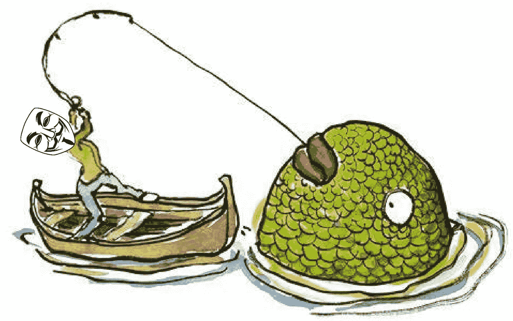
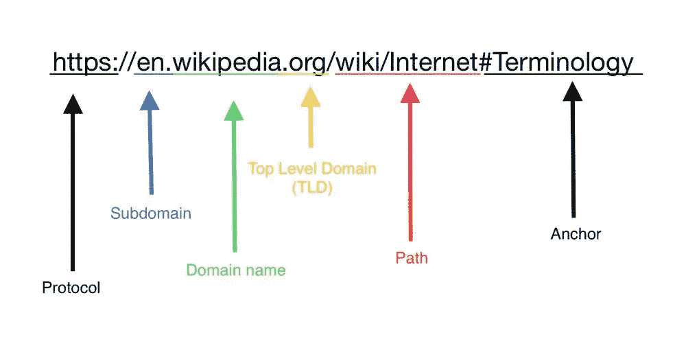
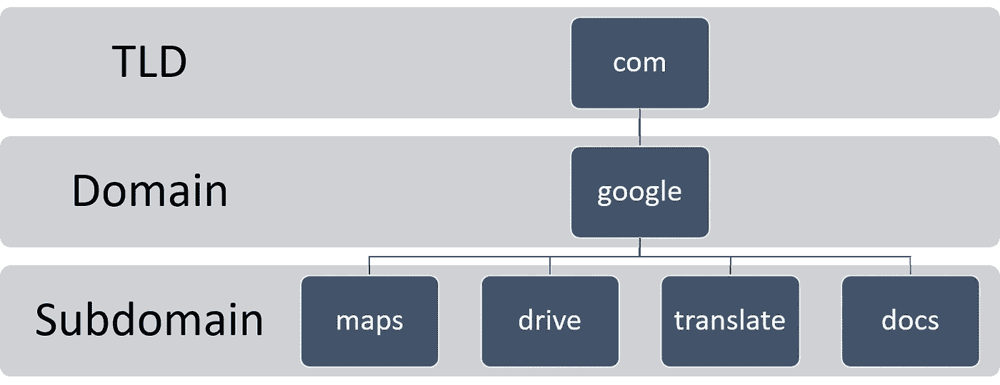
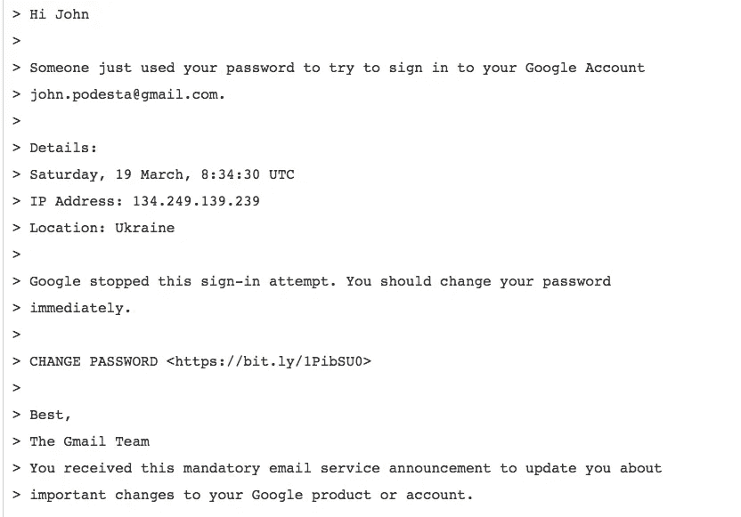

# 人们被黑的最常见方式&如何避免

> 原文：<https://medium.com/geekculture/the-most-common-way-people-get-hacked-how-to-avoid-it-c62eeedf57d6?source=collection_archive---------4----------------------->

## 识别网络钓鱼攻击的简单方法:理解 URL/链接语法

Photo by [Colman Byrne](https://unsplash.com/@colmanbyrne?utm_source=medium&utm_medium=referral) on [Unsplash](https://unsplash.com?utm_source=medium&utm_medium=referral)

沙特记者贾马尔·哈肖吉(Jamal Khashoggi)、希拉里·克林顿 2016 年总统竞选主席约翰·波德斯塔(John Podesta)和乌克兰电网。所有这些有什么共同点？答案是:他们都是电脑钓鱼攻击的受害者。

这些攻击发送了恶意软件，控制了他们的设备，导致 [Khashoggi 最终被谋杀，](https://citizenlab.ca/2018/10/the-nso-connection-to-jamal-khashoggi/)约翰·波德斯塔的[电子邮件泄露](https://en.wikipedia.org/wiki/Podesta_emails)扰乱了 2016 年美国大选，[乌克兰电网被暂时禁用](https://en.wikipedia.org/wiki/December_2015_Ukraine_power_grid_cyberattack)。

尽管引用的例子非常引人注目，但这并不意味着网络钓鱼攻击只针对高价值目标。恰恰相反，它们是当今最常见的网络攻击形式。2020 年，联邦调查局互联网犯罪投诉中心记录的网络钓鱼事件是其他任何形式的计算机犯罪的两倍。

那么什么是网络钓鱼，我们如何防范它呢？

# 什么是网络钓鱼

> [网络钓鱼](https://en.wikipedia.org/wiki/Phishing)是指黑客伪装成朋友或金融机构等值得信任的实体，以欺诈方式获取敏感信息。

“钓鱼”比喻的意思是让你上钩，然后让你上钩。

网络钓鱼攻击最常见的来源是电子邮件或即时消息。攻击者会使用各种方式来获取想要的信息。以下是一些常见的例子。

*   将受害者发送到虚假网站收集机密信息。例如 Paypal 诈骗、[假重设密码警报](https://www.techoperative.com/how-to-spot-a-scam-password-reset-email-scam/)。
*   向您发送包含恶意软件的[附件](https://www.forbes.com/sites/barrycollins/2021/01/16/dont-click-on-these-5-dangerous-email-attachments/?sh=5c00c3ad7847)或让您通过链接下载恶意软件。

# 如何保护自己

为了不被钓鱼，你需要发现什么时候你被引诱。当你被引导到一个虚假的网站时，你需要能够发现。

有许多启发或指标，我们可以用来识别虚假电子邮件。

## 不可靠的

*   情感激励因素。
*   拼写错误和不寻常/不专业的格式。
*   陌生发件人— [发件人和原始电子邮件地址可以伪造](https://www.tessian.com/blog/what-is-email-spoofing/)。
*   不称呼你的名字——注意，黑客可以在数据泄露或社交媒体中找到你的名字。
*   *https* 安全连接(在你的浏览器中显示的挂锁)——这意味着到网站的[连接被加密](https://www.wired.com/story/phishing-schemes-use-encrypted-sites-to-seem-legit/)。这就像说，你和黑客的连接是安全的。

## 可靠的

*   不请自来的/意外的附件—尤其是当它们是可执行文件格式时:iso、exe、msi、dmg、docm、xlsm、pptm 等
*   检查和评估链接。

我将集中讨论最常见也是最难识别的指标:恶意链接。

不幸的是，识别虚假链接并没有直观的意义。例如，*drive-google.com*。为什么这不是合法的 Google Drive 网址？请继续阅读…

## 学习网址、链接或 URL 结构

网络链接由一个或多个部分组成(技术上称为标签)。每一部分都用句号隔开。

[Sourced from Wikibooks: Internet Fundamentals](https://en.wikibooks.org/wiki/Internet_Fundamentals/Web_browsers)

最右边的标签传达了[顶级域名](https://en.wikipedia.org/wiki/Top-level_domain)；比如域名*google.com*属于 *com* 的顶级域名(TLD)。TLD 的其他例子有 net、gov 和 org 等。
特定国家/地区的 TLD 也存在，如澳大利亚、英国、德国、台湾等。

在名称中，域的层次结构从标签的右侧到左侧递减；左边的每个标签指定了右边域的一个子部分，或子域。例如:对于 en。wikipedia.com，维基百科是 com 的一个子域。en 是维基百科的一个子域。

子域有许多用途。在上面的例子中， *en* 子域就是英文版的维基百科。但再举一个例子:【maps.google.com】—*地图*用来表示地图是谷歌提供的一项服务。

Examples of Google’s use of Subdomains

重要的是要知道，我们正在寻找的主要领域，这总是挂在 TLD 之后。为什么？[因为主域名的拥有者可以在他们的主域名](https://www.namecheap.com/support/knowledgebase/article.aspx/9776/2237/how-to-create-a-subdomain-for-my-domain/?__cf_chl_captcha_tk__=ebe5a33ebe56d688c09b291889e946249e1dfac6-1618128652-0-AWch8TcMSFBvIoQllwjTFu5Aq_TJ80uf47yMbLE23vmW8SR3Uhb9I0srqMPjlV_XCJ434hH-Oc42nUraWchPKjSloaETF-dhMHLpTUoQ6Cb80LWhXqoq3S9dxTUxDGXrSCdj29FMnHCtjqMO_GY1oDa6QPk12XMEz1fyUHWhBf1y5R_kXxJguPJlWAJAl-mpSwwYLcqjhZD6TkPucQicDTW3rmUS_rdvCm3KDfwzrkX2mvTkvmukGfuji3L3l36hnI2AfanM23Fzxwc3Q7lqZ7mLmH4rlxRvKTnCw7DrV0xudmQqeIMOiGvl6N1Vsp8DZYGL2D2NF4LVs45xUd3JuZRuMGsJH_iE8j6ruADoFORs80fLcWOfs8Ur-rQN4uF4Np_EqWEo-RbOuybnvyPQPK3UeF0dnY5QZG6pvo_dWBKUn1DvEEc--TKvrqNx0sWYXpR1PvqMF0unXCl4_lAdiJ70tP4xGJJ0l6B2g5sT4PZalp7iMrxreXHpx5ptfJxGDQj42LVgLb9Pl7TtH-qJXMqVmSnO3_hN3D2F273F7l7A-HOSJh3lFF1z_543KmkSKoPfuyUCRPDAtLV7N5EXuTVSLuSaoHJA0mTuue7uhd63kf0XGtJldeB1bRC0ZNL3VSw8YnSBJRhQOrIE2VOuJFXglRJCroauUSR9h5rp2mvdKD7a2XsBo2j2tAIKztghBW_VlIm86hW_KXjTQFEdPGOn-g-t7N2vBehlbqL3GzYGJhOeJbxRyDuNbN3GzfLIs7XYwpe0GsJXlLwUwHcXBOA)下附加任何他们想要的子域。

# 学习识别恶意链接

## 示例 1 —恶意子域

记住这一点，让我们看一个例子。想象一下，你收到一封看起来像是来自谷歌的电子邮件，说有人与你分享了一份文件。当你查看链接时，它会指引你去 drive.google.com.xyz.com 的

*乍一看，这似乎是真的。但是这里的主域是 *xyz* 。这里的诀窍是域名的所有者添加了子域名，使它看起来像是一个谷歌驱动链接。*

## *示例 2 —恶意主域*

*让我们重温一下之前的 drive-google.com 的例子。这个链接的问题是*驱动器*在这里不是子域，因为*驱动器*没有通过句号与主域分开。所以主域名不是 *google* ，而是 *drive-google* ，一个任何人都可以购买的完全不同的网站。*

## *示例 3 — URL 缩短/重定向服务*

**

*[Sourced from Wikileaks](https://wikileaks.org/podesta-emails/emailid/34899)*

*这是发给前面提到的 2016 年民主党竞选主席约翰·波德斯塔的电子邮件。*

*这封钓鱼邮件使用了一种不同的技术:URL 缩短/重定向服务。这些服务的常见例子有 [tinyurl](https://tinyurl.com/) 和 [bit.ly](https://bitly.com/) 。这些服务允许你做的是创建一个短链接，当打开时，重定向到另一个链接。*

*要记住的是，如果你点击其中一个链接，它可以把你重定向到任何东西。*

*在上面的邮件中，更改密码链接是一个 bitly 链接。当波德斯塔打开链接时，他被重定向到[恶意网站](https://checkshorturl.com/expand.php?u=https://bit.ly/1PibSU0)，导致他的电子邮件账户被黑。剩下的就是历史了。*

# *摘要*

*永远不要打开链接，除非你可以验证链接的主域名是真实的。
如果你想验证一个缩短的网址，你可以通过 [CheckShortURL](https://checkshorturl.com) 展开它。
如果有疑问，只需谷歌或 [DuckDuckGo](http://duckduckgo.com/) 该公司并使用搜索引擎的链接而不是点击电子邮件或短信的链接。
您也可以给公司或个人打电话，确认消息是否合法。
最后，练习！我建议试试谷歌的网络钓鱼测试。
免责声明:我与本网站没有任何关系。祝你好运！*