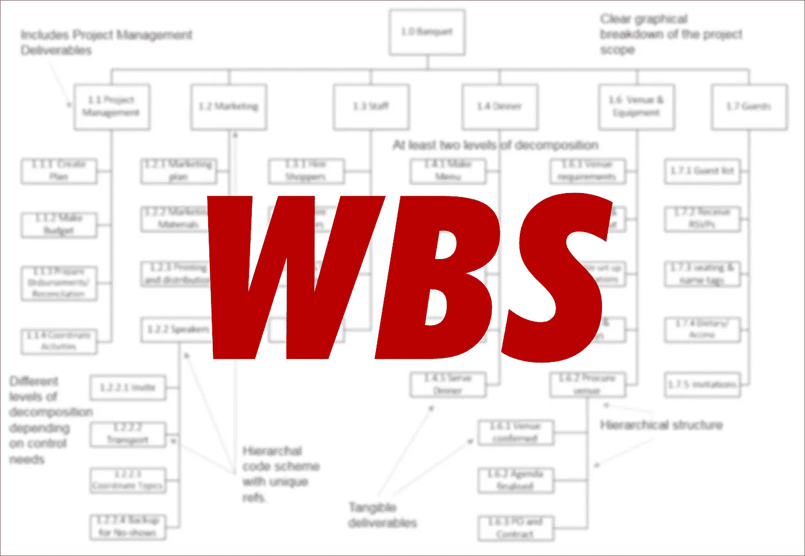

# 项目经理最重要的计划工具

> 原文：<https://medium.com/geekculture/the-most-important-planning-tool-for-project-managers-92f0805cdc99?source=collection_archive---------11----------------------->

## 创建工作分解结构(WBS)是项目管理中最重要的任务之一

无论你遵循什么项目管理标准，WBS 总是一个核心工具。

它构成了**你的项目**的详细规划的基础，因此在…