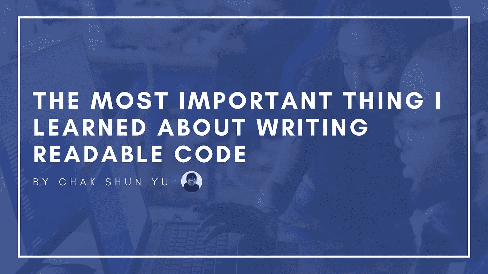

# 在写了 8 个月之后，我学到的关于写可读代码的最重要的事情

> 原文：<https://medium.com/geekculture/the-most-important-thing-i-learned-about-writing-readable-code-after-writing-about-it-for-8-months-8a8228c2c557?source=collection_archive---------16----------------------->

编码最困难的方面之一是它的可读性。每个人都会记得至少有一次他们不得不阅读非常难以理解的代码。您已经对代码的用途有了一点概念。但是不管你通读多少遍，你似乎就是不能理解…