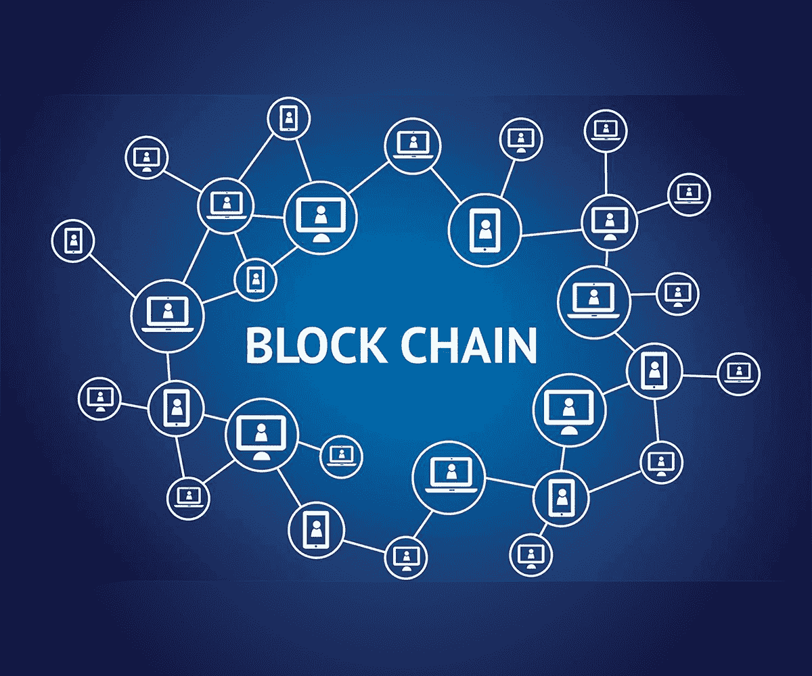
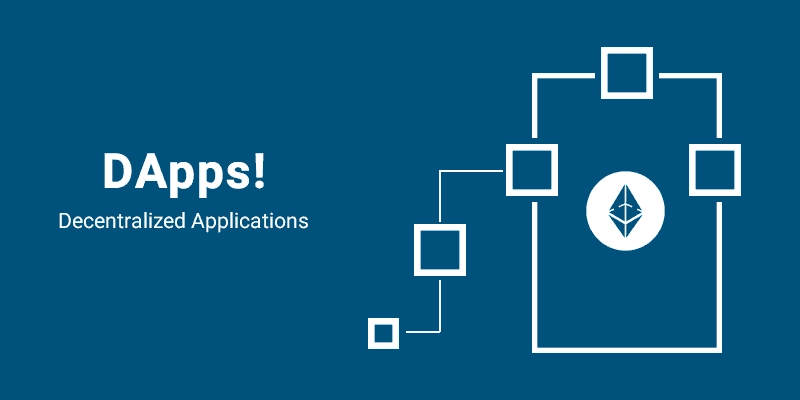
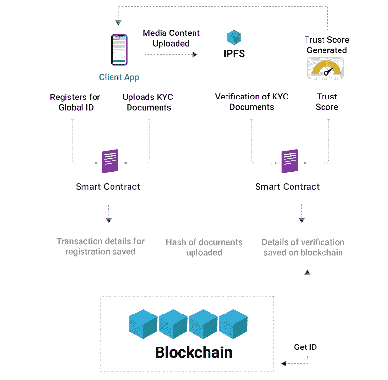
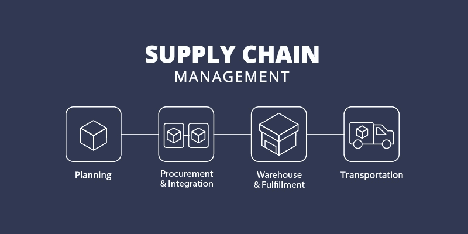
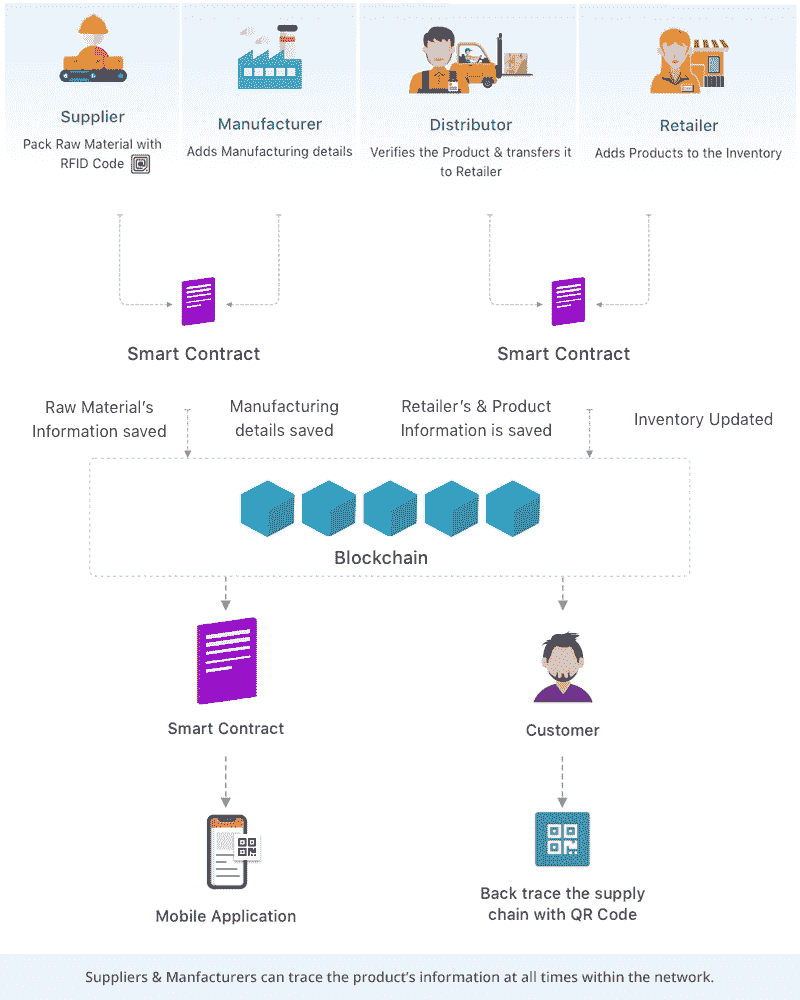
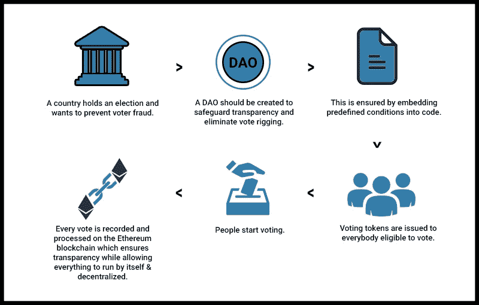
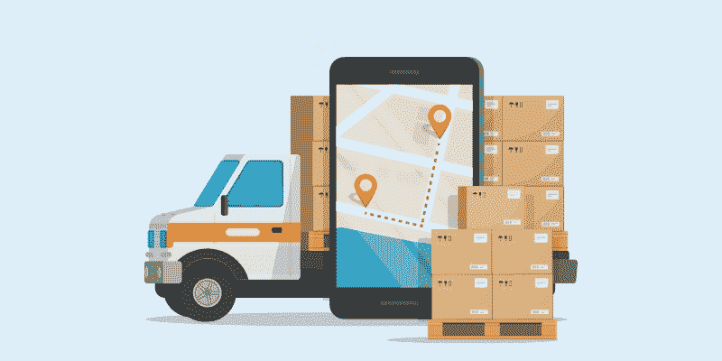
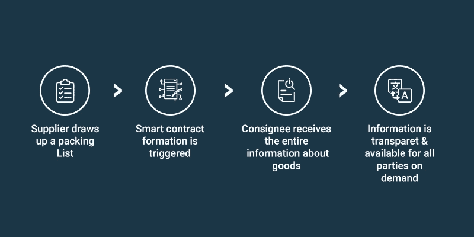

# 2022 年企业最感兴趣的区块链应用创意

> 原文：<https://medium.com/geekculture/the-most-interesting-blockchain-app-ideas-for-businesses-in-2022-f32a956a1204?source=collection_archive---------2----------------------->

***总有一天一切都会被一条区块链令牌化、连接起来。***

**-弗雷德·埃瑟拉姆**

自 2011 年诞生以来，区块链已经走过了漫长的道路。如今，它已经在市场上走过了十年，并取得了显著增长。

根据一项在线调查，**全球区块链市场将从 2020 年的 30 亿美元增长到 2025 年的 397 亿美元，2020-2025 年期间 CAGR 将达到 67.3%。**

对安全应用、简化业务流程以及无缝供应链管理应用的需求日益增长，这使得区块链成为一站式解决方案。它带来了许多商机，可以改变当前的业务流程。

区块链实际上是做什么的？有什么想法吗？这个问题我估计你们很多人都没有明确的答案，但是我有。阅读下文。

区块链是一种去中心化的技术，将信息存储在不可变的账本中。它提供安全和匿名的交易，包括一个精确的点对点网络。这种分散技术有两个主要作用:

*   数据安全
*   虚拟记录交易价值

早些时候，交易存储在银行的集中式数据库中，但随着区块链的出现，交易变得去中心化了。在这项技术的帮助下，记录不是存储在一个地方；相反，它们存储在全球的多台计算机上。它确保没有黑客可以访问和修改数据的中心点。

这就是为什么区块链是 IBM、三星 SAP 和马士基等顶级商业巨头的最终选择。他们在这项技术上投入了大量资金，以简化他们的业务流程。

如果你是创业者，区块链领域有哪些机会在等着你？考虑到区块链的巨大人气，我列出了一些令人兴奋的 2022 年区块链应用商业想法。让我们探索其中的一些。

# 2022 年顶级区块链应用创意:

> 1.分散式应用

区块链领域由运行在对等网络上的分散式应用组成。这些应用还包括加密货币钱包、采矿服务等。大多数新兴企业都在这一领域开展业务。

一些例子是 Cryptokami、Cryptyk、Zeus Exchange 和 Cognida。

2020 年，去中心化 app 用户总数为 2031596 人。但到 2022 年，这一数字将呈指数级增长至 36909238。这就是为什么企业家对这个领域感兴趣，以获得最大利益。

**基于区块链的 DApp 优势:**

-分散存储防止数据被黑客攻击或窃取。

-它们是透明且不可变的，因此用户可以信任这些数据。

-没有单点故障，因此网络能够抵御攻击。

-开发和运营成本低，因为不需要第三方。

> 2.基于数字身份的应用

区块链技术提供了一个去中心化的平台，在 [**区块链开发公司**](https://www.pixelcrayons.com/blockchain-development) 的帮助下构建数字身份。以前，身份认证既复杂又耗时。但现在不是了；区块链技术变得比以往任何时候都容易。这就是为什么企业家在他们的商业模式中探索数字身份，以最大限度地提高他们的盈利能力并简化他们的流程。

**基于数字身份的区块链应用程序的一些例子有 Civic、uPort 和 Bitnation。**

这些应用程序提供了一种安全便捷的方式来管理数字身份。它们也是透明的和不可变的，这使得它们对用户来说是值得信赖的。

**基于区块链的数字身份应用的优势:**

-它们提供了一种安全便捷的方式来管理用户身份。

-它们可用于各种业务场景，包括银行和金融、医疗保健、保险等。

> 3.供应链管理应用程序

对分布式账本技术管理复杂供应链的需求日益增加，这使得这种应用程序想法非常适合区块链企业家。大公司期待在这项技术的帮助下精简他们的供应链。

例如 IBM、三星和马士基。

他们正在区块链技术上进行大量投资，以建立高效透明的供应链。

**区块链供应链管理 app 的优势:**

-它们在制造商、仓库和零售商之间提供完全透明的信息。

-它们允许用户通过可靠的身份验证来处理他们的产品。

-它们是安全的和防篡改的，因此数据不能被修改或黑客攻击。

-它们提供实时数据和快速交易。

> 4.政府投票应用

投票过程是任何政府的基本职能之一。但这也是一个复杂而耗时的过程，很容易操作。然而，在区块链技术的帮助下，这个过程可以变得更加安全和高效。

根据一项研究，政府投票应用程序提供了一个不可改变的、可审计的、不能被操纵的平台。这将使投票过程更加透明，最终，公民将能够信任政府。

**政府投票应用程序的一些例子是 Follow My Vote 和 Voatz。**

它们提供了一种安全透明的投票方式，这是传统方法所无法做到的。这些应用程序也不受操纵和欺诈的影响。

**基于区块链的投票应用的优势:**

-它们是防篡改的，因此用户可以信任匿名投票。

-它们提供了一种安全透明的投票方式。

-它们不受操纵和欺诈的影响。

-它们提供了一个不变的、可审计的平台。

-它们提供更好的数据集成。

> 5.运输和物流应用

运输和物流行业是全球最复杂和最具挑战性的行业之一。这也是一个高度竞争的行业，因此企业需要找到简化运营和降低成本的方法。

好消息是，区块链技术可以帮助企业加强供应链和运营，最终增加收入。

事实上，根据一项研究，运输和物流领域的**区块链市场将从 2018 年的 7700 万美元增长到 2023 年的 31 亿美元，CAGR 为 80.76%。**这就是为什么这个行业中许多企业都在探索区块链技术并不奇怪。

一些使用区块链技术的交通和物流 app 有 OriginTrail、Modum 和 Ambrosus。

**基于区块链的交通物流 app 优势:**

-它们提供简单的文档协调。

-它们降低了运输成本。

-它们提供简单安全的货物跟踪。

-它们实时安全地存储、验证和更新数据。

*   它们有助于在企业和消费者之间建立信任。

# 现在，让我们结束吧！

这些是 2022 年最令人兴奋的区块链应用商业创意。如果你是一名企业家，你应该探索这些想法，看看你如何利用区块链技术为你的企业创造更好的未来。

如果你应该从这篇文章中吸取一些东西，那就是区块链应用中的一个绝佳机会。到 2025 年，市场规模将达到 150 亿美元，毫无疑问，进入这个行业的企业家将会有一个美好的未来。

换句话说，这些是 2022 年基于区块链技术的一些非常棒的应用想法，如果你需要帮助，你也可以 [**在印度雇佣一名区块链开发者**](https://www.pixelcrayons.com/hire-blockchain-developers) 。他们将帮助你开始你的项目，并提供必要的资源，使其取得成功。

# 常见问题

**问——什么是区块链技术？**

**A-** 区块链是一种去中心化、分布式的数字账本，记录跨越多台电脑的交易。没有网络对所有后续区块和共识的变更，你不能追溯性地变更它。把它想象成一个在许多不同地方记录信息的通道，如果你有正确的密钥，它几乎不可能被黑客入侵，但也可以被验证。

**问-什么是政府投票应用程序？它怎么会用区块链技术？**

**A-** 一款政府投票应用是一款在线工具，让投票更加安全高效。这个应用程序使用区块链技术来创建一个安全、不可变、可审计的平台，以增加选民的参与。

**问-什么是运输和物流业？**

**答-** 运输和物流行业包括所有为了商业利益而提供物品移动、存储或处理的组织。

**问-区块链技术如何改变行业？**

答:使用区块链，公司可以追踪供应链，以确保他们没有使用童工或传递危险材料。

**Q-2022 年区块链应用将如何影响公司？**

**答-** 区块链技术仍处于早期发展阶段，因此很难说。然而，很有可能更多的企业将开始使用区块链技术来创建更加透明和高效的系统。

**问-什么是数字身份？**

**A-** 数字身份是一种在线角色，由定义个人、实体或对象的信息和数据组成。区块链是存储数字身份的绝佳方式，因为所有信息都是去中心化的。

**问-区块链技术公司有哪些例子？**

**A-** 主要的区块链技术公司包括 PixelCrayons、微软公司、IBM 公司、LLP 德勤咨询公司、Ripple 和 chain。

**问-区块链应用将如何改变客户服务？**

**A-** 区块链技术可以降低处理交易的成本，因为它比使用银行或其他金融机构等第三方的传统方法更便宜。它还降低了欺诈风险，消除了手动过程中的错误，并确保更快地访问信息，同时保护敏感信息的隐私。