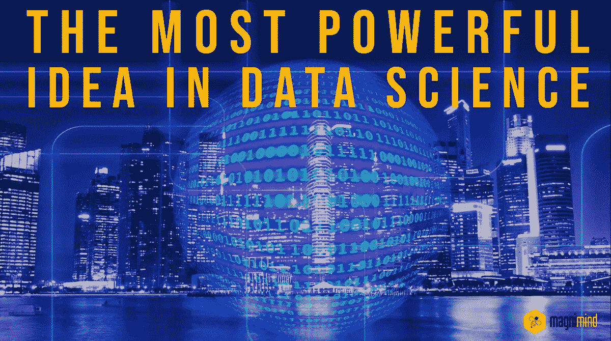

# 数据科学中最强大的想法

> 原文：<https://medium.com/geekculture/the-most-powerful-idea-in-data-science-6ff04025f76e?source=collection_archive---------24----------------------->

## *如今在*科技领域，有大量的人试图走上不同类型的新道路，最终在**数据科学领域找到职业**。不可否认，这个目标是有价值的，但是对**数据科学**的关键目标有一个清晰的认识也很重要。在这篇文章中，我们将尝试探索它。让我们开始讨论。

如今在科技领域，有大量的人试图走上不同类型的新道路，最终在**数据科学**领域找到职业。不可否认，这是一个有价值的目标，但对**数据科学**的关键目标有一个清晰的认识也很重要。在这篇文章中，我们将尝试探索它。让我们开始讨论。

> 首先，**数据科学**通常被描述为一个多学科领域，它使用科学流程、方法、系统和算法从数据中获取洞察力和知识。大数据的出现促进了新算法、系统和计算范式的发展。**数据科学**作为一个领域本质上是用最强大的硬件，最强大的编程系统，和算法来获得问题的解。

W 当谈到识别**数据科学**中最强大的想法时，我们可以说这取决于模式和你想要使用它们的方式。哪种模式对你有用，取决于你要实现的目标。

彼得·格里森

 [## 数据科学应该学习哪些语言？

### 数据科学是一个令人兴奋的工作领域，结合了先进的统计和量化技能与现实世界…

medium.com](/free-code-camp/which-languages-should-you-learn-for-data-science-e806ba55a81f) 

虽然**数据科学**最基本的定义是它是一个涉及捕获、存储、组织和分析大量数据的领域，但它都归结为识别模式和得出结论，可以帮助确定当前业务问题的解决方案或预测未来的范围。当谈到识别模式时，最好的办法可能是分割数据集。然后让分析师专注于某一部分，从该部分得出他们的见解，最后使用数据集的另一部分来检查他们的结论。

> 理解这一点很重要，近年来，**数据科学**的领域最终变得不那么关于数据，而是关于用于与数据交互的不同类型的工具和技术。

人工智能、机器学习等高端解决方案以及强大的高级分析工具现在不仅可以处理和理解大量数据，而且可以以前所未有的速度进行处理和理解。

如果阅读到现在并了解到**数据科学**最重要的思想让你对该领域感兴趣，让我们快速讨论一下对开始你的旅程至关重要的事情。一些显而易见的科目包括编程、数学、描述性统计、线性代数和机器学习。知名机构提供了许多在线课程，可以帮助你对所有这些主题有一个全面的了解。然后还有**数据科学**硕士项目，以及证书课程，可以帮助你获得该领域更高级的技能。

 [## 区块链:我们如何使用它，需要学习哪些技能？

### 让我们看一些最常见的区块链使用案例，以了解为什么专家称之为最大的干扰之一…

magnimind.medium.com](https://magnimind.medium.com/blockchain-how-can-we-use-it-and-what-skills-are-required-to-learn-db313e86b761) 

保持**数据科学**的关键目标和技术领域的现状，不难说**数据科学**的未来将变得比以往任何时候都更广阔——因为该领域几乎触及每个企业级流程。在自动化、机器学习和更先进、更高效的解决方案的帮助下，我们可以期待看到这一进展变得更快。

 [## 通过硅谷的训练营，在短短 6 周内成为一名数据科学家

### 数据科学中最强大的想法如今在科技领域，有大量的人试图开始…

magnimindacademy.com](https://magnimindacademy.com/blog/the-most-powerful-idea-in-data-science) 

> 在此订阅接收[我们的头条新闻。](http://eepurl.com/gjDwwP?source=post_page---------------------------)
> 
> 加入我们新的 Slack 社区:[https://bit.ly/AI-ML-DataScience-Lovers](https://join.slack.com/t/datasciencelovers/shared_invite/zt-iibhx6xf-MX8W8Ruueh~6ExrgCbIpeg)