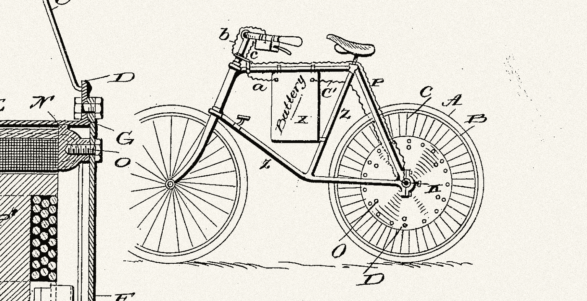

# 这是自 iPhone 以来我用过的最具革命性的技术

> 原文：<https://medium.com/geekculture/the-most-revolutionary-piece-of-tech-ive-used-since-the-iphone-14e7258e4b95?source=collection_archive---------4----------------------->

## 这不是密码，也不是元宇宙

在过去的几年里，我戴过 Oculus VR 头戴设备([非常酷](/digital-natives/we-gave-everybody-an-oculus-quest-2-here-are-our-notes-5c0aaaf6874d))，尝试过 crypto(谨慎乐观)。在此之前，我已经为我的家配备了回声扬声器和智能家居灯、插座和恒温器(实际上非常棒，只要你降低期望值)。我戴过 Apple Watch(但一年后它就在抽屉里了)，升级过 iPhone(增量更好)，甚至买过任天堂 Switch 来打发疫情时间(好玩！).

跨越创新的地平线有很多令人兴奋的事情。摩尔定律[继续震撼着我](https://twitter.com/guttmann/status/1450159467006414856)，一些新技术几乎与魔法无异。

但是通过这一切，我在过去五年中使用的最具革命性的技术看起来很像两百多年前发明的东西。**是电动自行车。**

自从 2008 年我的第一部 iPhone 以来，没有什么比这更能改变我在这个世界上的存在方式，我看待周围空间并与之互动的方式。电动自行车改变了你人生的地理位置。它们打开了新的世界和新的感觉。它们是一个可持续的、健康的、彻底快乐的解决人和事物如何移动的方案。

虽然早在 1897 年就发明了第一辆电动自行车，但直到最近几年，随着电池变得更强大、更实惠，这场革命才真正加速。当疫情给纽约和其他城市带来自行车热潮时，一切都变得明朗了。

大多数领先的电动自行车，比如我去年夏天买的(并爱上了)RadRunner ，都有足够的能量让你轻松地爬过那些在正常通勤中会让你大汗淋漓的山丘和桥梁。在纯油门模式下，你可以达到轻快的 20 英里/小时，轻松到达大多数城市内的目的地，并在一次充电内返回。特别是随着我们的城市慢慢变得更加自行车友好，这些设备——而不是电动汽车——是在汽车拥堵的市中心导航的最佳解决方案。

一段时间以来，送货者一直领先于电动自行车，在这座城市的任何一条大街上，你都可以看到他们以令人印象深刻的速度和优雅在城镇周围快速送餐和购物。这些专业人士比任何人都更有在城市空间中移动的经验，他们是我们应该期待的早期采用者，以了解我们其余人如何出行的未来。

元宇宙很好，但我们仍然存在。在现实世界中，没有什么比电动自行车改变我们的城市和生活的力量更让我兴奋的了。

 [## 本·古特曼的《简而言之》|

### 想想你听过的最有力的信息。想象一下流传下来的最能改变生活的建议…

www.benguttmann.com](https://www.benguttmann.com/simply-put-book)  [## 3 件简单的事情——营销通讯

### 通过市场营销部门的 3 件简单的事情简讯，每周只需 3 分钟就能更好地沟通、说服和领导

www.benguttmann.com](https://www.benguttmann.com/newsletter)