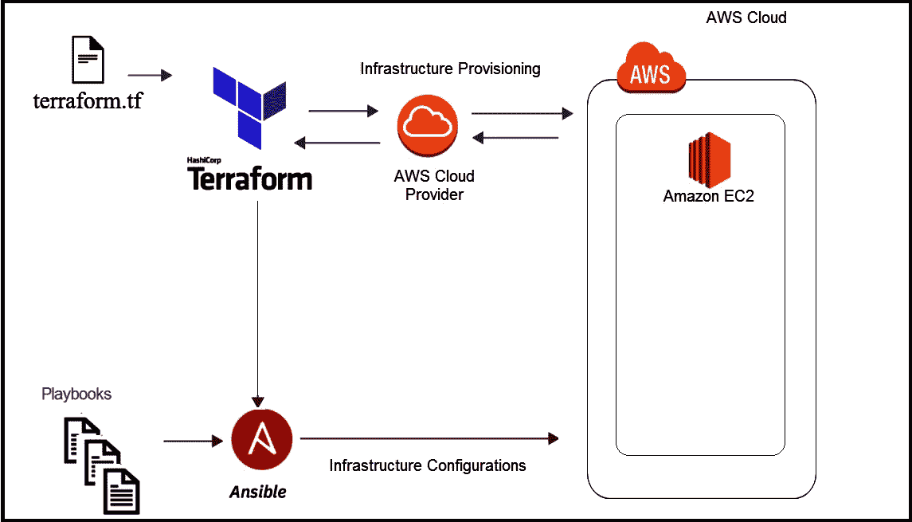
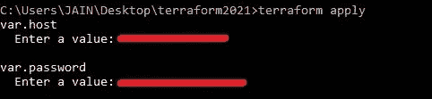
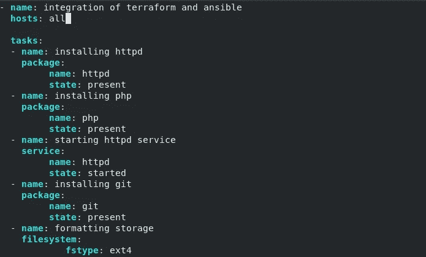
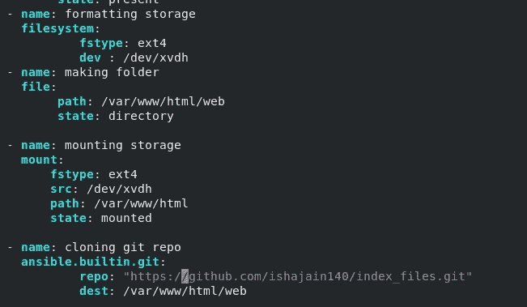
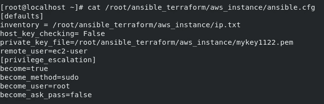
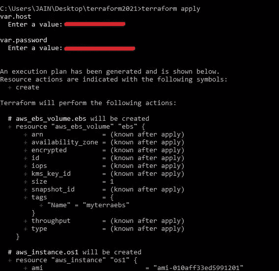
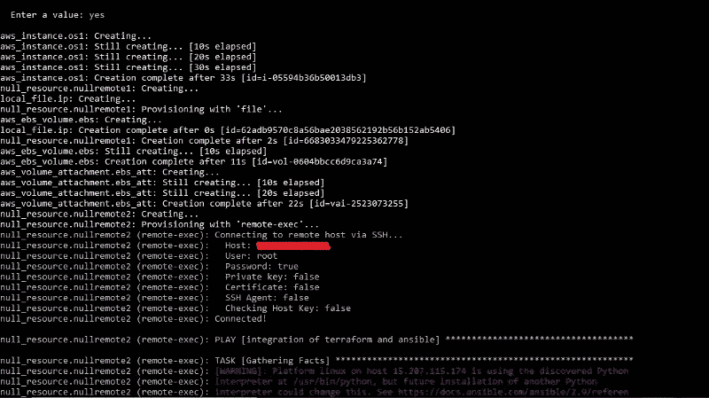
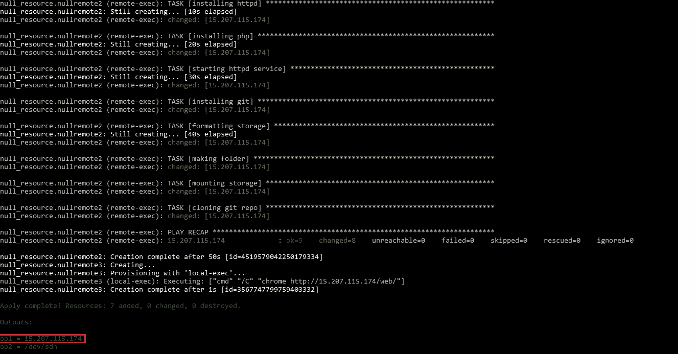
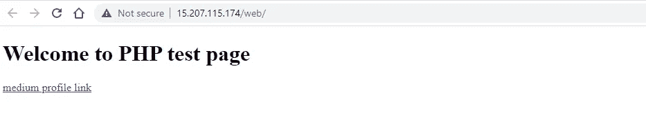
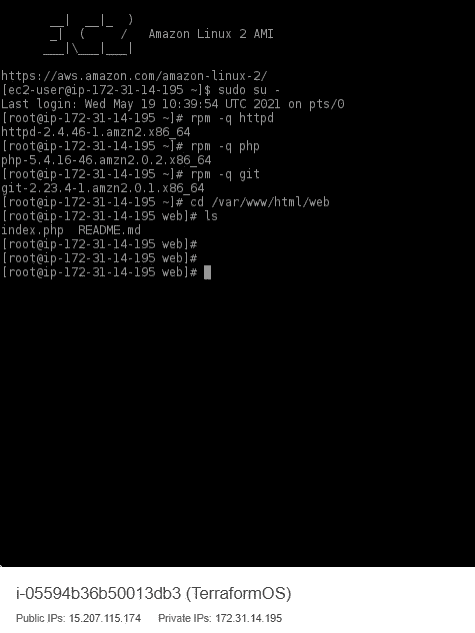

# Ansible 和 Terraform 的最简化集成

> 原文：<https://medium.com/geekculture/the-most-simplified-integration-of-ansible-and-terraform-49f130b9fc8?source=collection_archive---------1----------------------->

大家好！我带着另一个演示回来了，以最简化和精细的方式集成不同的工具。

*Terraform 和 Ansible 是两个独立的工具，有着各自的用途，但事实上，它们可以集成在一起解决典型的用例，它们相互补充的方式使它们更受欢迎。*



# 将（行星）地球化（以适合人类居住）

It 是一个基础设施代码(IaC)软件工具，用于构建、更改和版本控制基础设施。它与 500 多家提供商合作，这些提供商的资源可用于配置基础架构。


# Ansible

它是一个配置管理工具，在已经设置好的基础设施上配置和部署应用程序时非常方便。在本文中，我们已经使用 Ansible 配置了 terraform 部署的基础设施。


在这个演示中，我试图通过协调 Terraform 管理节点和 Ansible 控制节点来集成这些工具。为此，我将使用 terraform 启动一个 AWS 实例，然后使用 Ansible 配置该实例来部署我们的网页，该网页将在部署后自动打开。让我们看看这是如何做到的…

# 使用 terraform 创建 AWS EC2 实例

首先，我们使用 terraform 代码在 AWS 上创建基础设施。我们创建了一个 AWS EC2 实例和一个与之相连的 EBS 卷。

```
**#aws instance creation**
resource "aws_instance" "os1" {
  ami           = "instance-image-id"
  instance_type = "t2.micro"
  security_groups =  [ "secret-group-name" ]
   key_name = "key-name-used-to-create-instance"
  tags = {
    Name = "TerraformOS"
  }
}**#ebs volume created**
resource "aws_ebs_volume" "ebs"{
  availability_zone =  aws_instance.os1.availability_zone
  size              = 1
  tags = {
    Name = "myterraebs"
  }
}**#ebs volume attatched to instance**
resource "aws_volume_attachment" "ebs_att" {
  device_name = "/dev/sdh"
  volume_id   = aws_ebs_volume.ebs.id
  instance_id = aws_instance.os1.id
  force_detach = true
}
```

使用 Terraform 创建基础架构后，所有关于已供应资源的信息都保存在其[***terra form . TF state***](https://www.terraform.io/docs/language/state/index.html)文件中。该状态文件用于检索已启动的实例的 IP，该实例在 Ansible [**库存文件**](https://docs.ansible.com/ansible/latest/network/getting_started/basic_concepts.html#inventory) **中传递。**该库存文件保存了关于其 [**管理节点**](https://docs.ansible.com/ansible/latest/network/getting_started/basic_concepts.html#managed-nodes) 的信息，Ansible 需要在该节点安装必要的应用程序。

# 已创建动态可行库存文件，并将其复制到远程可行控制节点

为了将启动的 AWS 实例的 IP 转移到 Ansible，首先将 IP 复制到一个文件( *ip.txt* )中，该文件将作为 Ansible 的一个清单。然后使用 terraform [***连接***](https://www.terraform.io/docs/language/resources/provisioners/connection.html) 将该文件复制到 Ansible 控制节点。使用 *SSH 连接*连接到远程控制节点 terraform。

```
**#IP of aws instance copied to a file ip.txt in local system**
resource "local_file" "ip" {
    content  = aws_instance.os1.public_ip
    filename = "ip.txt"
}**#connecting to the Ansible control node using SSH connection**
resource "null_resource" "nullremote1" {
depends_on = [aws_instance.os1] 
connection {
 type     = "ssh"
 user     = "root"
 password = "${var.password}"
     host= "${var.host}" 
}**#copying the ip.txt file to the Ansible control node from local system** 
provisioner "file" {
    source      = "ip.txt"
    destination = "/root/ansible_terraform/aws_instance/ip.txt"
       }
}
```

库存文件从上面的代码中复制到 Ansible 控件节点:


inventory copied at Ansible control node

## Variable.tf 文件

一个 *variable.tf* 文件用于保存“密码”和“主机”等变量，如下所示。

```
variable "password"{
  type = string
 }
variable "host"{
}
```

当我们运行 terraform 文件( *ansi_terraform.tf* )时，会动态询问*密码*和*主机*变量的值，这可以防止您的密码和个人 IP 暴露给任何有权访问您代码文件的人。



variable’s value passed while running the terraform file

# 使用 terraform 文件中的 remote-exec 在远程系统上运行 ansible 剧本

现在，要使用 Ansible 配置已启动的实例，我们需要在本地系统的远程 ansible 控制节点上运行 ansible playbook，在本地系统中我们有 terraform。这可以通过使用 terraform 的 [***远程执行***](https://www.terraform.io/docs/language/resources/provisioners/remote-exec.html) 功能来实现，该功能使我们能够在远程系统上运行命令。

***注意:在本演示中，Terraform 在 Windows 上使用，由于 Ansible 需要 Linux 操作系统，我们使用了一个远程 Linux 系统作为 Ansible 控制节点。***

```
provisioner "remote-exec" {
 inline = [
 "cd /root/ansible_terraform/aws_instance/",
 "ansible-playbook instance.yml"
]
}
```

**完整的 terraform 代码文件 *ansi_terraform.tf* 可以在** [***这里***](https://github.com/ishajain140/terraform_ansible_integration/blob/main/ansi_terraform.tf) **找到。**

# 可行的剧本任务

我们使用 ansible 剧本在 AWS 实例上执行一些任务:

*   *安装 httpd，php，git 包，*
*   *启动 httpd 服务，*
*   *制作文件夹/var/www/html/web*
*   *格式化和挂载存储在/var/www/html/ folder*
*   *克隆/var/www/html/web 文件夹中的 GitHub 存储库*

***注意:如果你想在 Linux 中创建一个分区，使用*** `***fdisk device_name***` ***命令，例如:*** `***fdisk /dev/xvdh***` ***，一个交互终端将打开，它将询问不同的选项。您可以输入' n '来创建一个新分区，输入' d '来删除一个分区，输入' h '来获得帮助。***



**instance.yml** ansible playbook



**instance.yml** ansible playbook

***注:如需完整的可下载 ansible 剧本，请访问 GitHub 资源库*** [***此处***](https://github.com/ishajain140/terraform_ansible_integration/blob/main/ansi_terraform.tf) ***。***

关于如何使用 Ansible 在 AWS 上部署 web 服务器的详细解释可以在我之前的文章中找到:

[](https://faun.pub/deploy-web-server-on-aws-through-ansible-a4c2e26df182) [## 通过 ANSIBLE 在 AWS 上部署 Web 服务器

### 本文涵盖了 Ansible 与 AWS 的集成。在这里，我使用 AWS-EC2 实例作为我的基本操作系统来启动我的…](https://faun.pub/deploy-web-server-on-aws-through-ansible-a4c2e26df182) 

# 可转换的配置文件

我们已经完成了这里的主要部分。另外，我们需要在[***Ansible . CFG***](https://docs.ansible.com/ansible/latest/installation_guide/intro_configuration.html#configuration-file)文件中提供 *ip.txt* 文件在 ansi ble 控制节点上的位置作为库存地址。



**ansible.cfg** file

***注意:Ansible config 文件可以从*** [***这里***](https://github.com/ishajain140/terraform_ansible_integration/blob/main/ansible.cfg) ***下载。***

# 在本地系统上自动打开网页的 Terraform 代码块

最后一步是当我们完成设置后，在本地系统上自动打开网页。为此，我们使用以下 terraform 代码块:

```
provisioner "local-exec" {
command = "chrome http://${aws_instance.os1.public_ip}/web/"
}
```

***所有的地形代码和可译剧本都可以在下面的链接中找到:***

[](https://github.com/ishajain140/terraform_ansible_integration) [## isha Jain 140/terra form _ ansi ble _ integration

### 演示如何将 Terraform 与 ansi ble-ishajain 140/terra form _ ansi ble _ integration 集成

github.com](https://github.com/ishajain140/terraform_ansible_integration) 

现在我们可以继续运行我们的地形代码，使用`terraform apply`。建议先运行`terraform plan`。



terraform apply



AWS instance configured and ansible playbook running



output shows IP of instance

输出一出现，网页就打开，显示部署的网页。



webpage automatically opens

让我们验证一下我们的剧本是否成功地在我们的实例中安装了所需的包。为此，我使用 [*EC2 实例连接*](https://docs.aws.amazon.com/AWSEC2/latest/UserGuide/Connect-using-EC2-Instance-Connect.html) 登录到我的实例。



required packages were installed and the git repository was cloned successfully

## 总结一下…

只需一次点击，我们就可以自动化整个工作流程，这就是通过集成 DevOps 工具实现自动化的力量。这只是其巨大力量的一瞥。这种集成可以扩展到其他云平台，如微软 Azure，GCP 等。以及扩大其范围。

*希望这篇文章能够激发一些好奇心，了解集成的力量。如果你喜欢我的文章或者它在某些方面有所帮助，请留下一些掌声。*