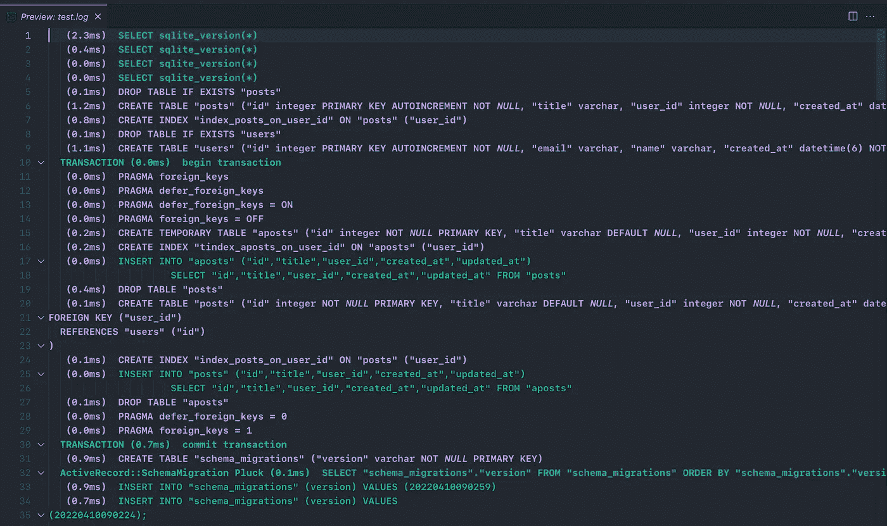
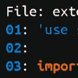
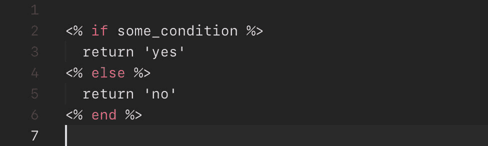
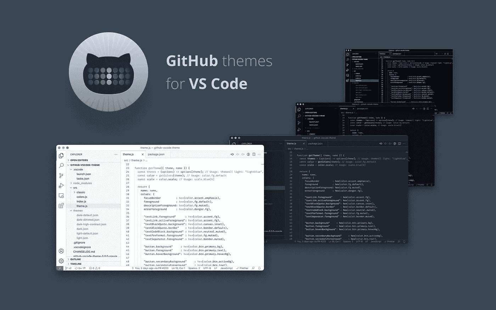
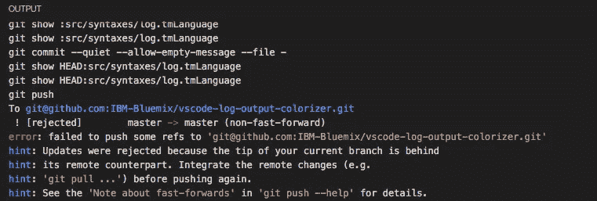
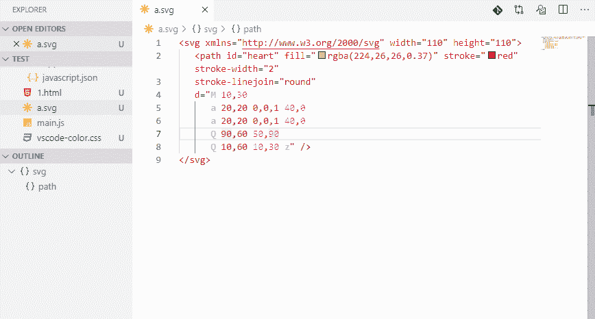
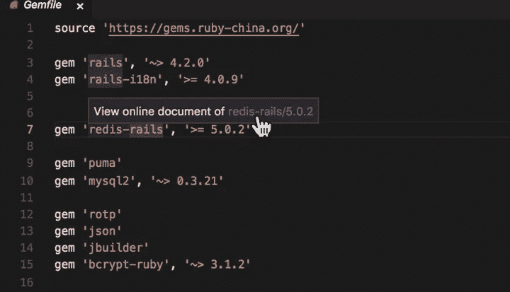
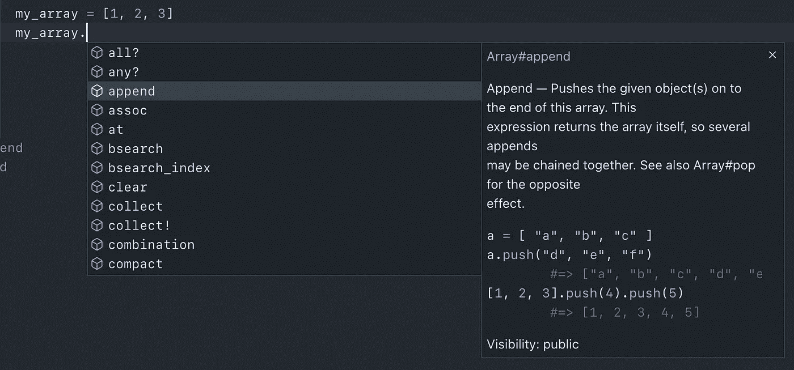

# 我用于 Ruby 开发的最有用的 Visual Studio 代码扩展

> 原文：<https://medium.com/geekculture/the-most-useful-visual-studio-code-extensions-i-use-for-ruby-development-637501115248?source=collection_archive---------1----------------------->

我每天都使用 Visual Studio 代码进行 Ruby on Rails 的 web 开发。默认情况下，它是一个带有便利工具的伟大编辑器。但它的强大之处在于它的推广体系。就像那句“有一个应用程序可以做到这一点”。你也可以说“有一个扩展”:对于你在开发工作中需要的几乎任何东西，无疑都有一个扩展会使事情变得更容易。

以下是我按字母顺序使用的扩展列表。

# ANSI 颜色

如果您在 Rails 中打开一个日志文件，您会看到到处都是奇怪的代码，几乎无法阅读。这些代码是 ANSI 代码，用于给线条着色。

有了这个扩展，您将能够将这些代码翻译成颜色，并轻松地阅读日志，就像在开发控制台中一样。

## 如何使用

ANSI Colors extension screenshot

安装完扩展后，打开日志，然后打开命令面板(macOS 上的 *CMD+Shift+P* ，找到 *ANSI Text: Open Preview* 选项。

文本将被着色，正如你在上面的图像中看到的。

【https://marketplace.visualstudio.com/items?】链接: [itemName = ilia Zeus . vs code-ansi](https://marketplace.visualstudio.com/items?itemName=iliazeus.vscode-ansi)

# 自动关闭标签

Auto Close Tag

自动关闭 HTML 标签。

虽然在默认情况下，Visual Studio 代码已经使用“ *html.autoClosingTags* ”选项自动关闭 HTML 标记，但是该扩展允许您配置使用哪些语言来激活该函数。

## 如何使用

它可以自动关闭 HTML 之外的文件类型中的标记(Visual Studio 代码默认已经这样做了)。

它还允许自动完成标签关闭，就像 Sublime Text 一样。

但最有帮助的特性是它的快捷方式( *CMD+Shift+)。*在 macOS 上)，尤其是在模板中。

**链接:**[https://marketplace.visualstudio.com/items?itemName = formula Hendry . auto-close-tag](https://marketplace.visualstudio.com/items?itemName=formulahendry.auto-close-tag)

# 带行号复制

将代码段复制到它们的行号旁边。

您也可以复制文件名。

## 如何使用

Copy With Line Numbers demo

选择你想要复制的代码片段，打开命令面板，寻找*带行号复制*选项。您有两个变体:*带文件名*和*不带路径*。

然后随便贴哪里都行。

**链接:**[https://marketplace.visualstudio.com/items?itemName = yashs . copy-with-line-numbers](https://marketplace.visualstudio.com/items?itemName=yassh.copy-with-line-numbers)

# 纵向

将*端*自动添加到红宝石块上。

## 如何使用

Endwise demo

打开挡块后，按*进入*，自动添加*端*。

如果您在行中间按 *CMD+Enter* ，它也会被添加。

**链接:**[https://marketplace.visualstudio.com/items?itemName=kaiwood.endwise](https://marketplace.visualstudio.com/items?itemName=kaiwood.endwise)

# ERB 棉绒

检查 ERB 文件中的代码样式。

## 如何使用

ERB Linter demo

你需要 *erb_lint* 宝石。您可以在全局范围内安装，也可以通过带有*捆绑器*的 *Gemfile* 安装。

有几种方法可以从 Visual Studio 代码中检查样式:

*   保存 ERB 文件，它会标记错误。
*   打开命令调板，选择 *ERB 棉绒:带 erb-lint 的棉绒*检查样式。
*   另外，从命令面板中，选择 *ERB Linter:用 erb-lint 自动更正当前文件*来自动更正潜在的错误。

**链接:【https://marketplace.visualstudio.com/items?】[itemName = manuelpuyol . erb-linter](https://marketplace.visualstudio.com/items?itemName=manuelpuyol.erb-linter)**

# 埃斯林特

将 ESLint 集成到 Visual Studio 代码中。

无论如何，您的应用程序最终都会有 JavaScript。这个扩展确保您的代码遵循 JavaScript 风格标准。

## 如何使用

首先，在你的机器上安装并配置 *eslint* ，然后是这个扩展。

当您打开一个 JavaScript 文件时，扩展将检查您在安装库时选择的语法和样式。

**链接:**[https://marketplace.visualstudio.com/items?itemName = dbaeumer . vs code-eslint](https://marketplace.visualstudio.com/items?itemName=dbaeumer.vscode-eslint)

# 责备

在状态栏中键盘光标所在的位置显示谁以及何时编写了代码行。

## 如何使用

Git Blame demo

只需将键盘光标放在一行代码上，然后观察状态栏。

此外，单击此信息会打开更改该行的最后一次提交。

**链接:**[https://marketplace.visualstudio.com/items?itemName = wader Yan . git knob](https://marketplace.visualstudio.com/items?itemName=waderyan.gitblame)

# GitHub 主题

官方 GitHub 主题，各种配色。

## 如何使用

GitHub Theme for Visual Studio Code

安装好主题后，打开主题列表(在 macOS 上，这是用 *CMD+K* 再用 *CMD+T* 完成的，我觉得在 Windows 上也是一样但是用 *CTRL* )。

你会看到不同的主题变化为光明和黑暗的版本。

**链接:**【https://marketplace.visualstudio.com/items? itemName = github . github-vs code-theme

# 输出着色程序

它为面板着色，如“输出”面板。

## 如何使用

Output Colorizer extension screenshot

你什么都不用做。面板的内容会自动着色。

【https://marketplace.visualstudio.com/items?】链接: [itemName = IBM . output-colorizer](https://marketplace.visualstudio.com/items?itemName=IBM.output-colorizer)

# Rails 数据库模式

*   模型对象的自动完成属性
*   访问这些对象的定义
*   访问模式表
*   插入光标所在模式中定义的属性

## 如何使用

Rails DB Schema autocomplete demo

*   在您键入一个点之后，自动补全功能开始工作。
*   要访问对象的定义，请按下 *CMD* (或在 Windows/Linux 上按下 *ALT* )并将鼠标指向对象。将出现一条下划线。单击，您将看到它在浮动区域内的定义位置。事实是它非常方便和有帮助。
*   要访问模式中定义的表，您必须访问命令面板并搜索 *Rails DB Schema: Open*
*   要插入属性，同样的事情:访问命令面板并搜索 *Rails DB 模式:Insert*

**链接:**[https://marketplace.visualstudio.com/items?itemName = aki 77 . rails-d b-schema](https://marketplace.visualstudio.com/items?itemName=aki77.rails-db-schema)

# 红宝石太阳图

Ruby 的自动完成、代码检查和文档。

## 如何使用

Ruby Solargraph demo

为了让这个扩展工作，你必须安装 solargraph gem: *gem 安装 solargraph*

*   正如你在上面的演示中看到的，它检测变量和对象，并在输入一个点后自动完成。如果没有自动出现，可以在 macOS 上按 CMD+Space(或者在 Linux/Windows 上按 CTRL+Space)。
*   如果您将鼠标悬停在任何对象或方法上，会出现一个包含文档的弹出窗口。
*   它包含了一个 linter 来验证 Rubocop 的代码风格。您必须访问扩展配置并启用诊断选项。我喜欢它的高速度，你不需要保存文件来验证它。

如果打开命令面板并选择*solar graph:Create a solar graph config file*，它将在项目的根目录下创建 *.solargraph.yml* 文件。最有趣的选项是在哪里做检查以及使用哪种棉绒。我一般都分配*全部！*到*记者*选项，这样它就把它们都用上了。

**链接:**【https://marketplace.visualstudio.com/items? itemName = cast wide . solar graph

# 挽救（saving 的简写）

创建、修改、缩小和预览 SVG。

## 如何使用

SVG previewing demo

*   当您编辑 SVG 文件时，它会向您显示自动完成的建议。
*   如果你想删除所有不必要的东西，打开 SVG 文件，进入命令面板，选择*缩小 SVG* 。
*   在我看来，最有趣的是当你想预览 SVG 格式的图像时。右击该文件并选择*预览 SVG* 。如果已经打开了文件，也可以从命令选项板中选择该选项。

**链接:**[https://marketplace.visualstudio.com/items?itemName=jock.svg](https://marketplace.visualstudio.com/items?itemName=jock.svg)

# VSCode rdbg Ruby 调试器

使用 Visual Studio 代码工具调试 Ruby。

也许是我使用的最令人兴奋的扩展之一，因为在 Ruby 中调试通常是在控制台中完成的。但是这样的话，你可以在视觉上做到。

## 如何使用

你需要在你的系统上安装 debug gem，这是 Ruby 的新标准。

*   转到*运行和调试*部分，创建一个新的 launch.json 文件。
*   选择*拼音*作为语言。
*   根据需要对其进行配置。例如，如果你想在 Ruby on Rails 中进行调试，把这个放到*脚本*选项:*" $ { workspace folder }/bin/Rails server "*。

如果你对这个话题感兴趣，我目前正在为 LinkedIn 学习开设一门课程，你会发现非常有用。请关注我，当它准备好的时候，我会发布一个更新，给你一个惊喜。

**链接:**[https://marketplace.visualstudio.com/items?itemName = koichisasada . vs code-rdbg](https://marketplace.visualstudio.com/items?itemName=KoichiSasada.vscode-rdbg)

# vscode-gemfile

快速访问 gem 文件中定义的 gem 文档。

## 如何使用

vscode-gemfile demo

*   将鼠标悬停在一个 gem 名称上，会出现一个弹出窗口，其中有一个指向 RubyDoc 文档的链接。

**链接:**[https://marketplace.visualstudio.com/items?itemName = bung 87 . vs code-gem file](https://marketplace.visualstudio.com/items?itemName=bung87.vscode-gemfile)

# 虚拟代码-图标

一个在 Ruby 项目中非常好用的图标包。

我试过其他的，但是不习惯。有些颜色太花哨，有些太单调。我认为这个包有一个有趣的风格，但不太花哨。

## 如何使用

vscode-icons demo

只需安装它，重新加载编辑器后，它会要求您激活图标。

如果消息没有出现，打开命令面板并搜索*图标:激活 VSCode 图标*选项。

【https://marketplace.visualstudio.com/items?】链接: [itemName = vs code-icons-team . vs code-icons](https://marketplace.visualstudio.com/items?itemName=vscode-icons-team.vscode-icons)

# VSCode Ruby

包括许多有价值的片段。我在 Ruby 类中用得最多的是创建一个方法(用 *def* 快捷键)。在 ERB，我用它来打开标签( *er* 和 *pe* 快捷键)、关闭块(用 *end* 快捷键)、创建条件(用 *if* 、 *else* 和 *elseif* 快捷键)。

另一方面，它有一个自动完成功能，正如你在下面的截图中看到的，打开一个额外的弹出窗口，里面有你可以快速看到的文档。

## 如何使用

VSCode Ruby demo

安装后，您可以使用它的代码片段。如果你想在课程中使用 *def* 快捷键，不要选择第一个建议。它是从这个扩展而来的第二个。

关于自动完成，当你把点激活。如果没有出现，可以用 *CTRL+强制。*

**链接:**[https://marketplace.visualstudio.com/items?itemName = wing runr 21 . vs code-ruby](https://marketplace.visualstudio.com/items?itemName=wingrunr21.vscode-ruby)