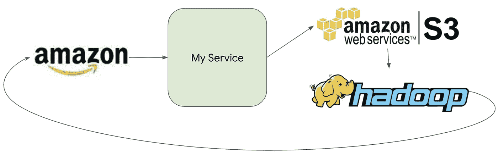
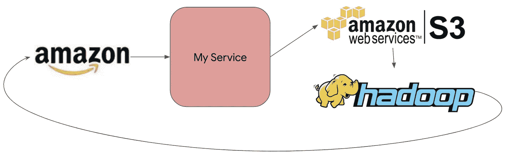
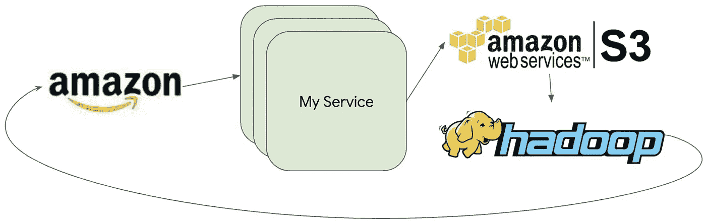
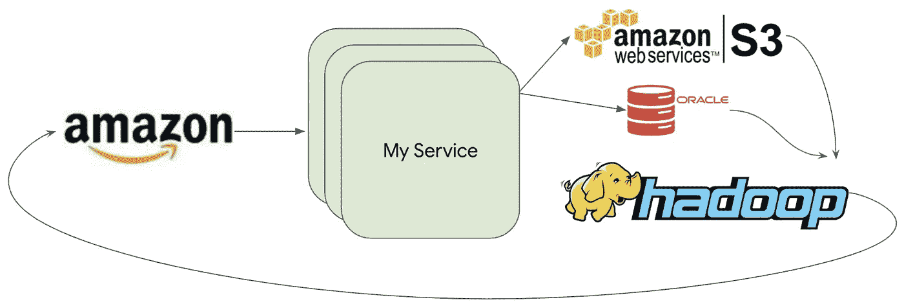
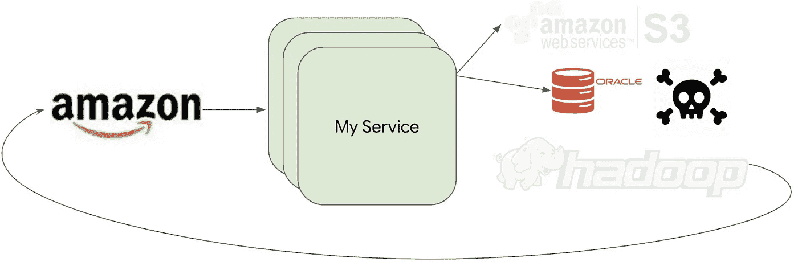
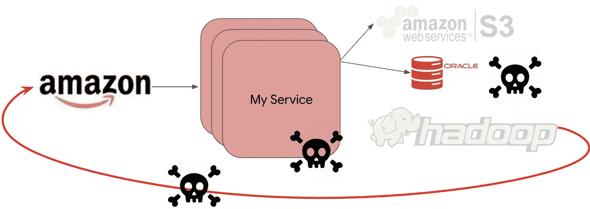
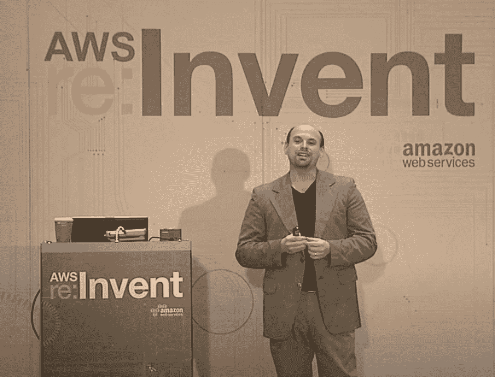

# 我的错误让 Amazon.com 下台的那一天

> 原文：<https://medium.com/geekculture/the-multimillion-dollar-failure-that-changed-my-professional-life-for-the-better-2011-f96ad1afd9db?source=collection_archive---------1----------------------->

## 拥抱意外收获:有时一次尴尬的失败会让你走上一条意想不到的新路

想象一下。你在亚马逊已经两年了。你克服了学习文化和内部工具的困难，最终变得富有成效，并开始追求晋升为高级工程师。生活是美好的。您负责 Amazon.com 关键路径服务的工程和运营卓越性。然而今天，一年中最繁忙、最重要的购物日，你的服务却出现了故障，造成了数百万美元的损失。分秒必争，全靠你了。这是将改变你一生的事件。

对我来说，那天是我职业生涯的转折点。不知何故，这个毁灭性的、可怕的事件变成了一个出人意料的积极支点。这实际上让我意外地快速成为了亚马逊的首席工程师！

> 我们的生活就像从山上流下的水，或多或少朝着一个方向流动，直到我们溅入一些迫使我们寻找新路线的东西。水从不等待。它改变形状，绕着东西流动，找到别人从未想过的秘密路径。—阿瑟·高顿

大多数零售网站，比如亚马逊，使用某种点击流服务，负责数百万次网站点击(用户 X 浏览了页面 Y，然后浏览了页面 Z，购买了商品 P，等等)。这些数据用于分析、机器学习，有时甚至用于实时商业决策和行为调整。早在 2011 年，我的工作就是找出我们将如何测试它。在你太激动之前，我要告诉你:[a]我将跳过亚马逊内部的细节，用通用术语来描述它,[b]架构已经发生了很大的变化，今天看起来与十年前完全不同,[c]我们花了数年时间来识别和消除像我将要描述的瓶颈。

我列出了一长串需要测试的东西，自动化和运行测试的成本，以及不测试特定东西的风险。我看了一下时间表，在我实际能完成的数量上画了一条硬线，然后让我的队友来执行。本质上:“这是我要测试的东西，这是我不会测试的东西。”正好落在这条线下面的是*负载测试服务*。这样做的成本很高，而且我认为这项服务不太可能遇到扩展瓶颈。我的服务在当时世界上最大的 Hadoop 集群之一中通过 map/reduce 愉快地处理了万亿字节的数据，使用 AWS S3 进行存储。Hadoop 和 S3 都是高度可扩展的，对吗？

Amazon.com 在黑色星期五，或网络星期一，或黄金日的交通流量比一年中的任何一天都多，这可能并不奇怪。[即使是几分钟的停机时间也意味着数百万美元的损失](https://www.cnbc.com/2021/05/01/how-much-revenue-tech-giants-like-amazon-and-apple-make-per-minute.html?fbclid=IwAR3Lx_fdi4bDDZ_FvKSVbBmqYM9uXmlImLyJcabn5q71IPxfoTW-z_U2HmE)。所以那些是你害怕的巅峰日子。以及为什么您真的应该负载测试您的产品，以确保它可以优雅地处理增加的吞吐量！

随着 2011 年黑色星期五的流量激增，我开始注意到我的服务运行得有点热(CPU 使用率、内存使用率、网络带宽指标都达到了阈值)。当我们进入高峰时段时，很明显我们没有足够的容量来处理预计的流量。今天，这个问题可能会通过 AWS 自动缩放自动解决，或者您可以通过请求更多的 AWS EC2 实例在一分钟内自己解决它。或者更好的方法是将整个问题交给无服务器解决(AWS Lambda 或 AWS ECS)。但这是在裸机时代:这项服务在实际的物理主机上执行。所以，我们几乎是绕着大楼跑，问半随机的人，如果他们有多余的主机，我们可以重新利用到我们的舰队，非常-请。我们确实找到了主机(很多)，我们确实重新调整了它们的用途，指标又回到了绿色。我觉得我们就像是在一部纪录片中的“T2，距离灾难只有几秒钟”。

Failure#1: State 1 (normal, service metrics ok)

Failure#1: State 2 (service metrics indicate running out of capacity)

Failure#1: State 3 (added capacity, service metrics ok again)

不过，我们还没完。*我们只是把一个瓶颈移到了堆栈的更深处。我忽略了一个小细节。对于每个服务调用，我们刚刚扩展的服务还会向 Oracle 数据库写入一段元数据！这是你在当今世界不太可能遇到的那种问题，因为你可能用 AWS DynamoDB 运行这样的服务(或者甚至 AWS RDS 会拯救我们)。但是，这是在 2011 年，我们有一个实际的 Oracle 数据库，运行在一个实际的主机上，没有经过适当的扩展来处理一个小时前我们添加的额外容量。[亚马逊最终从架构上彻底抛弃了甲骨文](https://www.businessinsider.com/amazon-consumer-business-last-oracle-database-aws-2019-10)，但我们还没到那一步。*

我们完了(三小时内第二次)。数以千计的主机试图同时写入数据的争用最终到达了数据库。一旦数据库停止响应，那数千台主机就无法运行。重试开始起作用，使问题变得更糟，并导致不断升级的故障。最终，这成为了高吞吐量分布式系统失败的典型案例。

Failure#2: State 1 (normal, after we scaled the service up)

Failure#2: State 2 (with newly added hosts, database has more traffic than expected, contention for writes)

Failure#2: State 3 (with database down, the entire fleet can’t do anything, cascading failures)

那天我学到了一些高层次的东西。首先也是最重要的是，**您的系统的可伸缩性取决于您最不可伸缩的组件**。我们拥有像 Hadoop 和 S3 这样的可水平扩展的构建模块并不重要。我们有一个伸缩性很差的数据库，它成了一个争用点，所以整个架构从一开始就注定要失败。其次，**有时候，如果存在根本性的架构缺陷，快速解决方案只会拖延时间。我们摆脱了第一次失败，只是让问题进一步发展，直到我们遇到第二次失败。**

这太尴尬了。[导演彼得](https://www.linkedin.com/in/peter-commons-b541a0/)约了我 1:1 见面。我吓坏了。彼得比我高 4 级，是一个严肃、直接的领导者。多年来，彼得和我成为了好朋友，他也成为了我的导师之一——我今天的很多风格都来自于他和其他像他一样的亚马逊领导者。但是，在 2011 年，我不在那里，所以我很害怕。彼得显然很沮丧，他花了很长时间问一些难题。但他更感兴趣的是我如何在未来防止这种情况，而不是责备我没有预见到这一点。

最终，我说了这样的话:*“Peter，我可以在一个测试环境中进行负载测试，这样可以找到一些 bug。但实际上，我需要针对生产环境进行测试，以真正证明它能够处理我们预期的流量。任何针对非生产环境的测试都只是对生产实际行为的假设。”*

今天，针对 prod 的负载测试很常见。但在 2011 年，这有点像自杀。彼得迷惑地看了我一眼；我知道我已经激起了他的兴趣，所以我觉得大胆，并继续我的疯狂想法。我的想法是:*我将重放生产流量，并将生产处理的吞吐量提高三倍，同时运行真实客户的实时流量，以进行测试。如果它失败了，我宁愿它失败，因为我们都在关注它，并且已经有了恢复机制，可以随时运行，而且经济损失也不会那么高。另一个选择是在一年中最繁忙的购物日失败。*

彼得笑了笑，并以一个笑话结束了会议:“我喜欢这个！你要么被解雇，要么被提升！”我认为有 50%的晋升机会对我来说已经足够冒险了。所以我开始研究如何实现这个疯狂的想法。我花了大量的时间来了解数据如何在服务之间流动，流量在正常情况下是如何分布的，负载等因素在实际高峰日是如何变化的，等等。我想出了如何修改生产环境来安全地接受测试流量，以及如何修改指标，以便我发送的测试流量不会污染生产指标。今天，我们认为这些机制是理所当然的；但是，在 2011 年，每一步都像是未知的领域。我研究了我的依赖项是否能够处理我将要引入的额外流量。我修改了我们的操作仪表板，这样我们就可以立即了解系统的任何部分何时会受到测试的影响。我想出了实现紧急停止的方法，以及在出现任何问题时将系统恢复到工作状态的计划。我协调了几十个上游和下游的服务。我抓起一个寻呼机，ssh 到主测试主机，关掉负载生成器，屏住呼吸，让我新添加的 Pb 级合成数据进入系统。

几分钟之内，我可以看到我的服务的流量仪表板上升；和向上；向上(如预期)。事情进展顺利了几个小时，直到我注意到在我们的一个服务中磁盘使用量意外攀升。我做了一个粗略的计算，并预测在接下来的一两个小时内，我将有几千台主机用完磁盘空间！写在墙上；一旦这些主机用完了磁盘空间，真正的客户就会受到影响。我中止了测试，花了一下午的时间试图找出为什么会发生这种情况。您可以看到，该服务是 CPU 受限的，并且据我们所知没有使用本地磁盘。事实证明，我们的依赖之一是使用临时文件，它有一个错误，如果有效负载大于一兆字节，它会泄漏一个文件句柄。这个 bug 已经生产了几个月，但在正常的日子里，超过一兆字节的有效载荷并不常见，而且服务经常被反弹，泄漏永远不会积累。但在黑色星期五和网络星期一这一周，这项服务不会被反弹，大多数有效负载都将超过 1 兆字节，因为零售网站处理的流量明显更多。

我发现了(并阻止了)一只金色的虫子！这个漏洞会在 2012 年造成另一次数百万美元的停机。我不认为我会在测试环境中发现这个 bug 我发现这一点是因为我坚持在生产规模上对生产进行测试，使用类似生产的数据来模拟实际高峰日的交通模式。

我得意洋洋地冲进彼得的办公室，告诉他。“我猜你不会被解雇了，是吗？”他对我报以微笑。在那一周的时间里，我发现并阻止了几个更重大的风险。2012 年网络星期一进展顺利。我救赎了自己。

我把一次尴尬的失败变成了一个成功的故事。半年后，我被提升为高级工程师，那项工作与此有很大关系。两年半后，我被提升为首席工程师，这些事件也让我走上了这条道路。以高吞吐量对高度分布式系统进行负载测试的经历点燃了我的热情。 [**我创建并发展了亚马逊的负载和性能测试平台(TPSGenerator)。**](https://carloarg02.medium.com/how-i-grew-an-engineering-productivity-tool-to-impact-thousands-of-engineers-at-amazon-and-how-28a990091207) 到 2020 年我离开亚马逊的时候，它已经被成千上万的工程师用于商业关键应用，以每秒数亿次的交易速度运行，并由一个了不起的工程师团队维护。它防止了数百起运营问题，并节省了数百万美元。这一切都始于 2011 年那个星期五早上的事件。

我非常喜欢这句话，我将重复它来结束我的小故事…

> 我们的生活就像从山上流下的水，或多或少朝着一个方向流动，直到我们溅入一些迫使我们寻找新路线的东西。水从不等待。它改变形状，绕着东西流动，找到别人从未想过的秘密路径。—阿瑟·高顿

**If you’re curious,** [**I actually gave an external talk at AWS reInvent in 2013 about this**](https://www.youtube.com/watch?v=pgnQQoTMBhI)