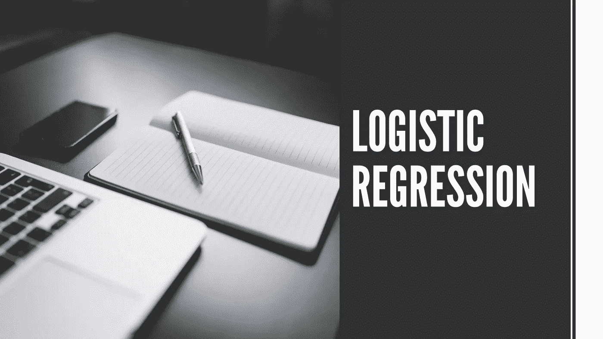
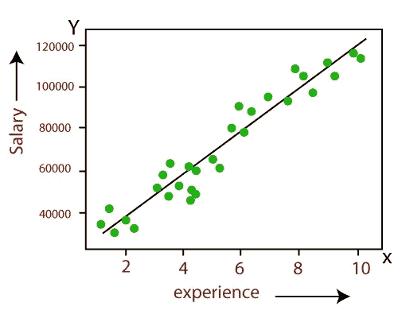
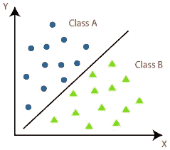
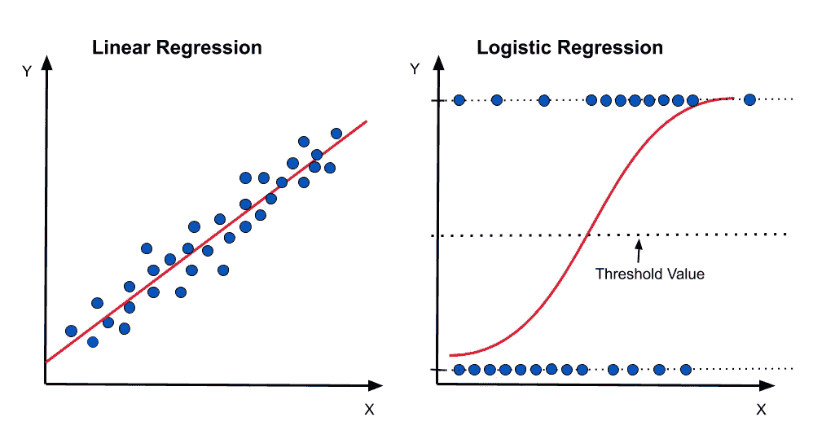

# 名字的奥秘:物流回归

> 原文：<https://medium.com/geekculture/the-mystery-of-the-name-logistics-regression-16f1b33a5fcd?source=collection_archive---------21----------------------->

我们都知道 ***逻辑回归*** 是一种分类机器学习算法那么为什么逻辑回归的名字中有 ***【回归】*** 。

你有没有惊讶过，

如果它是一个分类机器学习算法，那么我们为什么不把它叫做 ***“逻辑分类”？***

在这个博客里，我会试着回答你所有的问题。

主要有两种类型的监督机器学习算法。

1.  ***回归***
2.  ***分类***

让我想想，

***1。什么是回归？***

回归是一种监督机器学习算法，用于预测一个 ***连续变量*** 。

在回归算法的情况下，连续结果/目标变量 y 基于一个或多个独立变量 x 的值。

***使用回归算法的一些例子:***

预测房子的价格。

二。预测一家广告公司的销售额。

三。预测股票价格。

***2。什么是分类？***

分类是一种受监督的机器学习算法，用于 ***将*** 因变量(y)分类为两个或多个类别或标签。

***例如:*** 男或女，是或否，0 或 1 等…

有两种类型的分类:

***一、二项式分类*** (2 个输出类)

***二世。多类分类***(2 个以上输出类)

***使用分类算法的一些例子:***

I .该人是否患有糖尿病。

二。垃圾邮件检测。

三。情绪分析(正面或负面)。

现在我们都知道回归和分类算法是两种有监督的机器学习算法。这两种算法都用于机器学习中的预测。回归和分类算法的主要区别在于，回归算法用于 ***预测连续值*** ，分类算法用于 ***对离散值*** 进行分类。

转到主要部分，

如果 ***逻辑回归*** 是一个 ***【分类】*** 算法那么为什么逻辑回归的名字里有 ***【回归】*** ？

这个问题的答案是…

线性回归和逻辑回归之间存在 ***关系*** 。

你明白上面那行字的意思了吗…？

好吧，让我用最简单的方法来看看…

在线性回归中，我们会根据自变量 x 来预测输出变量 y。

公式如下:

在哪里，

y 是因变量。

X1，X2，…，Xn 是独立变量。

M1，M2，…，Mn 是斜率的系数。

c 是截距。

在线性回归中，我们的主要目的是找出 ***最佳拟合线*** 。这意味着减少 ***实际值和预测值*** 之间的误差。

在逻辑回归中，我们的主要目标也是一样的，但是有一个小的补充。我们将该结果通过一个 ***Sigmoid 函数*** 来预测输出/目标变量 y

公式如下:

在哪里，

也就是说，

线性回归和逻辑回归都有相同的公式。

**结论:结论:**

逻辑回归使用相同的基本公式，其基本技术与线性回归完全相同。原因就在于此，逻辑回归在其名称中有 ***【回归】*** 。

请随时留下你的评论、建议或任何错误。😊

**帮我接通**[**LinkedIn**](https://www.linkedin.com/in/sagardhandare/)**|**[**GitHub**](https://github.com/SagarDhandare)**|**[**邮箱**](mailto:%20sagardhandare3@gmail.com)

**快乐学习！！！^_^**