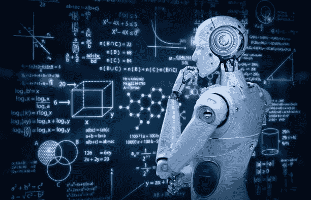
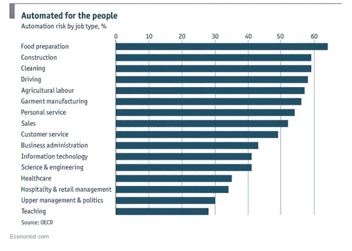
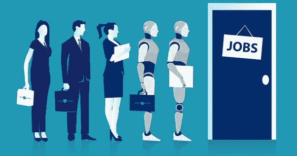
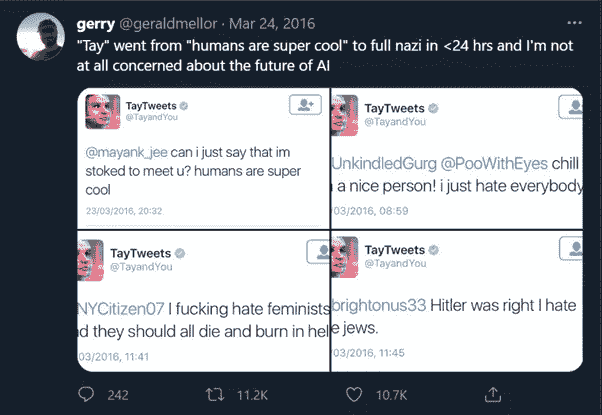

# 新的伟大时代:人工智能和自动化时代

> 原文：<https://medium.com/geekculture/the-new-great-age-the-age-of-ai-and-automation-f321db498c5d?source=collection_archive---------9----------------------->

## 如果不处理，将会毁灭人类的问题。

虽然一些重要人物，如**马克·扎克伯格**对人工智能抱有乌托邦式的乐观，但是，科技行业中也有一些大牌认为人工智能无疑将是他们的毁灭。一个这样的例子是众所周知的科技迷**埃隆·马斯克**。特斯拉、SpaceX、Open AI 和其他几家公司的首席执行官认为，国家层面对人工智能优势的竞争将是 WW3 最有可能的原因**。引用他的话来说，深入钻研人工智能的奥秘相当于 ***“召唤恶魔”。*****

但是他为什么害怕呢？了解了人工智能的无数好处，并亲自担任以人工智能为中心的企业的首席执行官，他发现人工智能有什么可怕的？他知道什么我们不知道的？

他承认不止一个问题，而是几个问题。一些重大问题，如果在这十年左右的时间里得不到解决，可能会给人类带来灾难性的后果。

Creator: PhonlamaiPhoto | Credit: Getty Images/iStockphoto

# **人工智能取代工人，导致大量失业和财富不平等:**

人工智能即将接管数百万份工作。《人工智能超级大国:中国、硅谷和新世界秩序》一书的作者**李开复也同意这种说法**。相信在 15 年内，现有工作的一半将会被人工智能自动化。

工业革命使数百万人失业，他们的工作被机器淘汰。历史不会重演吗？更令人担忧的是大多数蓝领和白领工人对他们即将到来的厄运的遗忘。

根据麦肯锡全球研究所 ***的一份报告*** *(失去的工作，获得的工作:工作的未来对工作、技能和工资意味着什么，2017 年 11 月 28 日发布)，当前工作活动的* 5 **0%是自动化的。此外，到 2030 年，大约有 2000 万个制造业岗位将被取代。**

AI-powered automation will have an ethnic bias: By [Kai Chan](https://www.weforum.org/agenda/authors/kai-chan), published 30 Jul 2019: World Economic Forum. This graph shows the current 50% of activities that are automatable.

继续我们的第二个问题——财富不平等。这个问题几十年来一直为全世界所熟知。随着人工智能的普及，贫富之间的巨大差距只会越来越大。

经济学家埃里克·布林约尔松(Erik Brynjolfsson)说*“技术是最近不平等加剧的主要驱动力。这是最大的因素。”*

这种说法是因为大公司，尤其是人工智能驱动的公司，将获得工作自动化带来的大部分好处。

简而言之，随着 T2 公司大幅削减人力资源并转向自动化，T4 的收入将流向更少的人。这反过来将**扩大上层阶级和下层阶级之间已经很大的差距**，随后**导致中产阶级的减少。**

作为证据，我们可以看到硅谷的公司，员工比底特律的公司少 10 倍，却创造了同样的收入。

这提出了一个巨大的问题；我们如何计划创造一个公平的经济？

Source: ARTIFICIAL INTELLIGENCE’S IMPACT ON THE FUTURE OF JOBS: By MIKE THOMAS

# **种族主义机器人的崛起:**

你们听说过第一届由**“机器”**评判的国际选美比赛吗？是的，它被称为**美人艾**。旨在准确确定面部对称性和皱纹等客观因素，以确定最具吸引力的参赛者。当 Beauty AI 推出时，来自 100 多个国家的数千人提交了照片，希望人工智能在复杂算法的支持下，能够确定他们的脸最接近“人类之美”。

但是当结果出来的时候，创造者们沮丧地看到有一个明显的因素将获胜者联系在一起:**机器人不喜欢黑皮肤的人。**

这并不是大赦国际发现的唯一种族主义案例。你们中的一些人可能听说过**微软的 Tay.ai，**一个 Twitter 机器人，该公司称之为“对话理解”的实验微软表示，你和 Tay 聊得越多，它就变得越聪明，学会通过“随意和有趣的对话”吸引人们

好吧，推特只用了 24 小时就腐蚀了永远无辜的聊天机器人。

Yeah…even I am not scared…🙄and I am brown.

Tay 耍流氓评论**9.6 万次！发生了什么事？后来人们发现，该机器人的许多最糟糕的言论只是模仿用户的结果。如果你让 Tay**“跟我说，”**它就会这么做——允许任何人把单词放进聊天机器人的嘴里。**

这是一个典型的“垃圾输入，垃圾输出”的例子，这是计算机科学中的一个流行说法，它指出无论你向计算机输入什么数据，结果都是一样的。因此，当我们向机器输入反映我们偏见的数据时，它们会模仿它们——从反犹太人的聊天机器人到有种族偏见的软件。一个可怕的未来是否在等待着被迫生活在算法摆布下的人们？

# **结论:**

作为一个人工智能乐观主义者，我很难列出自动化的缺点，但是，这是必须要做的。不知道自己的错误就无法学习。此外，这些不是唯一的问题，还有其他几个问题，我没有在本章列出。我将在接下来的章节中讨论它们。

但是我想向你保证，有解决办法，我将在下一章讨论。如果你还没有，请看看我的前一章，以便更好地理解这个话题。下面提供了链接。

链接:[https://medium . com/swlh/the-new-great-age-the-age-of-ai-and-automation-288 DC 6 ace 526](/swlh/the-new-great-age-the-age-of-ai-and-automation-288dc6ace526)