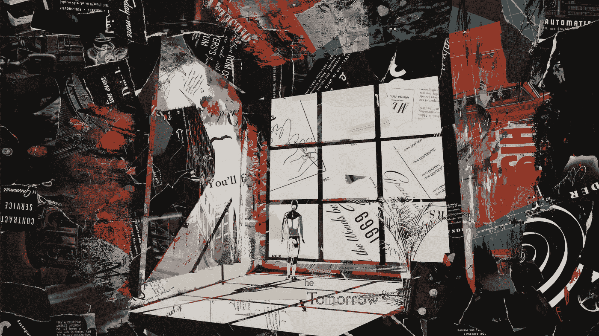

# 新的互联网正在彻底改变创意产业

> 原文：<https://medium.com/geekculture/the-new-internet-is-revolutionising-the-creativity-business-46f4e9136aaf?source=collection_archive---------17----------------------->

Photo by [Micha Frank](https://unsplash.com/@meeezy?utm_source=unsplash&utm_medium=referral&utm_content=creditCopyText)

## 更改/ Web3

## 包容性、创新和收入

注意力经济正在主导思想份额。品牌，不顾一切地寻找有效的方法来吸引被俘虏的观众并使他们的产品(包括内容)货币化，正在向新的互联网倾斜，以在日益多样化的…