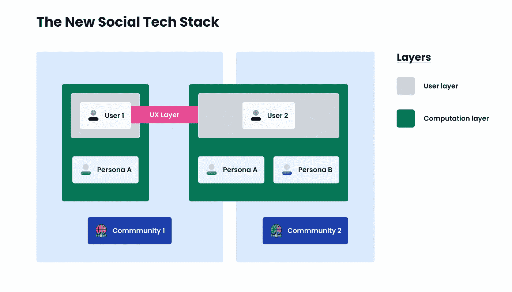

# 新的社交技术堆栈

> 原文：<https://medium.com/geekculture/the-new-social-tech-stack-d7694b993226?source=collection_archive---------11----------------------->

The software architecture of the New Social

## **传统社交媒体是一场盛宴**

在当前的社交媒体格局中，少数大型平台拥有我们的大部分数据和注意力。很明显，他们利用这种力量积极地伤害他们的用户、其他公司和整个社会。

这些问题最近已经达到了公众意识的水平，最终可能导致事情…