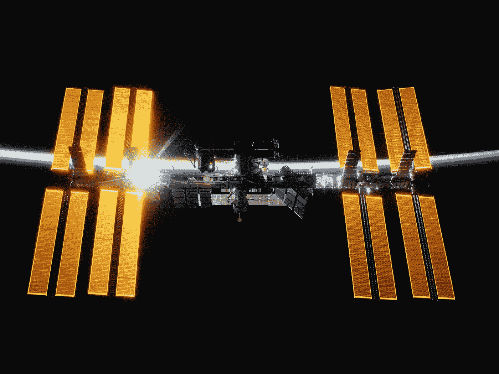

# 下一个国际空间站将是电梯

> 原文：<https://medium.com/geekculture/the-next-international-space-station-will-be-an-elevator-2f7b08fb4c4?source=collection_archive---------4----------------------->

## 人类长期进入地球轨道的关键将是国际合作建造太空电梯。

Photo by [NASA](https://unsplash.com/@nasa?utm_source=medium&utm_medium=referral) on [Unsplash](https://unsplash.com?utm_source=medium&utm_medium=referral)

## 人性的一小步

建立国际空间站可能会被年轻一代的美国人忽视，但它…