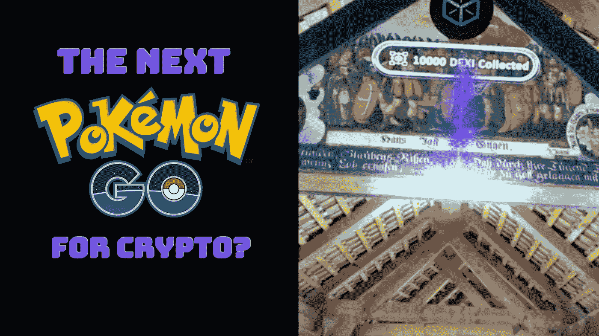

# 加密的下一个神奇宝贝？

> 原文：<https://medium.com/geekculture/the-next-pok%C3%A9man-go-for-crypto-8e3cb14494e4?source=collection_archive---------0----------------------->

## 可能是游戏中最大的隐藏宝石。

如果你不熟悉 Pokémon Go，这是一款增强现实游戏，于 2016 年发布，风靡全球。这款游戏变得如此受欢迎，以 Andriod 上的日活跃用户来说，它现在正在与 Twitter 竞争。