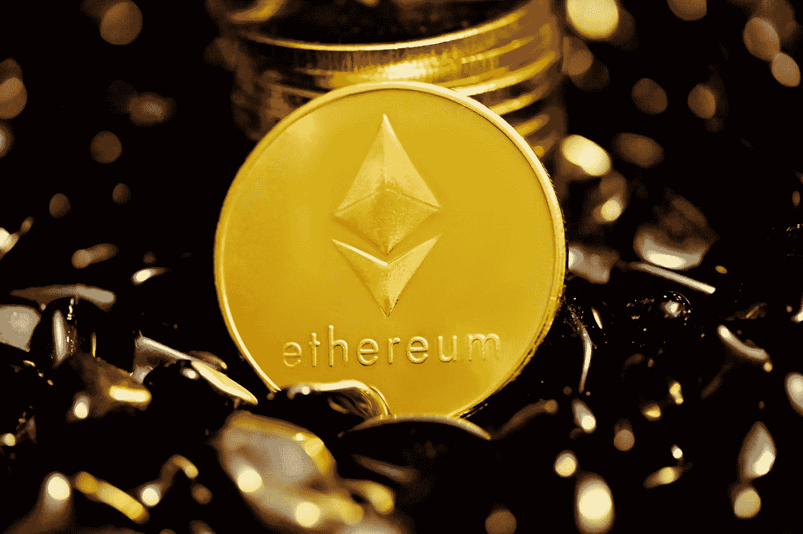

# NFT 淘金热对以太坊来说是个坏消息

> 原文：<https://medium.com/geekculture/the-nft-goldrush-is-bad-news-for-ethereum-ce6afe40df9d?source=collection_archive---------15----------------------->

## 天然气的高成本可能会刺激以太坊的竞争对手的采用和进一步发展

Photo by [Executium](https://unsplash.com/@executium?utm_source=medium&utm_medium=referral) on [Unsplash](https://unsplash.com?utm_source=medium&utm_medium=referral)

你简直不敢相信自己的运气——一家有着令人惊叹的咖啡、座位和不用排队的咖啡店。起初，你是仅有的几个人之一，但随着时间的推移，游客的数量开始增加。最终，它变成了…