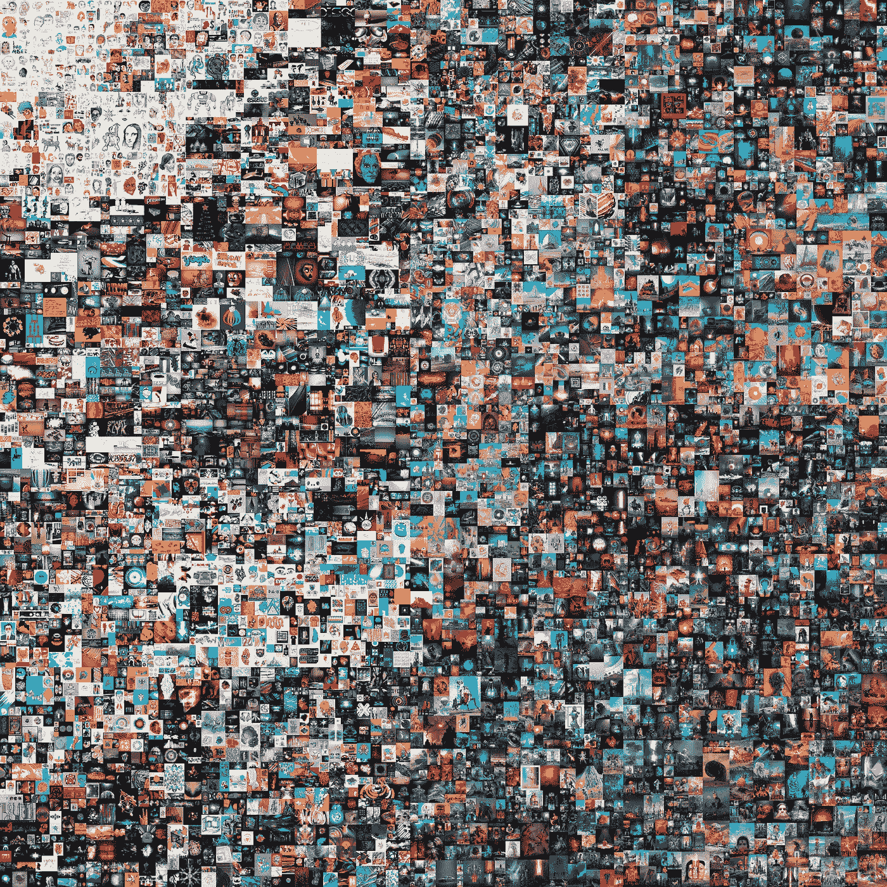
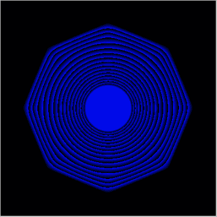
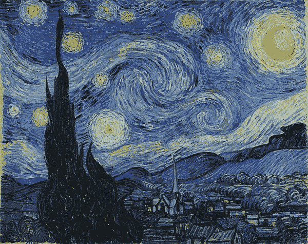
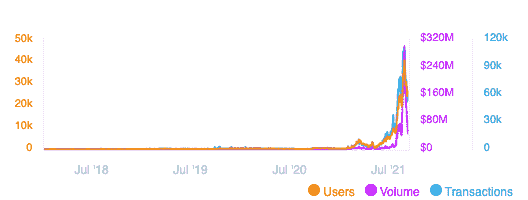

# NFT 文艺复兴——为什么非传统艺术对文化、艺术和所有权的未来很重要

> 原文：<https://medium.com/geekculture/the-nft-renaissance-71b187d6f593?source=collection_archive---------15----------------------->

> 一个真正的艺术家不是被激励的，而是激励他人的。
> 
> ―萨尔瓦多·达利

2021 年 3 月 11 日，佳士得以 6900 万美元的天价拍卖了一件艺术品，使艺术家迈克·温克尔曼成为第三位最昂贵的在世艺术家。但是这次拍卖有一些不寻常和独特的地方。迈克·温克尔曼通常被称为毕普。买方是 Vignesh Sundaresan 又名“Metakovan”。这幅艺术作品名为*:最初的 5000 天，*由 2007 年 5 月以来每天 5000 幅数字图像拼贴而成。《纽约时报》文章的标题是

> *随着《NFT 狂热》的加速，《JPG 档案》卖到了 6900 万美元。*

几年前，这样的交易甚至是不可能的。然而，让包括我在内的人们困惑的问题是，为什么需要这样做，非功能性测试的目的是什么。

[EVERYDAYS: THE FIRST 5000 DAYS](https://onlineonly.christies.com/s/beeple-first-5000-days/beeple-b-1981-1/112924) by Beeple

# 简要背景

NFTs 或不可替代令牌是一种数据单位，它使用区块链来证明数字资产的唯一性和所有权。NFT 类似于加密货币，因为它们使用与加密货币相同的技术来识别资产所有者。它们的不同之处在于可替代性方面。每个比特币或以太币都是一样的，而非比特币是唯一的，不可互换的。

Quantum

艺术家凯文·麦考伊和技术专家阿尼尔·达什在 2014 年 5 月创造了第一条 NFT 路。(*提醒人们当艺术与技术交叉时，奇迹就会发生*)它被称为量子，并在名为 coin 的区块链上铸造。当时，数字艺术正在 Tumblr 等平台上激增。他们对猖獗的剽窃和没有署名感到沮丧。他们将这项技术命名为*货币化图形。显然，当 Dash 和 McCoy 在纽约新博物馆现场演示他们的新“货币化图形”系统时，他们遭到了嘲笑。保罗·格拉厄姆曾在他的文章[中写道:](http://paulgraham.com/startupideas.html) *如何获得创业点子“就像试图想出创业点子往往会产生坏点子一样，致力于那些可能被视为‘玩具’的东西往往会产生好点子。从某些方面来说，我们今天所知的货币化图形或 NFT 就是这种现象的一个例证。**

# NFTs 增加的价值

Art on Blombos Cave, South Africa

为了理解非艺术作品在当今世界填补了什么空白，我们需要快速了解一下艺术的演变。

在南非布隆伯斯洞发现的一块岩石上绘制的抽象交叉阴影图案被认为是最古老的艺术品。它创作于 73000 年前。从那时起，随着人类文明的进步，艺术创作的媒介也在进步。

人类开始在岩石和墙壁上绘画。公元前 5400 年，希腊人在陶罐上作画，埃及人在巴黎的石膏上创作壁画，中国人在丝绸上作画。列奥纳多·达·芬奇在一块白杨木板上画出了他的杰作《蒙娜丽莎》。梵高在画布上画了《星夜》。今天艺术家用来创作艺术的媒介和工具已经改变了。

下面的视频显示了 Beeple 正在制作他的一件艺术品。使用的工具包括 Adobe Photoshop、4D 影院和 Octane。21 世纪的媒介是数字化的。人们在屏幕上创作艺术，这些艺术作品是数字原生的。

Beeple’s Process

但是这种变化带来了挑战。数字艺术本质上是可替代的，可以被无限复制。在这种情况下，你如何断言谁是艺术品的创造者和所有者？

NFTs 通过将数据存储在当今最安全的数据存储上解决了这一问题。NFTs 还引入了一种对创作者更友好的新商业模式。每当一件艺术品转手时，最初的创作者都会得到交易的一部分。这使得艺术家在获得价值的同时，也能获得卖出艺术品的收益。

# 局限性

目前形式的 NFTs 还不完善。文件本身并不存储在区块链上，相反，NFT 有一个到存储在中央服务器上的文件的链接。如果服务器宕机，您可能仍有证书，但资产本身没有。此外，NFT 与现实世界的所有权几乎没有任何相似之处。例如，你可能拥有一个数字艺术的 NFT，但它不需要版权或许可费。NFTs 并不限制对艺术的接触(*想象一下* *人们淹没在卢浮宫去看蒙娜丽莎*)也不宣传图像存在的所有权。尽管如此，这些都是可以解决的问题，技术将会发展到呈现一个更优雅的 NFTs 版本。

# 艺术之外的应用

虽然 NFT 在艺术领域的应用最近得到了最多的报道，但非功能性数字技术也用于其他数字资产。2017 年，Dapper Labs 在以太坊上推出了一款名为 Cryptokitties 的古怪虚拟宠物游戏。每一只隐猫都是独一无二的，并且具有被称为属性的特征，这些特征可以遗传给它们的后代(*是的！它们也可以被繁殖。Cryptokitties 变得如此受欢迎，以至于它们一度占据以太坊 25%的流量。*

以太坊名称服务使用 NFTs 来提供一个更易于阅读的以太坊地址，而不是复杂的以太坊钱包地址的十六进制表示。NBATopshot 与 NBA 合作，制作了 NBA 关键时刻的数字收藏短片。NFT 也被创建为高级俱乐部的中心。例如， **Bored Ape Yacht Club** 是一个 10000 个 NFT 的集合，它不仅让你成为一个 Ape 化身的所有者，还可以作为一张会员卡，让你进入虚拟世界。

NFTs 不仅支持任何数字项目的标记化，而且还提供了一种极其可靠和持久的方式来存储现实世界资产的所有权证明。想象一个有政治纷争的国家。当所有权记录存储在区块链上时，它是可以在链上全球验证的证明。一个新政权可能拒绝尊重它，但它不能消除或模糊所有权的记录。

从采用的角度来看，NFT 主要市场之一的 Opensea 在 8 月份完成了 30 亿美元的交易。今年年初，Opensea 每天的交易量为 7 万美元。到 8 月底，这一数字达到了 2 . 25 亿美元的峰值。

NFTs 为未来开辟了令人兴奋的可能性。几个月前，Techcrunch 创始人迈克尔·阿灵顿通过 NFT 卖掉了他在基辅的公寓。这说明了 NFTs 可以超越加密和真实世界经济界限的方式。

这是我写的关于加密生态系统进化的系列文章的第三部分。你可以在这里找到第一个帖子: [*通过密码冬*](/geekculture/understanding-the-decentralized-world-through-the-crypto-winters-edff53378d1a) *了解去中心化的世界第二个帖子:* [*德菲的夏天*](/geekculture/the-summers-of-defi-8ea87b17615e)

*另外，如果你对 crypto 和 DeFi 特别感兴趣，可以看看我们正在开发的新东西:* [*Brew*](https://brew.money/)

# 感谢

*   输入的 [Mehul](https://www.linkedin.com/in/mehulmarakana/) 和 [Pritesh](https://www.linkedin.com/in/pritesh123iit/)
*   Eric 向我解释了非功能性思维在艺术中的重要性

**参考文献**

*   [https://hyperallergic . com/652671/Kevin-McCoy-quantum-first-NFT-created-sells-at-Sotheby-over-100 万/](https://hyperallergic.com/652671/kevin-mccoy-quantum-first-nft-created-sells-at-sothebys-for-over-one-million/)
*   [https://www . the verge . com/2021/4/2/22364240/NFT-区块链-艺术家-黑客马拉松-凯文-麦考伊-阿尼尔-达什](https://www.theverge.com/2021/4/2/22364240/nft-blockchain-artist-hackathon-kevin-mccoy-anil-dash)
*   [https://www.nature.com/articles/s41586-018-0514-3.epdf?第一季 第 9 集 第一季 第 9 集 第一季 第 9 集 第一季 第 9 集 第一季 第 9 集 第一季 第 9 集 第一季 第 9 集 第一季 第 9 集 第一季 第 9 集 第一季 第 9 集 第一季 第 9 集 第一季 第 9 集 第一季 第 9 集 第一季 第 9 集 第一季 第 9 集 第一季 第 9 集 第一季 第 9 集 第一季 第 9 集 第一季 第 9 集 第一季 第 9 集 第一季 第 9 集 第一季 第 9 集 第一季 第 9 集 第一季 第 9 集 第一季 第 9 集 第一季 第 9 集 第一季 第 9 集 第一季 第 9 集 第一季 第 9 集 第一季 第 9 集 第一季 第 9 集 第一季 第 9 集 第一季 第 9 集 第一](https://www.nature.com/articles/s41586-018-0514-3.epdf?sharing_token=Y2pzFUsv0Gd4tj0lq5sTCdRgN0jAjWel9jnR3ZoTv0Om7oE8mgx5t97mBOHpTj1Gj1t2fwxXjVd-L6l4cK1MJP_aPE3YkS3ayhtqHUW0J2jDTe5S1QqLo449Yd6AvQ9PScOSPLvN5FgvR9x6EIJvJqadptphmbleJg1mhGkxmDQit6pZBnhkZEYr-euZ584LfftPMkIFsE0cmE2IULr1N9eavaglQabeALrWDK2HF20%3D&tracking_referrer=www.nationalgeographic.com)
*   [https://www.coindesk.com/business/2021/05/25/techcrunch-founders-apartment-to-be-sold-as-nft/](https://www.coindesk.com/business/2021/05/25/techcrunch-founders-apartment-to-be-sold-as-nft/)