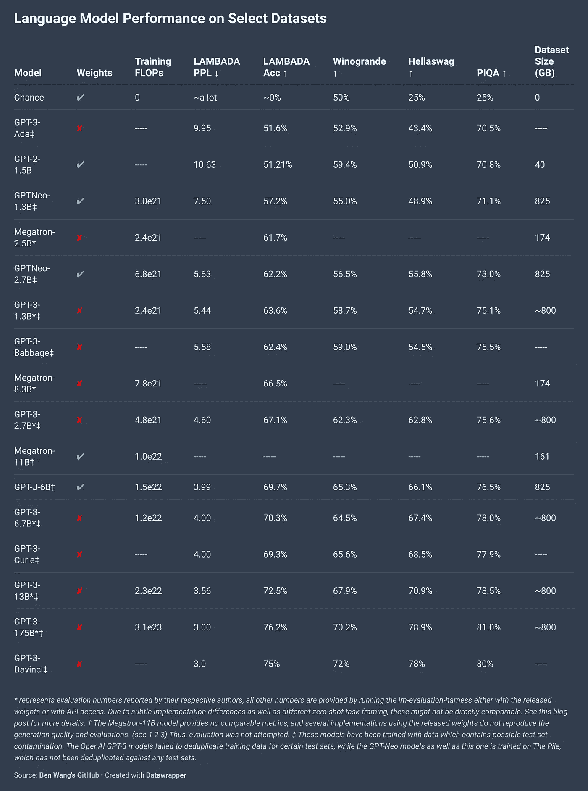
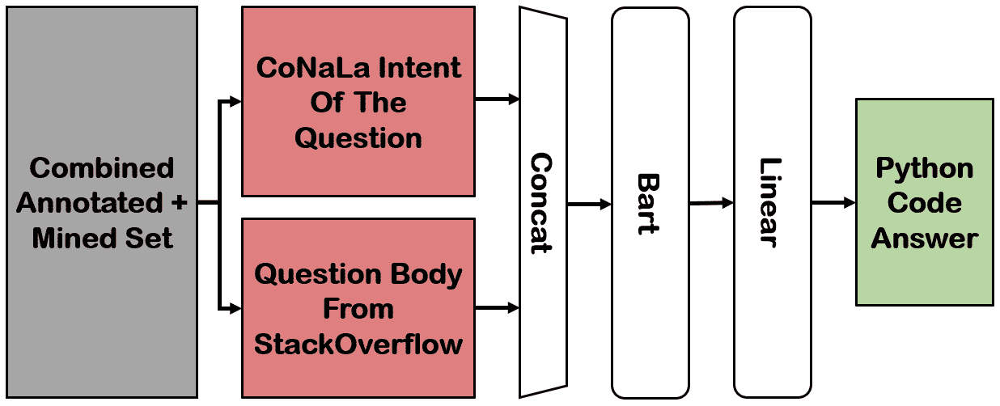
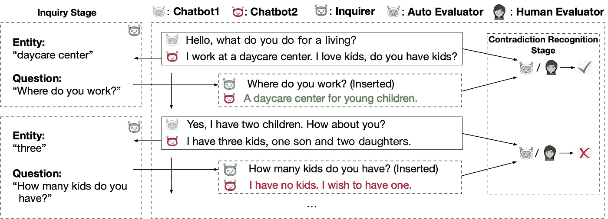
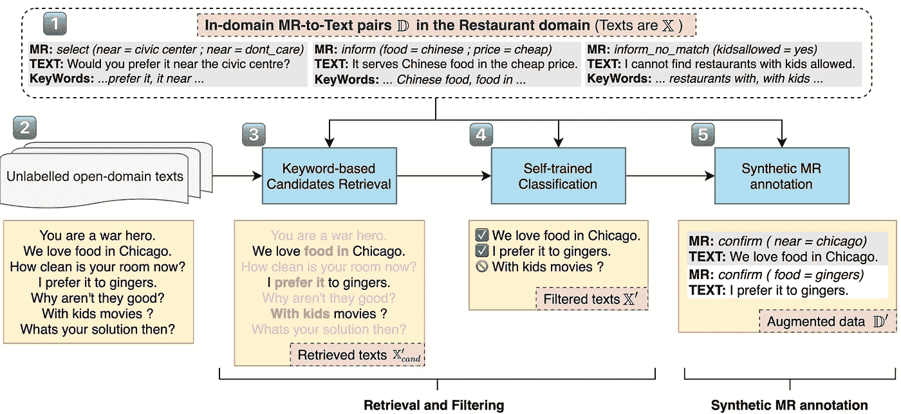

# NLP 密码| 06.13.21

> 原文：<https://medium.com/geekculture/the-nlp-cypher-06-13-21-5b7a42a181f9?source=collection_archive---------18----------------------->

The Voyage of Life: Youth | Cole

## 自然语言处理每周时事通讯

## 过时的

欢迎回来！EleutherAI 有一个全新的(大的)GPT 模型，在过去的一周被开源。该模型(基于 JAX)在 Eleuther 自己的约 800GB 数据转储 Pile 数据集上训练了 5 周。该模型被称为 GPT-J，是一个 60 亿参数的模型，可与相同大小的 GPT-3 的性能相媲美。显然，它在代码生成方面表现良好:

以下是各种数据集上所有主要语言模型的比较:

EleutherAI 有一个演示网页供您试用该模型:

 [## 电子文档生成测试用户界面

### 语言模型的 EleutherAI web 应用测试

6b.eleuther.ai](https://6b.eleuther.ai/) 

和用于 TPU 推理的 Colab😁：

 [## 谷歌联合实验室

### 编辑描述

colab.research.google.com](https://colab.research.google.com/github/kingoflolz/mesh-transformer-jax/blob/master/colab_demo.ipynb) 

要感谢本周大声疾呼的相关论文！😎

仅供参考，在即将到来的 NLP 指数更新后，我们将突破 6000 回购大关！🚀

# TextStyleBrush

TextStyleBrush 可以识别图片中文本的样式，并在保持样式的同时编辑文字。

这是*“…第一个自我监督的人工智能模型，它使用一个简单的单词，在一个镜头中取代了手写和场景图像中的文本。”*

**例句**:

 [## 人工智能现在可以在一个镜头中模仿图像中的文本风格——只用一个单词

### 我们正在介绍 TextStyleBrush，这是一个人工智能研究项目，可以复制照片中的文本样式，只需使用一个…

ai.facebook.com](https://ai.facebook.com/blog/ai-can-now-emulate-text-style-in-images-in-one-shot-using-just-a-single-word) 

# tensor flow-金属可插拔设备入门

> 安装 TensorFlow v2.5 和 tensor flow-metal pluggable device，在 Mac GPUs 上加速 Metal 的训练。

 [## Tensorflow 插件-金属-苹果开发者

### 查找使用 Metal 构建 macOS、iOS 和 tvOS 应用程序的演示文稿、文档、示例代码和资源…

developer.apple.com](https://developer.apple.com/metal/tensorflow-plugin/) 

# 你真的需要 Redis 吗？如何摆脱 PostgreSQL

Chris Farber 强调了如何将 Postgres 用于常见的 Redis 用例。总之，他描述了作业排队、应用程序锁和发布/订阅的 3 个用例！不得不说，pub/sub 的例子令人惊讶:

 [## 需要 Redis 吗？PostgreSQL 执行排队、锁定和发布/订阅

### 有一种可靠的架构，我见过很多次，用于支持您的 web 服务和应用程序…

spin.atomicobject.com](https://spin.atomicobject.com/2021/02/04/redis-postgresql/) 

# 用知识图表推理(幻灯片)

浏览了两篇论文:

用语言模型和知识图进行推理进行问答【https://arxiv.org/abs/2104.06378 

KGs 上的多跳逻辑推理[https://arxiv.org/abs/2010.11465](https://arxiv.org/abs/2010.11465)

# 回购密码👨‍💻

## 一组最近发布的回购引起了我们的关注👁

## [使用窗口化标签排序生成提取研究幻灯片](https://arxiv.org/pdf/2106.03246.pdf)

> 一种基于从会议论文集网站汇编的 5000 个论文-幻灯片对的语料库自动生成科学论文的幻灯片的方法。

 [## atharsefid/Extractive _ Research _ Slide _ Generation _ Using _ Windowed _ Labeling _ Ranking

### 这篇文章发表在科学学术处理(SDP) 2021 研讨会上。下载原始论文和…

github.com](https://github.com/atharsefid/Extractive_Research_Slide_Generation_Using_Windowed_Labeling_Ranking) 

[**连接论文**](https://www.connectedpapers.com/main/adf3e9bd9b71dd2f30cc1257ffd4cf8e7083cde6) **📈**

## [跨文档共指消解](https://arxiv.org/pdf/2106.04192.pdf)

> 第一个从原始文本进行跨文档(CD)共指解析的端到端模型，它将文档内共指的主要模型扩展到 CD 设置。

 [## ariecattan/coref

### 这个存储库包含端到端跨文档共指解析的代码和模型，如我们的…

github.com](https://github.com/ariecattan/coref) 

[**连接论文**](https://www.connectedpapers.com/main/70d42b1e9ca8eb8d5afe6aa0ee08651e7979aca3) **📈**

## [使用 BART 生成 Stackoverflow 代码](https://arxiv.org/pdf/2106.04447.pdf)

> 超过 40，000 个 StackOverflow 问题文本的语料库将与 CoNaLa 数据集的相应意图结合使用。

 [## gabeorlanski/stack overflow-鼓励作弊

### 这是文章阅读栈的储存库。流量鼓励作弊:添加问题文本提高提取…

github.com](https://github.com/gabeorlanski/stackoverflow-encourages-cheating) 

**Colab** :

 [## 谷歌联合实验室

### 编辑描述

colab.research.google.com](https://colab.research.google.com/github/gabeorlanski/stackoverflow-encourages-cheating/blob/main/BART_CG_Experiments.ipynb) 

[**连接论文**](https://www.connectedpapers.com/main/cc9ad384ec0d0176ce05865d3866b44d2519bd68) **📈**

## [文本转 SQL](https://arxiv.org/pdf/2106.05006.pdf)

> 从 Stack Exchange 网站上的实际使用中收集了 12，023 对话语和 SQL 查询的数据集。

 [## hirupet/sede

### 文章中的代码和数据:自然生成的基于栈交换数据的数据集。

github.com](https://github.com/hirupert/sede) 

[**连接论文**](https://www.connectedpapers.com/main/67e8e2d3b276c339588b9551e6b20cd62ebdda7c) **📈**

## [在基于 Transformer 的表格问答中捕获行和列语义](https://arxiv.org/pdf/2106.04441.pdf)

 [## IBM/行列交集

### 这个项目提供了我们的 NAACL 论文“在 Transformer 中捕获行和列语义…

github.com](https://github.com/IBM/row-column-intersection) 

[**连接论文**](https://www.connectedpapers.com/main/016c171611237518dd8f167f9195c984cfb482c4) **📈**

## [开放域聊天机器人一致性评估框架](https://arxiv.org/pdf/2106.02228.pdf)

> 寻址询问历史(AIH)包含两个阶段:(1)在询问阶段，关于对话历史中提到的事实和观点的问题被插入到聊天机器人之间的对话中。(2)在矛盾识别阶段，收集插入问题的回答，可以采用自动模型或人工判断来判断回答是否与对话历史一致。

 [## ictnlp/AIH

### 这个存储库包含 ACL 2021 论文的发现的代码，解决关于历史的查询:一个有效的和…

github.com](https://github.com/ictnlp/AIH) 

[**连接论文**](https://www.connectedpapers.com/main/f9ce79b7e238be2e5ca228672181169bb5bc3029) **📈**

## [少量拍摄意图检测](https://arxiv.org/pdf/2106.04564.pdf)

> 带有/不带有范围外(OOS)意图的少数镜头意图检测。

 [## 建国/少击意图探测

### 少数镜头意图检测是一个存储库，设计用于少数镜头意图检测，包括/不包括范围外(OOS)…

github.com](https://github.com/jianguoz/Few-Shot-Intent-Detection) 

[**连接论文**](https://www.connectedpapers.com/main/464aacf09587932dadef0c49e53a9547385ff4dd) **📈**

## [SciFive:生物医学文献的文本到文本框架](https://arxiv.org/pdf/2106.03598.pdf)

> 已经在大型生物医学语料库上预先训练的领域特定 T5 模型。在命名实体关系、关系提取、自然语言推理和问题回答的任务上，模型优于当前的 SOTA 方法(即 BERT、BioBERT、Base T5)。

 [## justinphan3110/SciFive

### SciFive 为自然语言处理中的生物医学语言和自然语言提供了一个文本-文本框架。在 T5 的框架下…

github.com](https://github.com/justinphan3110/SciFive) 

[**连接论文**](https://www.connectedpapers.com/main/6003d268e9b5230dbc3e320497b50329d6186816) **📈**

## [FastSeq:序列模型库](https://arxiv.org/pdf/2106.04718.pdf)

> 为文本生成、摘要、翻译任务等提供序列模型(如[巴特](https://arxiv.org/pdf/1910.13461.pdf)、[预言网](https://github.com/microsoft/ProphetNet))的实现。它基于流行的 NLP 工具包(例如 [FairSeq](https://github.com/pytorch/fairseq) 和 [HuggingFace-Transformers](https://github.com/huggingface/transformers) )自动优化推理速度，而不会损失准确性。

 [## 微软/快速序列

### FastSeq FastSeq 为文本提供了流行的序列模型(如 Bart、ProphetNet)的高效实现…

github.com](https://github.com/microsoft/fastseq) 

[**连接论文**](https://www.connectedpapers.com/main/5806dbe5e04b9073ccbad283f455ee182ebf7950/FastSeq-Make-Sequence-Generation-Faster/graph) **📈**

## [Python 编程难题](https://arxiv.org/pdf/2106.05784.pdf)

> python 编程难题的数据集，可用于教授和评估人工智能的编程能力。

 [## 微软/python 编程难题

### 这个报告包含了一个 python 编程难题的数据集，可以用来教授和评估人工智能的编程…

github.com](https://github.com/microsoft/PythonProgrammingPuzzles) 

[**连接论文**](https://www.connectedpapers.com/main/889638364380d54af695e0b303363825dc4b5000) **📈**

## [用于提取大规模多语言神经网络的 xtremedithtransformers](https://arxiv.org/pdf/2106.04563.pdf)

> XtremeDistilTransformers 附带了 Tensorflow 2.3 和[hugging face Transformers](https://huggingface.co/transformers)，它们具有统一的 API，具有以下特性:

*   提取任何受支持的[预先训练的语言模型](https://huggingface.co/transformers/pretrained_models.html)作为教师(例如伯特、伊莱克特、罗伯塔)
*   使用任何预先训练的模型(例如，MiniLM、DistilBert、TinyBert)初始化学生模型，或者从头开始初始化
*   多语言文本分类和序列标记
*   从教师中提取多种隐藏状态
*   从教师那里提取深度注意力网络
*   成对和实例级分类任务(如 MNLI、MRPC、SST)
*   逐步解冻的渐进式知识转移
*   蒸馏的快速混合精度训练(例如，mixed_float16，mixed_bfloat16)
*   ONNX 运行时推理

 [## 微软/Xtreme-distilt-transformers

### 使用 Tensorflow 2.3 发布[xtremedithtransformers]和使用统一 API 的 HuggingFace Transformers

github.com](https://github.com/microsoft/xtreme-distil-transformers) 

[**连接论文**](https://www.connectedpapers.com/main/8bae7c23c567f999527d31556a6283bf9120bae8) **📈**

## [万剑⚔️:斯坦福单词替换基准](https://arxiv.org/pdf/2106.04102.pdf)

> 词汇替换的新基准，在上下文中为目标词找到合适的替代词的任务。

 [## p-λ/swords

### 这个库包含了斯坦福单词替换(Swords)基准。剑⚔️是一个基准的任务…

github.com](https://github.com/p-lambda/swords) 

[**连接论文**](https://www.connectedpapers.com/main/91252e0e6fa12b7204719b05d85dab0923e0fe84) **📈**

## [非结构化和结构化信息的事实提取和验证](https://arxiv.org/pdf/2106.05707.pdf)

> 数据集包含 87，026 个已验证的索赔。每一个主张都以句子和/或维基百科表格中的单元格的形式标注了证据，以及一个标签，表明这些证据是支持、反驳还是没有提供足够的信息来做出裁决。

 [## 拉尔迪尔/发烧

### 这个存储库维护生成和准备数据集的代码，以及注释平台的代码…

github.com](https://github.com/Raldir/FEVEROUS) 

[**连接论文**](https://www.connectedpapers.com/main/98294a07e312a3e760798d5f5edaba5eadd8b77f) **📈**

## [AUGNLG:使用自我训练的少量自然语言生成
数据增强](https://arxiv.org/pdf/2106.05589.pdf)

> 一种数据扩充方法，将自我训练的神经检索模型与少量学习的 NLU 模型相结合，以从开放域文本自动创建 MR-to-Text 数据。

 [## 新诺旭/AugNLG

### 许信诺，，金永范，李成镇

github.com](https://github.com/XinnuoXu/AugNLG) 

[**连接论文**](https://www.connectedpapers.com/main/c32b32c85e96dd82e64fe941d8ff82db40e773d2) **📈**

# 本周数据集:弗洛雷斯

## 这是什么？

低资源多语言机器翻译的评测基准。这是一个多对多多语言翻译基准数据集，由从英语维基百科中提取的 3，001 个句子组成，涵盖 101 种语言的各种不同主题和领域。

## 它在哪里？

 [## facebookresearch/flores

### FLORES-101 是 101 种语言的多对多多语言翻译基准数据集。寻找 FLORESv1，它…

github.com](https://github.com/facebookresearch/flores) 

> 每周日，我们都会对来自世界各地研究人员的 NLP 新闻和代码进行一次每周综述。
> 
> 如需完整报道，请关注我们的 Twitter: [@Quantum_Stat](http://twitter.com/Quantum_Stat)

[Quantum Stat](https://quantumstat.com/)